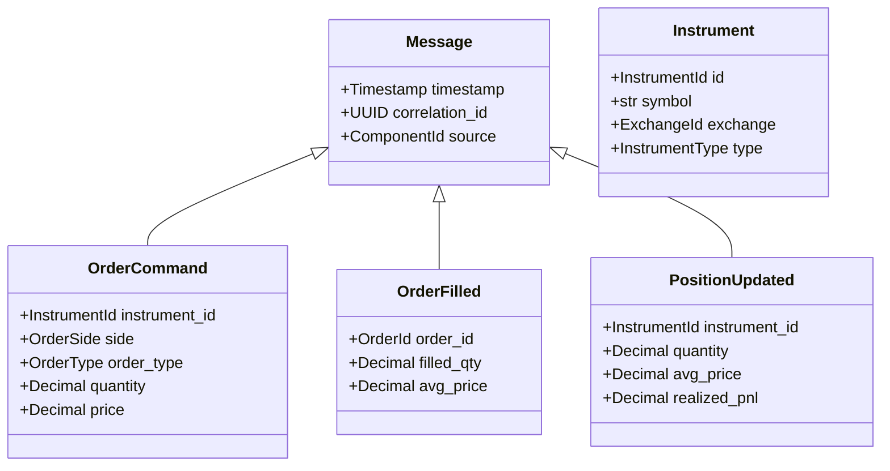

# 02 — Domain Model

## 1. Purpose

The domain layer is the innermost ring of Clean Architecture. It contains pure business logic: entities, value objects, events, commands, ports, services, and policies. It imports nothing from outer layers — only the standard library, shared types, and itself.

### Domain Package Structure

| Sub-package | Contents |
|-------------|----------|
| `entities/` | Order, Position, Trade, Quote, Bar, MarketDepth, OptionChain, Instrument |
| `value_objects/` | Money, Price, Quantity, InstrumentId, CorrelationId, TimeFrame |
| `events/` | DomainEvent, OrderPlaced, OrderFilled, PositionChanged, RiskBreached |
| `commands/` | PlaceOrderCommand, CancelOrderCommand, ModifyOrderCommand |
| `ports/` | BrokerAdapterPort, FillSourcePort, EventBusPort, DataCatalogPort, RiskEnginePort |
| `services/` | PricingService, FeeCalculator (STT, brokerage), InstrumentRegistry |
| `policies/` | SourceSelectionPolicy, RoutingPolicy |

## 2. Entity Model

### Core Entities

| Entity | Key Fields | Responsibility |
|--------|------------|----------------|
| Order | order_id, instrument_id, side, quantity, price, status, correlation_id | Order lifecycle state |
| Position | instrument_id, quantity, avg_price, realized_pnl, unrealized_pnl | Position tracking |
| Quote | instrument_id, bid, ask, bid_size, ask_size, timestamp | Market snapshot |
| Bar | instrument_id, OHLCV, timeframe, timestamp | Aggregated market data |
| MarketDepth | instrument_id, bids, asks, timestamp | Order book snapshot |
| OptionChain | underlying_id, strikes, expiries, greeks | Options analytics input |
| Instrument | instrument_id, symbol, exchange, asset_class, type | Canonical instrument definition |
| Account | account_id, balance, margin, equity | Account state |
| Trade | trade_id, order_id, instrument_id, price, quantity, side | Executed fill |

### Order State Machine

```
PENDING → SUBMITTED → PARTIALLY_FILLED → FILLED
                   → CANCELLED
                   → REJECTED
                   → UNKNOWN (ambiguous network; resolved by reconciliation)
```

Illegal transitions fail fast. UNKNOWN is never invented as REJECTED.

## 3. Value Objects

All value objects are immutable (frozen dataclasses):

| Value Object | Fields | Notes |
|--------------|--------|-------|
| InstrumentId | value: str | Canonical identifier |
| OrderId | value: str | Venue or internal ID |
| AccountId | value: str | Trading account |
| StrategyId | value: str | Strategy instance |
| ComponentId | value: str | Framework component |
| Money | amount: Decimal, currency: Currency | Decimal-based, no float |
| Price | value: Decimal | Tick-size aware |
| Quantity | value: Decimal | Lot-size aware |
| CorrelationId | value: UUID | Mandatory on order intents |
| TimeFrame | value: str | e.g. 1m, 5m, 1d |

## 4. Enumerations

| Enum | Values |
|------|--------|
| OrderSide | BUY, SELL |
| OrderType | MARKET, LIMIT, STOP, STOP_LIMIT |
| OrderStatus | PENDING, SUBMITTED, PARTIALLY_FILLED, FILLED, CANCELLED, REJECTED, UNKNOWN |
| TimeInForce | DAY, IOC, GTC |
| Environment | REPLAY, BACKTEST, PAPER, LIVE |
| ExecutionTargetKind | REPLAY, SIMULATED, PAPER, BROKER |
| BrokerId | DHAN, UPSTOX, PAPER |
| ExchangeId | NSE, BSE, MCX |
| AssetClass | EQUITY, DERIVATIVE, COMMODITY, CURRENCY |
| InstrumentType | EQUITY, FUTURE, OPTION, INDEX |
| OptionType | CALL, PUT |
| SignalDirection | BUY, SELL, NEUTRAL |
| RiskLevel | INFO, WARNING, CRITICAL |
| DriftSeverity | LOW, MEDIUM, HIGH |

## 5. Message Hierarchy

All framework messages inherit from a base Message:

```python
@dataclass(frozen=True)
class Message:
    timestamp: Timestamp      # UTC, nanosecond precision
    correlation_id: UUID | None = None
    source: ComponentId | None = None
```

### Data Messages

| Message | Key Fields |
|---------|------------|
| Quote | instrument_id, bid_price, ask_price, bid_size, ask_size |
| Trade | instrument_id, price, size |
| Bar | instrument_id, open, high, low, close, volume, timeframe |
| OrderBook | instrument_id, bids, asks |
| Tick | instrument_id, price, size, side |

### Order Messages

| Message | Key Fields |
|---------|------------|
| OrderCommand | instrument_id, side, order_type, quantity, price, time_in_force |
| OrderPlaced | order_id, instrument_id, side, quantity |
| OrderFilled | order_id, instrument_id, side, filled_qty, avg_price |
| OrderCancelled | order_id, reason |
| OrderRejected | order_id, reason, venue_code |
| OrderModified | order_id, new_quantity, new_price |

### Portfolio Messages

| Message | Key Fields |
|---------|------------|
| PositionUpdated | account_id, instrument_id, quantity, avg_price, realized_pnl, unrealized_pnl |
| AccountUpdated | account_id, balance, margin, equity |
| PnLUpdated | account_id, realized, unrealized, total |

### Risk Messages

| Message | Key Fields |
|---------|------------|
| RiskCheckResult | approved, reason, max_quantity, max_notional |
| RiskRejected | order_id, reason, correlation_id |
| RiskAlert | level, reason, instrument_id |
| AutoFlattenOrder | instrument_id, reason |

### System Messages

| Message | Key Fields |
|---------|------------|
| Startup | environment, broker_id, config_hash |
| Shutdown | reason |
| ComponentHealth | component_id, state, metrics |
| ReconciliationDrift | drift_items, severity |
| ReconciliationCompleted | items_healed, duration_ms |
| BrokerDisconnected | broker_id, reason |
| BrokerReconnected | broker_id |
| ReplayStarted | session_id, start_ts, end_ts |
| ReplayCompleted | session_id, events_replayed, duration_ms |
| FeatureComputed | instrument_id, feature_name, value, timestamp |

### Analytics Messages

| Message | Key Fields |
|---------|------------|
| SignalGenerated | instrument_id, direction, strength, scanner_id |
| ScanCompleted | scanner_id, signal_count, universe_size |
| BacktestCompleted | strategy_id, metrics, trade_count |
| RankingUpdated | universe, rankings |

## 6. Port Protocols

### Strategy

```python
class Strategy(Protocol):
    strategy_id: StrategyId

    def on_start(self, event: StartEvent) -> None: ...
    def on_stop(self, event: StopEvent) -> None: ...
    def on_quote(self, quote: Quote) -> None: ...
    def on_bar(self, bar: Bar) -> None: ...
    def on_fill(self, fill: OrderFilled) -> None: ...
    def on_event(self, event: Message) -> None: ...
```

### DataAdapter

```python
class DataAdapter(Protocol):
    def subscribe(self, instrument: Instrument, timeframe: TimeFrame) -> None: ...
    def unsubscribe(self, instrument: Instrument) -> None: ...
    def request_history(
        self, instrument: Instrument, start: Timestamp, end: Timestamp
    ) -> Iterator[Bar]: ...
    def get_quote(self, instrument_id: InstrumentId) -> Quote: ...
```

### ExecutionAdapter / BrokerAdapter

```python
class BrokerAdapter(Protocol):
    def submit_order(self, command: OrderCommand) -> OrderId: ...
    def cancel_order(self, order_id: OrderId) -> None: ...
    def modify_order(self, order_id: OrderId, command: OrderCommand) -> None: ...
    def get_order(self, order_id: OrderId) -> Order: ...
    def get_orderbook(self) -> list[Order]: ...
    def get_positions(self) -> list[Position]: ...
    def get_funds(self) -> Account: ...
    def mass_status(self) -> BrokerSnapshot: ...
```

BrokerAdapter composes: MarketDataPort, ExecutionPort, StreamingPort, DataProvider, ExecutionProvider.

### FillSource

```python
class FillSource(Protocol):
    def submit(self, command: OrderCommand) -> OrderResult: ...
    def cancel(self, order_id: OrderId) -> CancelResult: ...
```

Implementations: ReplayFillSource, SimulatedFillSource, PaperFillSource, BrokerFillSource.

### RiskModel

```python
class RiskModel(Protocol):
    def check_order(self, command: OrderCommand, context: RiskContext) -> RiskCheckResult: ...
    def check_position(self, position: Position, context: RiskContext) -> RiskCheckResult: ...
    def check_account(self, account: Account, context: RiskContext) -> RiskCheckResult: ...
```

### PortfolioModel

```python
class PortfolioModel(Protocol):
    def rebalance(self, signals: list[Signal], context: PortfolioContext) -> list[OrderCommand]: ...
    def optimize(self, signals: list[Signal], context: PortfolioContext) -> list[OrderCommand]: ...
```

### Clock

```python
class Clock(Protocol):
    def now(self) -> Timestamp: ...
    def advance(self, delta: timedelta) -> None: ...  # FakeClock only
```

### EventBusPort

```python
class EventBusPort(Protocol):
    def subscribe(self, msg_type: type, handler: Callable) -> Subscription: ...
    def publish(self, message: Message) -> None: ...
```

### Component (Lifecycle Base)

Every long-lived framework object inherits from Component:

```python
class ComponentState(Enum):
    UNINITIALIZED = "UNINITIALIZED"
    INITIALIZED   = "INITIALIZED"
    RUNNING       = "RUNNING"
    STOPPED       = "STOPPED"
    ERROR         = "ERROR"

class Component(ABC):
    component_id: ComponentId
    state: ComponentState

    def initialize(self) -> None: ...
    def start(self) -> None: ...
    def stop(self) -> None: ...
    def reset(self) -> None: ...
    def health_check(self) -> ComponentHealth: ...
```

Valid transitions: UNINITIALIZED → INITIALIZED → RUNNING → STOPPED; RUNNING → ERROR; STOPPED → INITIALIZED (reset). Invalid transitions raise LifecycleError.

### TradingContext

Central runtime container holding references to active components (ExecutionEngine, RiskManager, TradingCache, Clock). Passed to strategies and orchestrators; strategies must not reach OMS directly.

### FeeCalculator (Indian Market)

Domain service for STT, brokerage, exchange charges, and GST on trades. Pure calculation — no I/O. Used by backtest PnL and live reconciliation.

### IdempotencyGuard

```python
class IdempotencyGuard(Protocol):
    def check_and_reserve(self, correlation_id: CorrelationId) -> IdempotencyResult: ...
    def record_result(self, correlation_id: CorrelationId, result: OrderResult) -> None: ...
```

## 7. Class Diagram (Domain Core)



## 8. Instrument Model

```python
@dataclass(frozen=True)
class Instrument:
    instrument_id: InstrumentId
    symbol: str
    exchange: ExchangeId
    asset_class: AssetClass
    currency: Currency
    instrument_type: InstrumentType
    underlying_id: InstrumentId | None = None
    strike: Decimal | None = None
    expiry: Timestamp | None = None
    option_type: OptionType | None = None
```

### InstrumentMaster

Central registry mapping symbols to InstrumentId, sectors, and metadata. Owned by broker plugin + domain data catalog port.

## 9. Reconciliation (Pure Domain)

ReconciliationEngine stays pure — no I/O, no bus, no broker imports:

```python
class ReconciliationEngine:
    def compare_orders(self, local: list[Order], broker: list[Order]) -> list[DriftItem]: ...
    def compare_positions(self, local: list[Position], broker: list[Position]) -> list[DriftItem]: ...
    def compare_funds(self, local: Account, broker: Account) -> list[DriftItem]: ...
```

Drift severity:
- **HIGH** — missing local/broker order, quantity mismatch
- **MEDIUM** — price/avg drift beyond tolerance
- **LOW** — cosmetic/status lag within grace period

### StatisticsEngine (Analytics Metrics)

```python
class StatisticsEngine(Protocol):
    def analyze_trades(self, trades: list[Trade]) -> TradeStatistics: ...
    def compute_risk_metrics(self, equity_curve: list[Decimal]) -> RiskMetrics: ...
    def compute_benchmark_metrics(self, strategy: Decimal, benchmark: Decimal) -> BenchmarkMetrics: ...
```

### SourceSelectionPolicy

```python
class SourceSelectionPolicy(Protocol):
    def select(self, instrument_id: InstrumentId, timeframe: TimeFrame) -> DataSourceKind: ...
```

Resolution order for historical data: datalake local → broker historical → federated sync.

## 10. Domain Invariants

1. All messages are immutable (frozen dataclasses)
2. Money and Price use Decimal, never float
3. Timestamps are UTC with nanosecond precision
4. correlation_id is mandatory on OrderCommand
5. Order FSM transitions are validated before cache update
6. ReconciliationEngine has zero side effects
7. Wire identifiers never appear in domain entities
8. ExecutionTargetKind resolved once at composition; never changed at runtime
9. Feature values computed before strategy callbacks (pipeline ordering)
