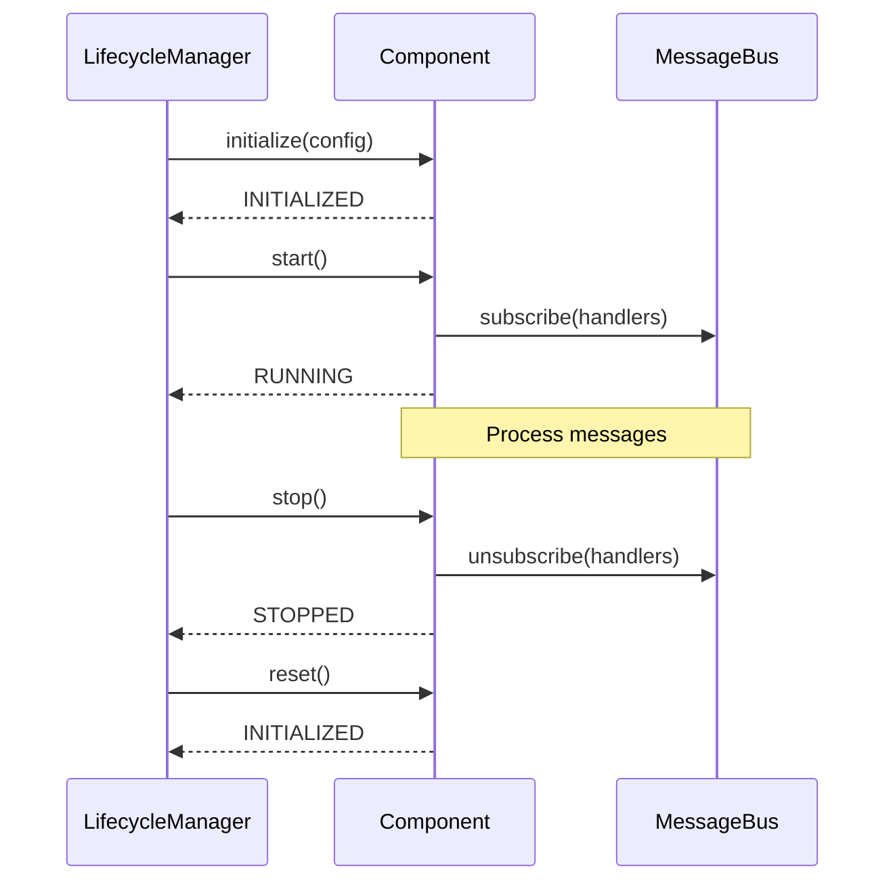
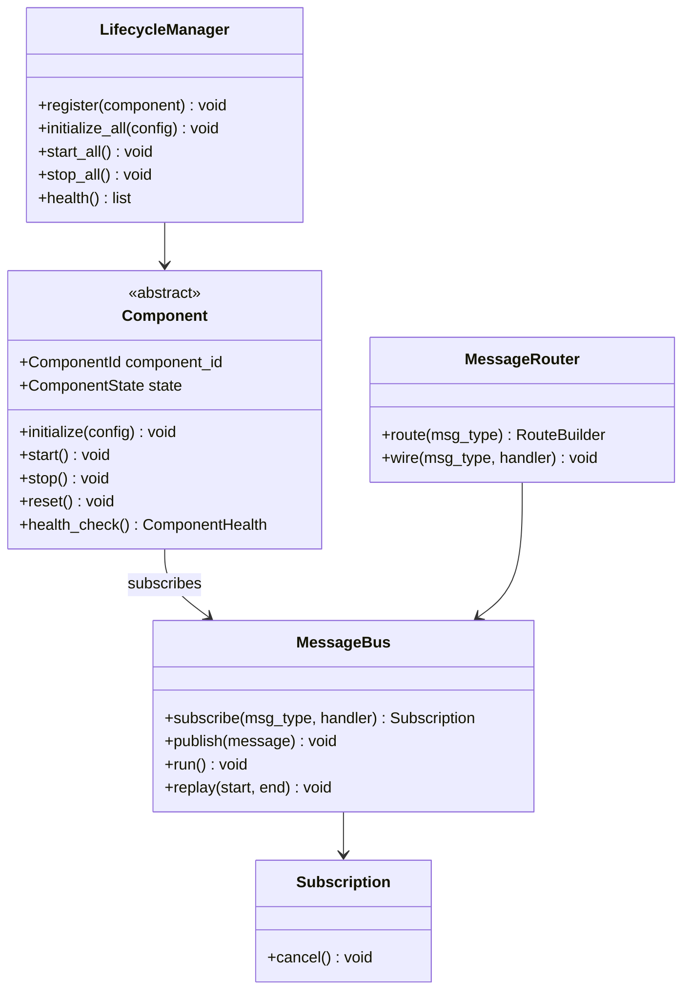

# 03 — Message Bus and Lifecycle

## 1. Purpose

The MessageBus is the spinal cord of the framework. Every component publishes and subscribes to messages through it. No direct method calls between subsystems.

## 2. Internal Architecture

```
┌──────────────────────────────────────────────────────────────┐
│                        MessageBus                            │
│  ┌─────────────┐  ┌──────────────┐  ┌────────────────────┐  │
│  │  Sync       │  │  Async       │  │  Dead Letter       │  │
│  │  Dispatcher │  │  Dispatcher  │  │  Queue (DLQ)       │  │
│  └──────┬──────┘  └──────┬───────┘  └────────┬───────────┘  │
│         └────────────────┼────────────────────┘              │
│                    Subscriber Registry                        │
│                    MessageBusMetrics                          │
└──────────────────────────────────────────────────────────────┘
```

Sync handlers run inline on publish; async handlers run in separate tasks. Failed deliveries go to DLQ with handler identity and exception.

### MessageBusMetrics

| Metric | Purpose |
|--------|---------|
| messages_published | Total publish count |
| messages_delivered | Successful handler invocations |
| messages_failed | Handler exceptions |
| dlq_count | Dead-letter entries |
| avg_latency_ns | Mean dispatch latency |

### Principles

| Principle | Description |
|-----------|-------------|
| Zero-copy | Messages are frozen dataclasses (immutable) |
| Async by default | Subscribers run in separate threads/async tasks |
| Backpressure | Queue size limits prevent memory exhaustion |
| Replay | Optional message log enables backtesting |
| Single instance | One MessageBus per runtime; no duplicate buses |
| Typed dispatch | Handlers registered by message type |

### Interface

```python
class MessageBus:
    def __init__(self, max_queue_size: int = 10_000): ...

    def subscribe(self, msg_type: type, handler: MessageHandler) -> Subscription: ...
    def unsubscribe(self, subscription: Subscription) -> None: ...
    def publish(self, message: Message) -> None: ...
    async def run(self) -> None: ...
    def stop(self) -> None: ...
    def replay(self, start: Timestamp, end: Timestamp) -> None: ...
```

### Publish Semantics

1. If persistent log enabled, append message to log
2. Look up subscribers for `type(message)`
3. For each subscriber, apply filter; if match, enqueue message
4. Subscriber processes message in its own queue/task
5. Handler exceptions are caught, logged, and optionally sent to dead-letter queue

### Expected Behavior Contract: Publish

| | |
|---|---|
| Inputs | Immutable Message with valid timestamp |
| Outputs | Message delivered to all matching subscribers |
| Timing | Synchronous publish; async handler execution |
| Failure modes | Handler exception → log + dead-letter; queue full → backpressure/block |
| State transitions | Message appended to log (if enabled) before dispatch |

## 3. Message Routing

### MessageRouter

Routes messages to components based on filters:

```python
class MessageRouter:
    def route(
        self,
        msg_type: type,
        *,
        instrument: InstrumentId | None = None,
        strategy: StrategyId | None = None,
        account: AccountId | None = None,
    ) -> RouteBuilder: ...

    def wire(
        self,
        msg_type: type,
        handler: MessageHandler,
        *,
        instrument: InstrumentId | None = None,
        strategy: StrategyId | None = None,
    ) -> None: ...
```

### Routing Examples

| Route | Target |
|-------|--------|
| All OrderCommand | ExecutionEngine.on_order_command |
| OrderFilled for RELIANCE | strategy_1.on_fill |
| OrderFilled for TCS | strategy_2.on_fill |
| All Bar | all registered strategies.on_bar |
| All RiskRejected | audit sink + operator alert |

### FilteredHandler

Wraps a handler with instrument/strategy/account filters. Non-matching messages are silently skipped.

## 4. Component Lifecycle

Every framework component implements a standardized lifecycle:

```
initialize(config) → start() → [running: process messages] → stop() → reset()
```

### Component Base

```python
class Component(ABC):
    component_id: ComponentId
    state: ComponentState  # INITIALIZED, RUNNING, STOPPED, ERROR

    def initialize(self, config: ComponentConfig) -> None: ...
    def start(self) -> None: ...
    def stop(self) -> None: ...
    def reset(self) -> None: ...
    def health_check(self) -> ComponentHealth: ...
```

### ComponentState

| State | Meaning |
|-------|---------|
| UNINITIALIZED | Created; not yet configured |
| INITIALIZED | Config validated, internal state set up |
| RUNNING | Processing messages, connections active |
| STOPPED | Flushed pending work, connections closed |
| ERROR | Unrecoverable failure; requires operator intervention |

Valid transitions enforced by state machine — invalid transition raises LifecycleError.

## 5. LifecycleManager

Manages lifecycle of all registered components:

```python
class LifecycleManager:
    def register(self, component: Component) -> None: ...
    def initialize_all(self, config: FrameworkConfig) -> None: ...
    def start_all(self) -> None: ...
    def stop_all(self) -> None: ...  # reverse order
    def health(self) -> list[ComponentHealth]: ...
```

### Startup Order

1. ConfigManager
2. MessageBus
3. TradingCache
4. DataEngine
5. RiskEngine
6. ExecutionEngine
7. StrategyEngine
8. BrokerAdapter (via composition root)
9. ReconciliationEngine

### Shutdown Order

Reverse of startup. BrokerAdapter stops first; MessageBus stops last.

### Expected Behavior Contract: Lifecycle

| | |
|---|---|
| Inputs | FrameworkConfig with all component configs |
| Outputs | All components in RUNNING state; health checks pass |
| Timing | initialize_all completes before start_all; no message processing during init |
| Failure modes | Any initialize failure → abort startup, no partial RUNNING state |
| State transitions | INITIALIZED → RUNNING → STOPPED; ERROR halts further starts |

## 6. Component Lifecycle Sequence



## 7. Subscription Model

```python
@dataclass
class Subscription:
    msg_type: type
    handler: MessageHandler
    filter: MessageFilter | None = None

    def cancel(self) -> None: ...
```

Subscriptions are returned from subscribe() and can be cancelled individually. Component.stop() cancels all subscriptions owned by that component.

## 8. Message Log (Core — Not Optional)

The durable event log is **core infrastructure** for deterministic replay (Nautilus-style event-sourced replay):

```python
class MessageLog(Protocol):
    def append(self, message: Message) -> None: ...
    def read(self, start: Timestamp, end: Timestamp) -> Iterator[Message]: ...
    def read_session(self, session_id: SessionId) -> Iterator[Message]: ...
    def clear(self) -> None: ...
```

Every published message is persisted when replay mode is enabled. ReplayEngine reads the log and republishes through the same MessageBus and ExecutionEngine used in live — research-to-live parity.

### Expected Behavior Contract: Event Log

| | |
|---|---|
| Inputs | Immutable Message with valid timestamp |
| Outputs | Message appended to durable store |
| Timing | Append before dispatch to subscribers |
| Failure modes | Write failure → halt session (no silent drop) |
| State transitions | Log grows monotonically; never truncated mid-session |

## 9. Dead-Letter Queue

Messages that fail handler processing are sent to a dead-letter queue:

```python
@dataclass(frozen=True)
class DeadLetter:
    original_message: Message
    handler: ComponentId
    error: str
    timestamp: Timestamp
```

Operator can inspect, retry, or discard dead letters via CLI/API.

## 10. Class Diagram



## 11. Invariants

1. Single MessageBus instance per runtime
2. All inter-component communication via publish/subscribe
3. Messages are immutable; handlers must not mutate
4. Component.start() registers subscriptions; stop() cancels them
5. LifecycleManager.start_all() only after all initialize() succeed
6. stop_all() runs in reverse registration order
7. Replay uses identical handlers as live (four-mode parity)
8. Durable event log append before dispatch when replay enabled
9. Order commands published on priority queue above market data
