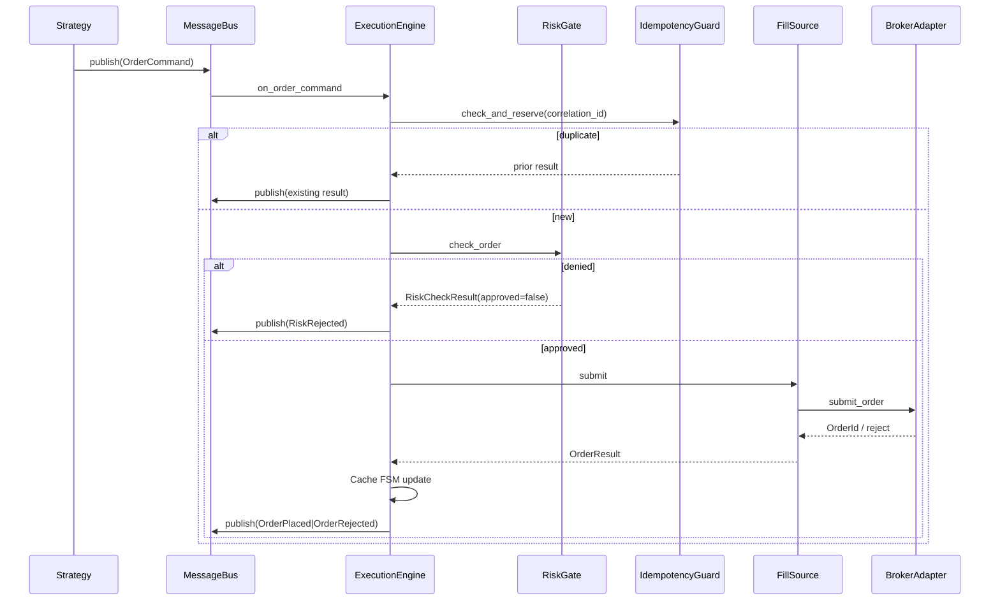

# 04 — Execution and OMS

## 1. Purpose

The ExecutionEngine is the framework's heart. It owns order lifecycle, position tracking, and risk enforcement. It runs identically in backtest and live — zero-parity is structural: the engine does not know if it runs against a simulator or a live broker.

## 2. OMS Subsystem

### Components

| Component | Responsibility |
|-----------|----------------|
| OrderManager | Order FSM, idempotency, cache upsert |
| PositionManager | Position projection from fills, PnL |
| RiskManager | Pre-trade RiskGate, capital alignment |
| ReconciliationEngine | Compare local vs broker snapshot (pure domain) |
| TradingCache | Authoritative in-memory state (Nautilus Cache equivalent) |
| ExecutionEngine | Orchestrates order path, fill processing |
| TradingOrchestrator | Multi-strategy session coordination |
| ProcessedTradeRepository | Fill dedup by trade_id |

### TradingCache Ownership

| Cache Entry | Owner | Update Trigger |
|-------------|-------|----------------|
| Orders | OrderManager | FSM transition on venue ack/fill |
| Positions | PositionManager | Trade applied |
| Quotes | DataEngine | Cache-then-publish on quote update |
| Account/Funds | RiskManager | Reconciliation, fill processing |

## 3. ExecutionEngine

```python
class ExecutionEngine(Component):
    def __init__(
        self,
        message_bus: MessageBus,
        fill_source: FillSource,
        order_manager: OrderManager,
        position_manager: PositionManager,
        risk_manager: RiskManager,
        idempotency: IdempotencyGuard,
        clock: Clock,
    ): ...

    def on_order_command(self, command: OrderCommand) -> None: ...
    def on_fill(self, fill: OrderFilled) -> None: ...
    def on_reconciliation(self, snapshot: BrokerSnapshot) -> None: ...
```

### Four-Mode Parity Contract

| Mode | FillSource | Clock | ExecutionEngine Code |
|------|------------|-------|---------------------|
| REPLAY | Engine replay from MessageLog | FakeClock | Identical |
| BACKTEST | SimulatedFillSource | FakeClock | Identical |
| PAPER | PaperFillSource | SystemClock | Identical |
| LIVE | BrokerFillSource | SystemClock | Identical |

Only FillSource, Clock, and DataSource differ at composition time.

### Forbidden: Bypass Paths

The following are **explicitly forbidden**:

- Alternate OMS adapter that places orders outside ExecutionEngine
- Direct BrokerAdapter calls from strategies or scanners
- Second order FSM with different transition rules
- Mode-specific RiskEngine or OrderManager implementations

Architecture tests must fail if any bypass path exists.

## 4. Order Flow

```
Orchestrator → OrderServicePort.place(intent, correlation_id)
  → IdempotencyGuard.check_and_reserve
  → RiskEngine.check_order
      denied  → MessageBus(RISK_REJECTED) — no venue call
      approved → ExecutionEngine → FillSource.submit → Venue
                 Venue ack/reject → Cache upsert (Order FSM) → MessageBus(ORDER_PLACED|ORDER_REJECTED)
                 Venue fill → ExecutionEngine.record_trade (idempotent on trade_id)
                   → Cache order status FSM → MessageBus(TRADE_APPLIED)
                   → PositionManager.apply_trade → MessageBus(POSITION_*)
```

### Denial vs Rejection

| Event | Meaning |
|-------|---------|
| RISK_REJECTED | Local risk denied; never reached venue |
| ORDER_REJECTED | Venue proved non-acceptance |
| UNKNOWN | Ambiguous network failure; resolved by reconciliation, never invented as REJECTED |

### Expected Behavior Contract: Order

| | |
|---|---|
| Inputs | OrderIntent with mandatory correlation_id, symbol, side, qty, type, product |
| Outputs | OrderResult; events per spine; ledger rows |
| Timing | Intent recorded before venue I/O; Clock stamps all local events |
| Failure modes | Duplicate correlation → prior result; risk deny → no I/O; venue ambiguous → UNKNOWN + reconcile; illegal FSM → fail-fast |

## 5. FillSource Implementations

### SimulatedFillSource (BACKTEST)

- Immediate fill at bar close or configured slippage model
- No network I/O; deterministic given same bar data and clock

### ReplayFillSource (REPLAY)

- Reads durable MessageLog; republishes events through same MessageBus
- ExecutionEngine processes fills identically to original session
- FakeClock advances per recorded timestamp

### PaperFillSource (PAPER)

- Uses live market data for pricing
- Simulates fills with configurable latency and slippage
- No venue order submission

### BrokerFillSource (LIVE)

- Delegates to BrokerAdapter.submit_order / cancel_order
- Receives venue acks, rejects, fills via streaming or polling
- Handles UNKNOWN on network ambiguity

```python
class FillSource(Protocol):
    def submit(self, command: OrderCommand) -> OrderResult: ...
    def cancel(self, order_id: OrderId) -> CancelResult: ...
    def modify(self, order_id: OrderId, command: OrderCommand) -> ModifyResult: ...
```

## 6. Order Sequence Diagram



## 7. Fill Processing

```python
def record_trade(self, fill: OrderFilled) -> None:
    # Idempotent on trade_id
    if self._cache.has_trade(fill.trade_id):
        return
    self._order_manager.apply_fill(fill)
    self._position_manager.apply_trade(fill)
    self._message_bus.publish(fill)
    self._message_bus.publish(self._position_manager.current(fill.instrument_id))
```

Fill processing is idempotent on trade_id. Duplicate fills from venue replay are ignored.

## 8. Reconciliation

```
BrokerAdapter.mass_status/positions/funds → ExecutionEngine
  → ReconciliationEngine.compare(local Cache, broker snapshot)
  → for each HIGH/MEDIUM drift: Cache upsert (FSM-validated) + RiskEngine capital refresh
  → MessageBus(RECONCILIATION_DRIFT) if any
  → MessageBus(RECONCILIATION_COMPLETED)
```

### Triggers

- On broker connect/reconnect
- On periodic mass-status (applied inside ExecutionEngine)
- On any UNKNOWN submission outcome

### Expected Behavior Contract: Reconciliation

| | |
|---|---|
| Inputs | Broker-normalized Order/Position/funds lists + Cache snapshot |
| Outputs | Cache healed; DriftItems published; risk capital aligned |
| Timing | Completes before accepting new risk after reconnect (or TradingState DEGRADED until done) |
| Failure modes | Compare exception → fail-fast/HALTED; partial apply → DEGRADED + alarm; HIGH drift never silent |

## 9. TradingContext

TradingContext bundles the runtime state visible to strategies and risk:

```python
@dataclass
class TradingContext:
    cache: TradingCache
    clock: Clock
    environment: Environment
    account: Account
    positions: dict[InstrumentId, Position]
    open_orders: list[Order]
```

Strategies receive TradingContext snapshots; they do not mutate cache directly.

## 10. TradingOrchestrator

Coordinates multi-strategy sessions under a single ExecutionEngine:

```python
class TradingOrchestrator(Component):
    def __init__(
        self,
        message_bus: MessageBus,
        execution_engine: ExecutionEngine,
        strategy_engine: StrategyEngine,
        config: OrchestratorConfig,
    ): ...

    def start_session(self) -> None: ...
    def stop_session(self) -> None: ...
    def place_order(self, intent: OrderIntent) -> OrderResult: ...
```

MultiStrategyRuntime wires multiple strategies sharing one MessageBus, one ExecutionEngine, one TradingCache. Strategy isolation via MessageRouter filters.

### Expected Behavior Contract: Orchestrator

| | |
|---|---|
| Inputs | OrchestratorConfig, registered strategies |
| Outputs | Running session; orders routed through single spine |
| Timing | All strategies start after ExecutionEngine ready |
| Failure modes | Any strategy crash → DEGRADED (others continue if configured) |
| State transitions | Session: INITIALIZED → RUNNING → STOPPED |

## 11. Class Diagram

```mermaid
classDiagram
    class ExecutionEngine {
        +on_order_command(cmd) void
        +on_fill(fill) void
        +on_reconciliation(snapshot) void
        +record_trade(fill) void
    }

    class OrderManager {
        +apply_fill(fill) void
        +transition(order_id, status) void
    }

    class PositionManager {
        +apply_trade(fill) void
        +current(instrument_id) Position
    }

    class RiskManager {
        +check_order(cmd, ctx) RiskCheckResult
        +refresh_capital(account) void
    }

    class FillSource {
        <<interface>>
        +submit(cmd) OrderResult
        +cancel(order_id) CancelResult
    }

    class SimulatedFillSource
    class PaperFillSource
    class BrokerFillSource

    ExecutionEngine --> OrderManager
    ExecutionEngine --> PositionManager
    ExecutionEngine --> RiskManager
    ExecutionEngine --> FillSource
    FillSource <|.. SimulatedFillSource
    FillSource <|.. PaperFillSource
    FillSource <|.. BrokerFillSource
```



## 12. Invariants

1. Single ExecutionEngine wiring at boot
2. No bypass order paths — architecture test enforced
3. RiskGate checked before every venue I/O
4. IdempotencyGuard checked before RiskGate
5. Order FSM transitions validated before cache update
6. Fill processing idempotent on trade_id (ProcessedTradeRepository)
7. Reconciliation applied inside ExecutionEngine, not detached service
8. UNKNOWN never mapped to REJECTED without venue proof
9. Same code path in REPLAY, BACKTEST, PAPER, LIVE
10. TradingOrchestrator never calls BrokerAdapter directly
