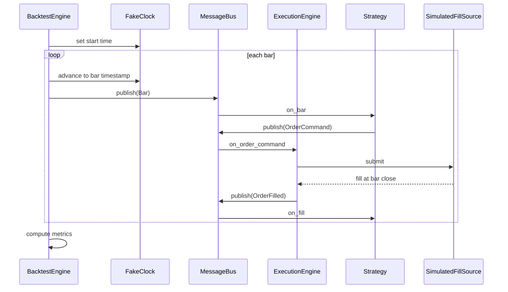

# 05 — Strategy and Analytics

## 1. Purpose

The strategy and analytics subsystem enables users to implement trading logic as pluggable components. The framework invokes strategy callbacks; strategies never call OMS or execution directly.

## 2. Strategy System

### Inversion of Control

Users implement the Strategy protocol. The framework:

1. Registers strategy with StrategyEngine
2. Routes relevant messages (Bar, Quote, OrderFilled) via MessageBus
3. Invokes on_start, on_bar, on_quote, on_fill, on_stop
4. Collects order intents from strategy output

### Strategy Interface

```python
class Strategy(Protocol):
    strategy_id: StrategyId

    def on_start(self, event: StartEvent) -> None: ...
    def on_stop(self, event: StopEvent) -> None: ...
    def on_quote(self, quote: Quote) -> None: ...
    def on_bar(self, bar: Bar) -> None: ...
    def on_fill(self, fill: OrderFilled) -> None: ...
    def on_event(self, event: Message) -> None: ...
```

### StrategyEngine

```python
class StrategyEngine(Component):
    def register(self, strategy: Strategy) -> None: ...
    def unregister(self, strategy_id: StrategyId) -> None: ...
    def emit_order(self, command: OrderCommand) -> None: ...
```

StrategyEngine publishes OrderCommand to MessageBus; it does not call ExecutionEngine directly.

### Example Strategy Pattern

```python
class MomentumStrategy:
    strategy_id = StrategyId("momentum_v1")

    def on_bar(self, bar: Bar) -> None:
        if self._signal(bar) == SignalDirection.BUY:
            self._engine.emit_order(OrderCommand(
                instrument_id=bar.instrument_id,
                side=OrderSide.BUY,
                order_type=OrderType.MARKET,
                quantity=Quantity("100"),
                time_in_force=TimeInForce.DAY,
            ))
```

## 3. Isolation Invariant

Strategies and scanners **must not** import or call:
- OrderManager, PositionManager, ExecutionEngine
- BrokerAdapter or any concrete broker module
- Runtime composition root

All order flow goes: Strategy → MessageBus → ExecutionEngine.

Trading must remain usable with **zero strategies loaded**. A scanner bug must never affect order state.

## 4. Scanner System

### Scanner Interface

```python
class Scanner(Protocol):
    scanner_id: ScannerId

    def scan(self, universe: list[InstrumentId], context: ScanContext) -> list[Signal]: ...
```

### Scan Pipeline

```
InstrumentMaster → Scanner.scan() → list[Signal]
  → PortfolioModel.rebalance(signals) → list[OrderCommand]
  → MessageBus.publish(OrderCommand) → ExecutionEngine
```

Scanners produce signals; they do not place orders directly.

## 5. Signal Model

```python
@dataclass(frozen=True)
class Signal:
    instrument_id: InstrumentId
    direction: SignalDirection
    strength: Decimal          # 0.0 to 1.0
    timestamp: Timestamp
    metadata: dict[str, Any]
```

## 6. Portfolio Construction

### PortfolioModel Protocol

```python
class PortfolioModel(Protocol):
    def rebalance(
        self, signals: list[Signal], context: PortfolioContext
    ) -> list[OrderCommand]: ...

    def optimize(
        self, signals: list[Signal], context: PortfolioContext
    ) -> list[OrderCommand]: ...
```

### Equal-Weight Example

1. Filter signals to BUY direction
2. Divide total capital equally across instruments
3. Calculate target quantity from current quote midpoint
4. Emit OrderCommand for delta (target - current position)

### PortfolioContext

```python
@dataclass
class PortfolioContext:
    account: Account
    positions: dict[InstrumentId, Position]
    quotes: dict[InstrumentId, Quote]
    constraints: PortfolioConstraints
```

## 7. FeaturePipeline

The immutable research pipeline stage between market data and strategy callbacks:

```
MarketDataEngine → FeaturePipeline → Indicators → StrategyEngine
```

```python
class FeaturePipeline(Component):
    def on_bar(self, bar: Bar) -> None:
        features = self._compute_features(bar)
        for name, value in features.items():
            self._bus.publish(FeatureComputed(
                instrument_id=bar.instrument_id,
                feature_name=name,
                value=value,
                timestamp=bar.timestamp,
            ))
        indicators = self._compute_indicators(features)
        self._bus.publish(BarWithFeatures(bar=bar, features=features, indicators=indicators))
```

FeaturePipeline runs before strategy.on_bar(). Strategies receive enriched bars with pre-computed features and indicators.

### Expected Behavior Contract: FeaturePipeline

| | |
|---|---|
| Inputs | Bar or Quote from MarketDataEngine |
| Outputs | FeatureComputed + enriched Bar published to MessageBus |
| Timing | Synchronous per bar; completes before strategy callback |
| Failure modes | Compute error → log + skip bar (no corrupt cache) |

## 8. Analytics Suite

Full analytics capability surface to reimplement:

| Module | Responsibility |
|--------|----------------|
| BacktestEngine | Historical simulation through same ExecutionEngine |
| ReplayEngine | Event-sourced replay from MessageLog |
| PaperTradingEngine | Live data + PaperFillSource |
| LiveTradingEngine | Live data + BrokerFillSource |
| WalkForwardEngine | Parameter optimization across rolling windows |
| ScannerEngine | Momentum, breakout, volume, relative-strength scans |
| RankingEngine | Universe ranking by metric |
| SectorAnalyzer | Rotation, strength, volume by sector |
| OptionsAnalytics | Greeks, chain analysis |
| FuturesAnalytics | Contract analytics |
| VolatilityAnalytics | IV, historical vol, skew |
| OrderFlowAnalytics | Bid/ask imbalance, delta |
| MarketBreadthAnalytics | Advance/decline, new highs/lows |
| VolumeProfileBuilder | Volume-at-price profiles |
| ProbabilityEngine | Signal probability scoring |
| FundamentalsAnalytics | Financial ratio analysis |
| IntradayAnalytics | Session-based intraday patterns |
| StockAnalytics | Per-stock deep analysis |
| ReportEngine | PnL, drawdown, Sharpe, trade statistics |
| StatisticsEngine | Domain-level metric computation |
| ResearchAPI | Programmatic research queries |

## 9. ReplayEngine

Event-sourced deterministic replay (Nautilus-style):

```python
class ReplayEngine(Component):
    def run(self, config: ReplayConfig) -> ReplayResult:
        for message in self._log.read_session(config.session_id):
            self._clock.set(message.timestamp)
            self._bus.publish(message)  # same handlers as live
        return ReplayResult(events=config.event_count, state=self._cache.snapshot())
```

Replay uses FakeClock, reads MessageLog, publishes through same MessageBus and ExecutionEngine. State after replay must match original session state.

### Expected Behavior Contract: Replay

| | |
|---|---|
| Inputs | ReplayConfig (session_id or time range) |
| Outputs | ReplayResult; cache state identical to original |
| Timing | FakeClock set per message timestamp |
| Failure modes | Missing log segment → fail with gap report |

## 10. Backtest Engine

```python
class BacktestEngine(Component):
    def run(
        self,
        strategy: Strategy,
        data: HistoricalDataSource,
        config: BacktestConfig,
    ) -> BacktestResult: ...
```

### Backtest Flow



Backtest uses FakeClock, SimulatedFillSource, and the same ExecutionEngine as live.

## 11. Paper Trading Engine

- Mode: PAPER
- Data: live DataProvider (real quotes/bars)
- Fills: PaperFillSource (simulated execution)
- Same ExecutionEngine, RiskEngine, FeaturePipeline as live

## 12. Live Trading Engine

Before accepting live order traffic:
1. Venue connected and authenticated
2. Reconciliation completed (no HIGH drift)
3. RiskGate configured with LIVE profile limits
4. Four-mode parity gate passed
5. Operator explicit confirmation (`--confirm` flag)

## 13. Indicator Library

Pure functions in domain layer (no I/O):

| Category | Indicators |
|----------|------------|
| Trend | SMA, EMA, WMA, VWMA |
| Momentum | RSI, MACD, ROC, CCI |
| Volatility | ATR, Bollinger, Keltner |
| Volume | OBV, VWAP, MFI |
| Pattern | Candlestick patterns |
| HalfTrend | HalfTrend trend-following indicator |

Built-in strategies (HalfTrend, Momentum) ship as reference implementations.

## 14. Analytics-First CLI Commands

Full command tree (research questions first):

| Command Group | Subcommands | Purpose |
|---------------|-------------|---------|
| scanner | momentum, breakout, volume, rs | Universe scans |
| indicator | halftrend, halftrend_scan | Indicator analysis |
| strategy | list, run | Strategy management |
| backtest | run, replay, optimize, walkforward, paper | Simulation modes |
| market | breadth, sector, sector_rotation, sector_strength, sector_volume | Market structure |
| support | levels, nearest | Support/resistance |
| fundamentals | — | Financial analysis |
| report | — | Performance reports |
| config | get, set, list, reset, validate | Configuration |
| live | — | Live trading (with safety gates) |
| paper | — | Paper trading session |

## 15. Four-Mode Engine Comparison

| Aspect | ReplayEngine | BacktestEngine | PaperTradingEngine | LiveTradingEngine |
|--------|--------------|----------------|--------------------|--------------------|
| Clock | FakeClock | FakeClock | SystemClock | SystemClock |
| FillSource | Replay (from log) | SimulatedFillSource | PaperFillSource | BrokerFillSource |
| Data | MessageLog | Datalake | Live adapter | Live adapter |
| ExecutionEngine | Identical | Identical | Identical | Identical |
| FeaturePipeline | Identical | Identical | Identical | Identical |
| RiskEngine | Identical | Identical | Identical | Identical |

## 16. Invariants

1. Strategies communicate only via MessageBus
2. Zero strategies loaded must not break OMS/execution
3. All four modes use same ExecutionEngine (four-mode parity)
4. FeaturePipeline runs before strategy callbacks
5. Indicators are pure functions (domain layer)
6. PortfolioModel produces OrderCommands, not direct venue calls
7. Scanner output is signals, not orders
8. ReplayEngine reproduces identical state from MessageLog
9. Analytics modules are read-only on OMS state (no direct cache mutation)

