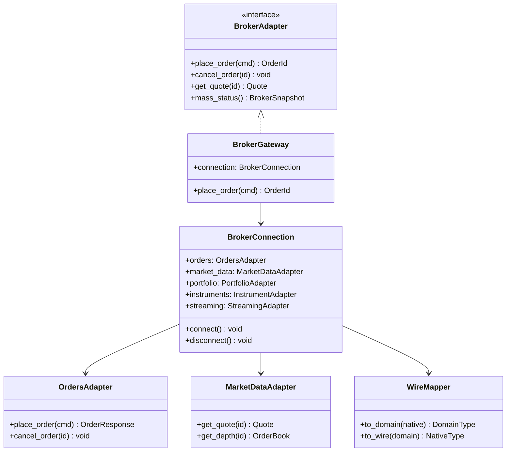

# 06 — Broker Adapter Framework

## 1. Purpose

The broker adapter framework provides pluggable connectivity to execution venues (Dhan, Upstox) and simulation backends (Paper). All broker-specific logic is isolated in plugins; the application layer depends only on domain ports.

## 2. Architecture Pattern

### Gateway → Connection → Sub-Adapters

```
BrokerGateway (implements BrokerAdapter)
  └── BrokerConnection (owns transport, lifecycle)
        ├── OrdersAdapter      (place, cancel, modify, orderbook, tradebook)
        ├── MarketDataAdapter  (quote, ltp, depth, history, chains)
        ├── PortfolioAdapter   (positions, holdings, funds)
        ├── InstrumentAdapter  (load, resolve, search)
        └── StreamingAdapter   (quotes, depth, order updates)
```

### Component Responsibilities

| Component | Responsibility |
|-----------|----------------|
| BrokerGateway | Thin facade implementing BrokerAdapter; delegates to BrokerConnection |
| BrokerConnection | Owns HTTP/WebSocket transport, sub-adapters, lifecycle |
| OrdersAdapter | Order placement, cancellation, modification |
| MarketDataAdapter | Quotes, LTP, depth, historical, option/future chains |
| PortfolioAdapter | Positions, holdings, funds, balances |
| InstrumentAdapter | Instrument loading, symbol resolution, search |
| StreamingAdapter | WebSocket subscriptions for quotes, depth, order updates |
| WireMapper | Broker-native payload ↔ domain types |
| Transport | HTTP client, WebSocket client with rate limiting |

## 3. BrokerAdapter Protocol

Composes domain ports:

| Port | Methods |
|------|---------|
| MarketDataPort | quote, ltp, depth, history, option_chain, future_chain, batch_quotes |
| ExecutionPort | place_order, cancel_order, modify_order, get_order |
| StreamingPort | stream, unstream, stream_order, stream_depth |
| DataProvider | subscribe, unsubscribe, request_history |
| ExecutionProvider | submit, cancel, modify, mass_status |

Full surface:

```
quote()         place_order()    stream()
ltp()           cancel_order()   unstream()
depth()         modify_order()   stream_order()
history()       get_order()      stream_depth()
option_chain()  get_orderbook()
future_chain()  get_trade_book()
search()        positions()
load_instruments() funds()
capabilities()  holdings()
describe()      trades()
                mass_status()
```

## 4. Class Diagram



## 5. Plugin Registration

Each broker plugin self-registers at import time:

```python
@dataclass(frozen=True)
class BrokerPlugin:
    broker_id: BrokerId
    env_file: str
    default_mode: Environment
    supported_modes: frozenset[Environment]
    is_live: bool
    capabilities: BrokerCapabilities

def register_broker_plugin(plugin: BrokerPlugin) -> None: ...
def register_data_adapter(broker_id: BrokerId, factory: Callable) -> None: ...
def register_execution_provider(broker_id: BrokerId, factory: Callable) -> None: ...
```

Entry-point discovery:

```
tradex.brokers:
  dhan   → plugins.brokers.dhan
  upstox → plugins.brokers.upstox
  paper  → plugins.brokers.paper
```

Runtime resolves broker **once at startup** via BrokerId enum. No string equality branching.

### BrokerCapabilities

```python
@dataclass(frozen=True)
class BrokerCapabilities:
    supports_market_orders: bool
    supports_limit_orders: bool
    supports_stop_orders: bool
    supports_modify: bool
    supports_websocket: bool
    supports_option_chain: bool
    supports_future_chain: bool
    max_orders_per_second: int
    supported_exchanges: frozenset[ExchangeId]
```

Capabilities exposed via `BrokerAdapter.capabilities()` — used by RiskGate and UI to disable unsupported order types.

### Common Infrastructure (Shared Across Plugins)

| Component | Responsibility |
|-----------|----------------|
| BaseWireAdapter | Enum mapping, decimal/datetime normalization |
| BaseTransport | HTTP client abstraction with retries |
| SymbolResolver | Canonical (symbol, exchange) → venue InstrumentRef |
| QuoteNormalizer | Venue quote → domain Quote |
| RateLimitConfig | Per-broker rate limit definitions |

Wire identifiers never leak past gateway boundary — callers use canonical InstrumentId only.

### Design Target: Module Size

Target ~50 focused broker plugin files total (Gateway→Connection→5 Sub-Adapters per venue). Each adapter independently testable via AdapterTestHarness.

## 6. Provider Structure

### Target Layout per Provider

```
plugins/brokers/dhan/
  __init__.py          # Self-registration, BrokerPlugin metadata
  gateway.py           # DhanGateway implements BrokerAdapter
  connection.py        # DhanConnection owns transport + sub-adapters
  orders.py            # DhanOrdersAdapter
  market_data.py       # DhanMarketDataAdapter
  portfolio.py         # DhanPortfolioAdapter
  instruments.py       # DhanInstrumentAdapter
  streaming.py         # DhanStreamingAdapter
  wire.py              # DhanWireMapper (native ↔ domain)
  transport.py         # HTTP + WebSocket clients
  auth.py              # TOTP, token store
  reconciliation.py    # Mass status, drift detection
  config.py            # Dhan-specific config schema
```

Same 8-file pattern for Upstox. Paper uses 6 files (no auth, no wire complexity).

### Common Infrastructure

```
plugins/brokers/common/
  capabilities.py    # BrokerCapabilities, RateLimitProfile
  idempotency.py     # Order dedup, correlation IDs
  transport.py       # Base HTTP/WS with rate limiting
  instruments.py     # Instrument carrier, ref resolution
  status_mapper.py   # Venue status string → OrderStatus enum
```

## 7. Wire Mapping

Wire mappers translate broker-native payloads to domain types:

```python
class WireMapper(Protocol):
    def to_order(self, native: dict) -> Order: ...
    def to_quote(self, native: dict) -> Quote: ...
    def to_position(self, native: dict) -> Position: ...
    def from_order_command(self, cmd: OrderCommand) -> dict: ...
```

### Instrument Ref Isolation

- Gateway callers use InstrumentId (domain)
- WireMapper resolves InstrumentId ↔ broker-native symbol internally
- Wire identifiers never leak above the gateway layer

## 8. Connection Lifecycle

Standardized across all providers:

```
connect() → authenticate() → load_instruments() → ready
disconnect() → flush() → close_transport()
health_check() → ConnectionHealth
```

Every BrokerConnection implements:
- connect / disconnect
- is_connected property
- health_check returning ConnectionHealth

## 9. Dhan Provider

| Concern | Implementation |
|---------|----------------|
| Auth | TOTP + token store with cooldown |
| Transport | REST (orders, portfolio) + WebSocket (market data, order stream) |
| Instruments | Dhan instrument master resolver |
| Status mapping | PLACED, TRIGGERED, CLOSED → OrderStatus |
| Reconciliation | Mass status vs local cache |

## 10. Upstox Provider

| Concern | Implementation |
|---------|----------------|
| Auth | OAuth + TOTP |
| Transport | REST + WebSocket v3 multiplexer |
| Instruments | Upstox symbol resolver |
| Reconciliation | Mass status vs local cache |

## 11. Paper Provider

| Concern | Implementation |
|---------|----------------|
| Orders | In-memory order manager |
| Market Data | Simulated or replayed quotes |
| Execution | PaperFillSource integration |
| Margin | PaperMarginProvider for capital checks |

PaperGateway structure:
- PaperOrders — place_order → OrderResponse
- PaperMarketData — simulated quotes
- PaperPortfolio — positions, funds
- PaperExecutionProvider — fill simulation

## 12. Rate Limiting

Two-layer rate limiting at transport boundary:

1. **Global QuotaScheduler** — cross-broker priority classes with max-wait deadlines
2. **Per-broker MultiBucketRateLimiter** — token bucket from BrokerCapabilities RateLimitProfile

Callers must not bypass either layer at the transport boundary.

## 13. Idempotency

Order deduplication at gateway level:

- correlation_id checked before venue submission
- Duplicate correlation returns prior OrderResult
- Idempotency ledger owned by common infrastructure

## 14. Reconciliation Service

Per-broker reconciliation:

```
mass_status() → normalize to domain types
  → ReconciliationEngine.compare(local, broker)
  → return DriftItems to ExecutionEngine
```

Triggers: connect, reconnect, periodic, UNKNOWN outcomes.

## 15. BrokerHealthMonitor

Structural health monitoring for venue connectivity:

```python
class BrokerHealthMonitor(Component):
    def on_disconnect(self, event: BrokerDisconnected) -> None: ...
    def on_reconnect(self, event: BrokerReconnected) -> None: ...
    def health(self) -> ConnectionHealth: ...
```

| Check | Pass | Fail Action |
|-------|------|-------------|
| WebSocket connected | Connected within 30s of start | Alert + reconnect policy |
| Auth token valid | Token not expired | Refresh or halt |
| Reconciliation complete | No HIGH drift | DEGRADED until healed |
| Mass status responsive | Response within timeout | Circuit breaker trip |

BrokerHealthMonitor publishes BrokerDisconnected/BrokerReconnected on MessageBus. Reconciliation triggers automatically on reconnect.

## 16. Expected Behavior Contract: Broker Connect

| | |
|---|---|
| Inputs | BrokerId, credentials from env, BrokerConfig |
| Outputs | Connected BrokerGateway; instruments loaded; reconciliation complete |
| Timing | Connect before accepting order traffic; reconciliation before risk acceptance |
| Failure modes | Auth failure → fail startup; partial connect → retry with backoff; reconciliation HIGH drift → DEGRADED |

## 17. Invariants

1. Application layer never imports concrete broker modules
2. Runtime is sole layer permitted concrete broker imports
3. All gateways implement identical BrokerAdapter protocol
4. Wire identifiers never leak to gateway callers
5. Self-registration via entry points; no central switch
6. Connection lifecycle standardized across providers
7. Rate limiting enforced at transport boundary
8. Status mapping centralized in StatusMapperRegistry
9. BrokerHealthMonitor mandatory for Live/Paper modes
10. Reconnect triggers reconciliation before accepting new risk
