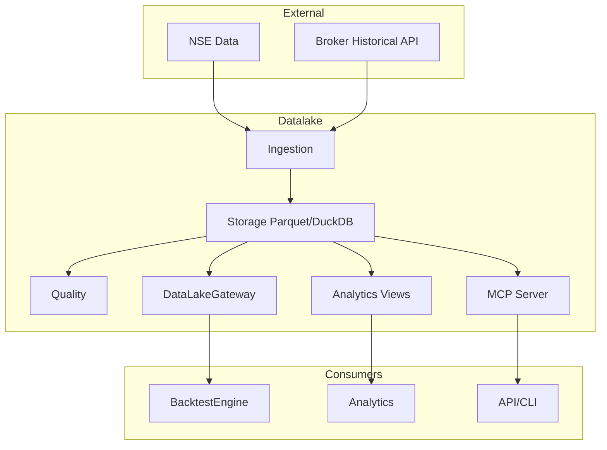

# 07 — Data Infrastructure

## 1. Purpose

The data infrastructure manages market data ingestion, storage, retrieval, and instrument master data. It provides canonical data models consumed by strategies, analytics, and the execution engine.

## 2. Unified DataEngine

The DataEngine provides unified access to live streaming, historical APIs, and the local datalake:

```
┌─────────────────────────────────────────────────────────────┐
│                      DataEngine                             │
│  ┌──────────────┐  ┌──────────────┐  ┌──────────────────┐  │
│  │  Live Ticks  │  │  Historical  │  │  DataLake        │  │
│  │  (StreamOrch)│  │  Fetch       │  │  (DuckDB+Parquet)│  │
│  └──────┬───────┘  └──────┬───────┘  └────────┬─────────┘  │
│         └─────────────────┼────────────────────┘            │
│                    SourceSelectionPolicy                    │
└─────────────────────────────────────────────────────────────┘
```

| Component | Responsibility |
|-----------|----------------|
| DataEngine | Unified facade for live + historical + datalake |
| StreamOrchestrator | Live tick pipeline, subscription management |
| LiveTickPipeline | WS → normalize → cache → publish |
| DataCatalog | SQL access to Parquet via DuckDB |
| SourceSelectionPolicy | Federated history resolution |

## 3. Data Engines (Detail)

| Engine | Responsibility |
|--------|----------------|
| MarketDataEngine | Live quotes, depth, ticks from broker adapters |
| HistoricalDataEngine | Bar retrieval from datalake |
| InstrumentEngine | Instrument master, symbol resolution, search |
| BarAggregator | Tick/quote → bar aggregation across timeframes |

## 4. Canonical Data Model

### Instrument

```python
@dataclass(frozen=True)
class Instrument:
    instrument_id: InstrumentId
    symbol: str
    exchange: ExchangeId
    asset_class: AssetClass
    currency: Currency
    instrument_type: InstrumentType
    underlying_id: InstrumentId | None = None
    strike: Decimal | None = None
    expiry: Timestamp | None = None
    option_type: OptionType | None = None
```

### InstrumentMaster

```python
@dataclass(frozen=True)
class InstrumentMaster:
    instruments: dict[InstrumentId, Instrument]
    symbol_map: dict[str, InstrumentId]
    sector_map: dict[InstrumentId, str]
    metadata: dict[str, Any]
```

### Bar

```python
@dataclass(frozen=True)
class Bar:
    instrument_id: InstrumentId
    open: Price
    high: Price
    low: Price
    close: Price
    volume: Quantity
    timeframe: TimeFrame
    timestamp: Timestamp
```

## 5. TimeFrame and Bar Aggregation

```python
@dataclass(frozen=True)
class TimeFrame:
    value: str  # 1m, 5m, 15m, 1h, 1d

class BarAggregator:
    def on_tick(self, tick: Tick) -> Bar | None: ...
    def on_quote(self, quote: Quote) -> Bar | None: ...
    def flush(self, instrument_id: InstrumentId) -> Bar | None: ...
```

Aggregation rules:
- Bar closes when timeframe boundary crossed
- Partial bar emitted on flush (session end)
- Timestamp = bar open time (UTC)

## 6. Market Data Flow

```
Broker WebSocket/REST → WireMapper → Quote/Bar/Tick (domain)
  → MarketDataEngine → TradingCache.set_quote(instrument_id, quote)
  → MessageBus.publish(QUOTE|TICK|BAR)
  → Strategy/Orchestrator handler
```

### Cache-Then-Publish Invariant

Quote is written to TradingCache **before** event publishes. Any handler reading Cache.get_quote() during callback sees the same value.

### Expected Behavior Contract: Quote

| | |
|---|---|
| Inputs | Venue WS/REST payload mapped to QuoteSnapshot |
| Outputs | Cache updated; QUOTE/TICK published once per accepted update |
| Timing | Timestamp = venue time if present, else Clock.now() |
| Failure modes | Parse failure → log + drop; duplicate seq → ignore; disconnect → BROKER_DISCONNECTED + reconnect |

## 7. Datalake Architecture

```
┌─────────────────────────────────────────────────────────────┐
│                      DATALAKE                                │
│                                                              │
│  ┌──────────┐  ┌──────────┐  ┌──────────┐  ┌──────────┐   │
│  │ Ingestion│  │ Storage  │  │ Quality  │  │ Analytics│   │
│  │          │  │          │  │          │  │          │   │
│  │ Federated│  │ Parquet  │  │ Validate │  │ SQL Views│   │
│  │ Sync     │  │ DuckDB   │  │ Health   │  │ Greeks   │   │
│  └──────────┘  └──────────┘  └──────────┘  └──────────┘   │
│                                                              │
│  ┌──────────┐  ┌──────────┐                                 │
│  │ Core     │  │ MCP      │                                 │
│  │ Schema   │  │ Server   │                                 │
│  │ Migrations│ │          │                                 │
│  └──────────┘  └──────────┘                                 │
└─────────────────────────────────────────────────────────────┘
```

### Datalake Components

| Component | Responsibility |
|-----------|----------------|
| core/ | IO, schema definitions, migrations, symbol registry |
| ingestion/ | Federated sync from external data sources |
| storage/ | Parquet catalog, DuckDB database |
| quality/ | Validation rules, health checks, gap detection |
| analytics/ | SQL views, support/resistance, VWAP, greeks |
| mcp/ | MCP server for external query access |
| gateway.py | DataLakeGateway — read-only BrokerAdapter backed by Parquet/DuckDB |

## 8. Data Pipeline (ETL)

```python
class DataPipeline:
    async def run(self) -> None:
        raw_data = await self._extract()       # from all sources
        clean_data = await self._transform()    # normalize, validate, enrich
        await self._load(clean_data)            # write to storage
        await self._quality.check()             # validation rules
        await self._materialize_views()         # DuckDB views
```

### Pipeline Stages

| Stage | Input | Output |
|-------|-------|--------|
| Extract | External APIs, broker historical, CSV | Raw DataFrames |
| Transform | Raw data | Normalized bars, instruments |
| Load | Clean data | Parquet files, DuckDB tables |
| Quality | Loaded data | Validation report, gap alerts |
| Materialize | Loaded data | Analytics views |

## 9. Storage Model

### Parquet Layout

```
datalake/
├── raw/           # Raw tick data (partitioned by exchange/symbol/date)
├── bars/          # OHLCV bars (1m/, 5m/, 1d/ partitions)
├── options/       # Option chain snapshots (NIFTY/, BANKNIFTY/)
└── catalog.db     # DuckDB metadata + analytics engine
```

### Parquet Schemas

| Dataset | Key Columns |
|---------|-------------|
| Bars | symbol, exchange, timestamp (UTC), open, high, low, close, volume, oi |
| Ticks | symbol, exchange, timestamp, last_price, bid, ask, bid_size, ask_size, volume |
| Options | underlying, expiry, strike, option_type, iv, delta, gamma, oi, volume |

### DataCatalog

Read-only SQL interface over Parquet files. DuckDB serves as analytical engine — no server required. DataLakeGateway implements BrokerAdapter backed by DataCatalog for historical queries.

| Store | Format | Purpose |
|-------|--------|---------|
| OHLCV bars | Parquet (partitioned by date/symbol) | Canonical historical data |
| Instrument metadata | Parquet | Master instrument records |
| Analytics views | DuckDB | SQL queries, aggregations |
| Corporate actions | Parquet | Splits, dividends, adjustments |

### Cache Ownership

| Cache | Owner |
|-------|-------|
| Instrument master (file + resolver) | Broker plugin + domain data catalog port |
| Historical bars (canonical) | Datalake — not broker-local |
| Quote snapshots | TradingCache via instrument refresh path |
| Token persistence | Per-broker auth modules |

## 10. Historical Data Coordinator

```python
class HistoricalDataCoordinator:
    def fetch_bars(
        self,
        instrument_id: InstrumentId,
        timeframe: TimeFrame,
        start: Timestamp,
        end: Timestamp,
    ) -> Iterator[Bar]: ...

    def sync(self, universe: list[InstrumentId], timeframe: TimeFrame) -> SyncResult: ...
```

Resolution order:
1. Datalake local Parquet (if fresh)
2. Broker historical API (if available)
3. External data source (federated sync)

## 11. Exchange Plugin

Exchange plugins provide market-specific logic:

```python
class ExchangeAdapter(Protocol):
    exchange_id: ExchangeId
    def trading_hours(self, date: date) -> TradingHours: ...
    def is_trading_day(self, date: date) -> bool: ...

class TradingCalendar(Protocol):
    def next_trading_day(self, date: date) -> date: ...
    def previous_trading_day(self, date: date) -> date: ...
    def session_times(self, date: date) -> SessionTimes: ...
```

NSE plugin exposes ADAPTER and CALENDAR for IST trading hours, holidays, session boundaries.

## 12. DataLakeGateway

Read-only BrokerAdapter backed by Parquet/DuckDB:

- Implements MarketDataPort and DataProvider
- No execution capability
- Used for backtest data source and analytics queries

## 13. Corporate Actions

```python
class CorporateActionStore:
    def record(self, action: CorporateAction) -> None: ...
    def adjust_bars(self, bars: list[Bar], actions: list[CorporateAction]) -> list[Bar]: ...
    def get_actions(self, instrument_id: InstrumentId, start: Timestamp, end: Timestamp) -> list[CorporateAction]: ...
```

Corporate actions (splits, dividends, bonus) adjust historical bars before backtest/replay. Adjustments are deterministic and logged.

## 14. Source Selection Policy

Historical data resolution uses federated source selection:

```python
class SourceSelectionPolicy:
    def select(self, instrument_id: InstrumentId, timeframe: TimeFrame) -> DataSourceKind: ...
```

Resolution order:
1. Datalake local Parquet (if fresh per quality check)
2. Broker historical API (if available and permitted)
3. Federated sync ingestion (background fill)

## 15. MCP Server

Model Context Protocol server for external tool access:

| Tool | Purpose |
|------|---------|
| query_bars | Fetch OHLCV for instrument/range |
| query_instruments | Search instrument master |
| query_analytics | Run SQL analytics views |
| sync_status | Check ingestion health |

## 16. Data Quality

| Check | Rule |
|-------|------|
| Gap detection | Missing bars in expected sequence |
| OHLCV validation | high >= low, open/close within range |
| Volume sanity | Non-negative, within historical bounds |
| Timestamp ordering | Strictly monotonic per instrument |
| Duplicate detection | Same timestamp + instrument rejected |

## 17. Universe Quality

UniverseQualityEngine validates instrument universes before scan/backtest:

| Check | Rule |
|-------|------|
| Universe completeness | All requested instruments resolvable |
| Data coverage | Minimum bar count per instrument |
| Liquidity filter | Minimum average volume threshold |
| Stale detection | No instrument with data older than threshold |

## 18. DFD Level 2D — Datalake



## 19. Invariants

1. Historical bars canonical in datalake, not broker-local
2. Cache-then-publish for all quote updates
3. Timestamps UTC; venue time preferred, Clock.now() fallback
4. Instrument master owned by broker plugin + domain port
5. Bar aggregation deterministic given same tick stream
6. DataLakeGateway is read-only (no execution)
7. Quality checks run after every load cycle
8. Corporate actions applied before backtest/replay data served
9. SourceSelectionPolicy resolves history without caller branching
