# 08 — Flows and Data Flow Diagrams

## 1. Purpose

This document defines end-to-end flow contracts and data flow diagrams (DFDs) at levels 0–2. Every flow includes an Expected Behavior Contract specifying inputs, outputs, timing, state transitions, and failure modes.

## 2. DFD Level 0 — Context Diagram

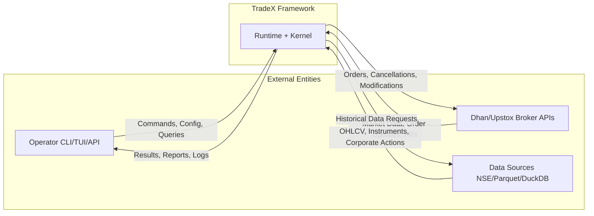

## 3. DFD Level 1 — Major System Components

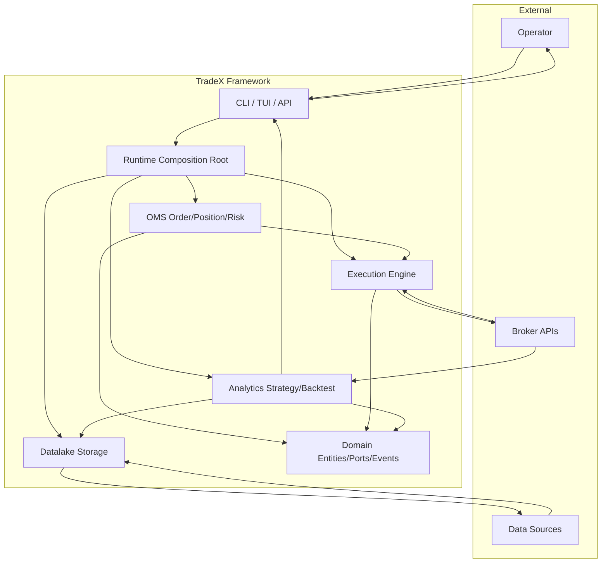

## 4. DFD Level 2A — Brokers Module

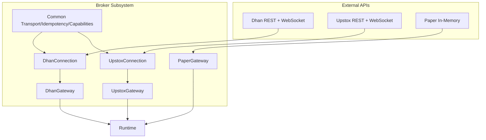

## 5. DFD Level 2B — OMS and Execution

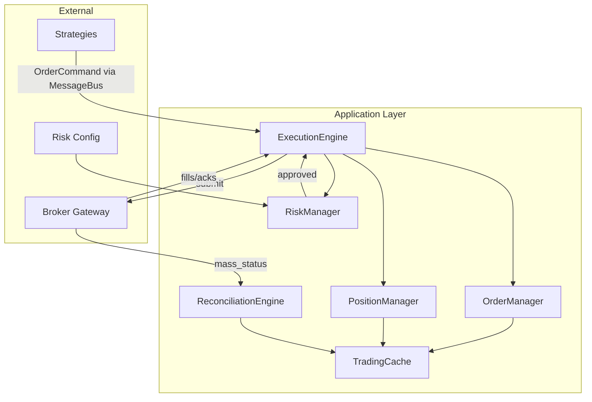

## 6. DFD Level 2C — Analytics Module

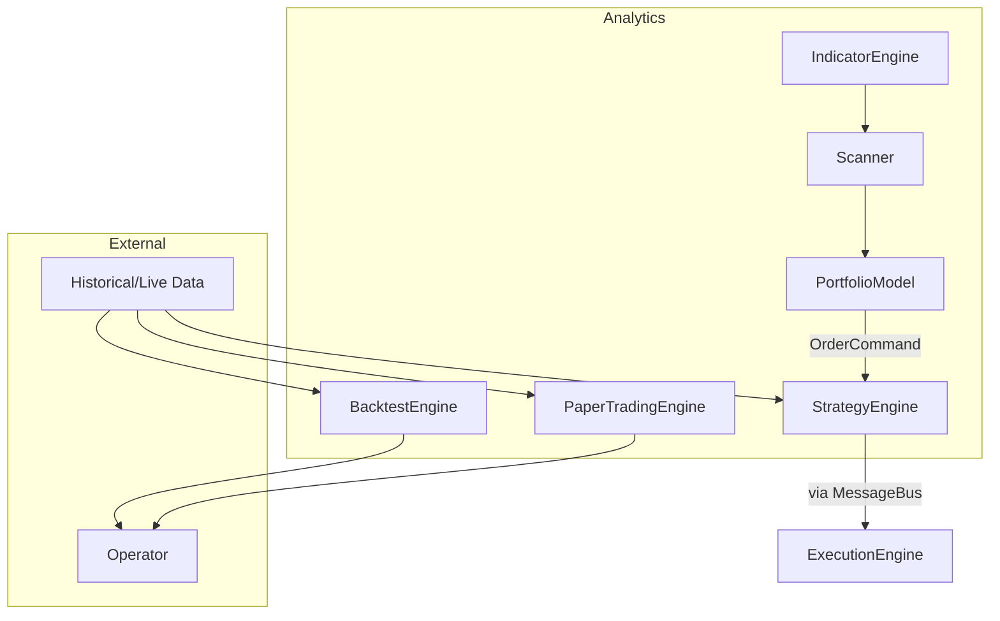

## 7. DFD Level 2D — Datalake Module

See [07-data-infrastructure.md](07-data-infrastructure.md) §14 for full datalake DFD.

## 8. DFD Level 2E — Runtime Composition Root

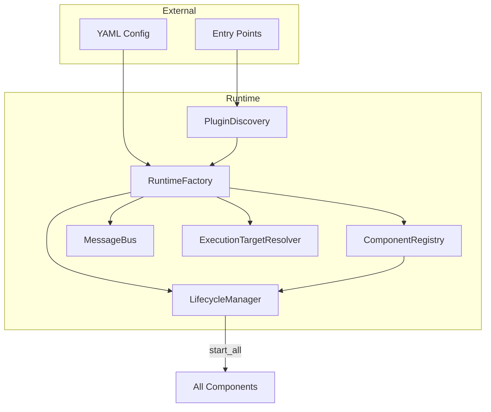

## 9. Flow §1 — Startup

```
Operator invokes CLI or connect(broker_id)
  → Runtime resolves broker ONCE via entry-point group (BrokerId enum)
  → Composition root wires:
      MessageBus (single instance)
      TradingCache
      RiskEngine (RiskGate port bound)
      ExecutionEngine (FillSource per environment)
      IdempotencyGuard
      Clock (SystemClock or FakeClock)
  → Structural boot checks:
      Single ExecutionEngine wiring
      Clock injection present
      RiskGate port bound (no getattr reach-through)
  → Environment frozen: REPLAY / BACKTEST / PAPER / LIVE
```

### Expected Behavior Contract: Startup

| | |
|---|---|
| Inputs | Config file, broker_id, environment, credentials |
| Outputs | Running runtime with all components in RUNNING state |
| Timing | All initialize() before start(); broker connect before traffic |
| Failure modes | Missing RiskGate → abort; duplicate ExecutionEngine → abort; auth failure → abort |
| State transitions | All components: INITIALIZED → RUNNING; Environment frozen |

## 10. Flow §6 — Quote (Market Data)

```
Broker DataClient → DataEngine → TradingCache.set_quote(instrument_id, quote)
  → MessageBus.publish(QUOTE|TICK) → Strategy handler
```

**Invariant:** cache-then-publish.

### Expected Behavior Contract: Quote

| | |
|---|---|
| Inputs | Venue WS/REST payload → QuoteSnapshot |
| Outputs | Cache updated; QUOTE/TICK published once per accepted update |
| Timing | Timestamp = venue time if present, else Clock.now() |
| Failure modes | Parse failure → log + drop; duplicate seq → ignore; disconnect → BROKER_DISCONNECTED |

## 11. Flow §7 — Order

```
Orchestrator → place(intent, correlation_id) → IdempotencyGuard.check_and_reserve
  → RiskEngine.check_order
      denied  → MessageBus(RISK_REJECTED) — no venue call
      approved → ExecutionEngine → FillSource.submit → Venue
                 ack/reject → Cache upsert (Order FSM) → MessageBus(ORDER_PLACED|ORDER_REJECTED)
                 fill → record_trade (idempotent on trade_id)
                   → Cache FSM → MessageBus(TRADE_APPLIED)
                   → PositionManager.apply_trade → MessageBus(POSITION_*)
```

See [04-execution-and-oms.md](04-execution-and-oms.md) for full contract.

## 12. Flow §9 — Reconciliation

```
BrokerAdapter.mass_status → ExecutionEngine
  → ReconciliationEngine.compare(local, broker) → DriftItems
  → HIGH/MEDIUM drift: Cache upsert + RiskEngine capital refresh
  → MessageBus(RECONCILIATION_DRIFT) → MessageBus(RECONCILIATION_COMPLETED)
```

Triggers: connect/reconnect, periodic mass-status, UNKNOWN outcomes.

## 13. Flow §11 — Four-Mode Parity

| Mode | Data Source | FillSource | Clock |
|------|-------------|------------|-------|
| REPLAY | MessageLog / recorded session | Engine replay | FakeClock |
| BACKTEST | Datalake / Parquet / DuckDB | SimulatedFillSource | FakeClock |
| PAPER | Live DataProvider | PaperFillSource | SystemClock |
| LIVE | Live DataProvider | BrokerFillSource | SystemClock |

**Invariant I12:** Strategy, RiskEngine, ExecutionEngine (minus FillSource), FeaturePipeline, position projection, and event types are identical across all four modes. Environment frozen at boot. Parity gate never skipped in LIVE.

## 14. Flow — FeaturePipeline (Research Pipeline)

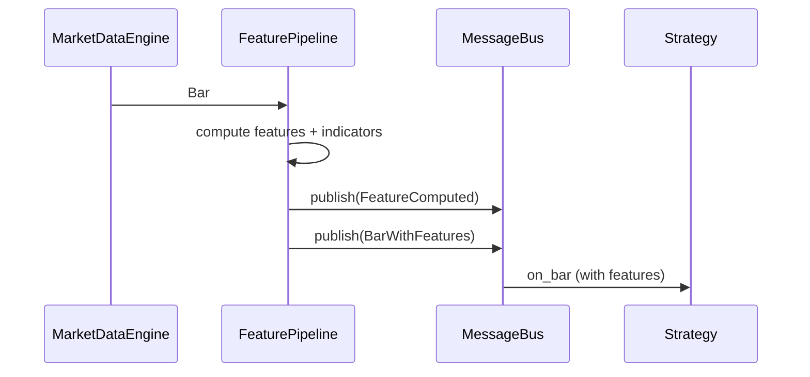

### Expected Behavior Contract: FeaturePipeline

| | |
|---|---|
| Inputs | Bar from MarketDataEngine |
| Outputs | FeatureComputed + enriched Bar on MessageBus |
| Timing | Completes before strategy.on_bar callback |
| Failure modes | Compute error → log + skip bar |

## 15. Flow — Order Placement (End-to-End Sequence)

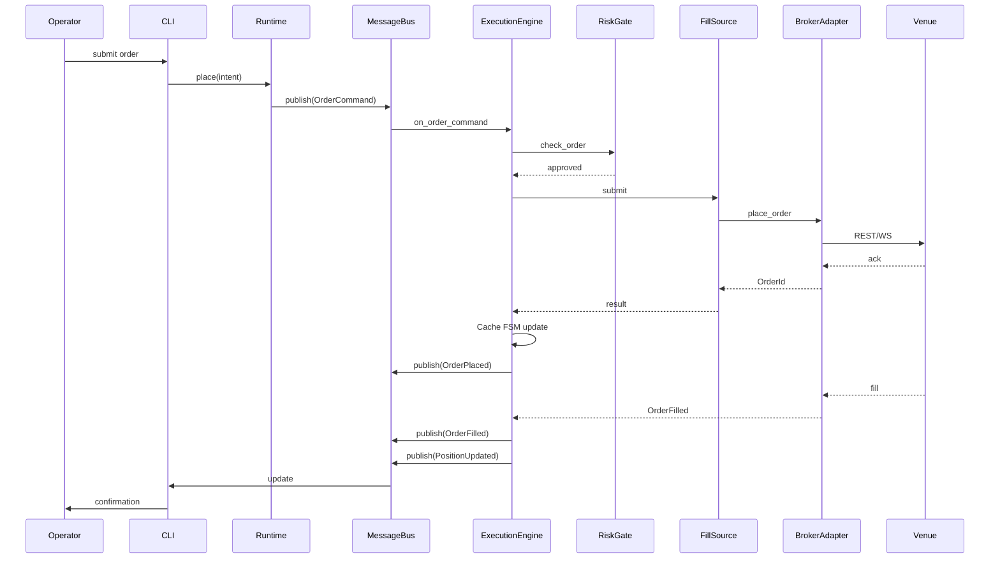

## 16. Flow — Market Data Ingestion

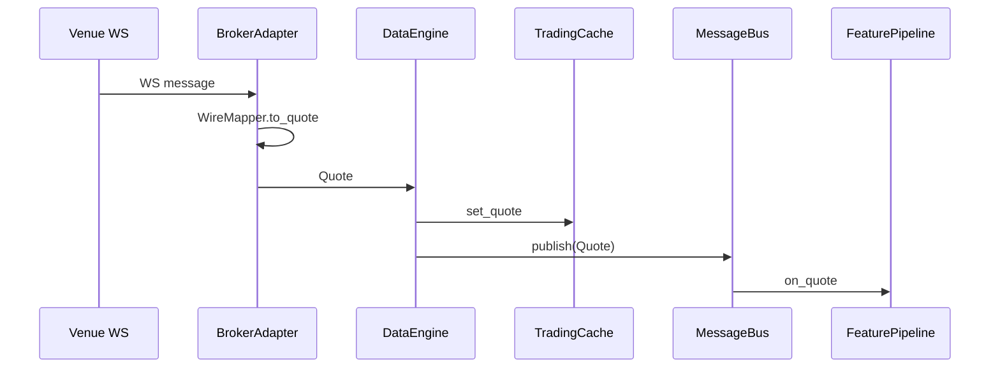

## 17. Flow — Replay Engine

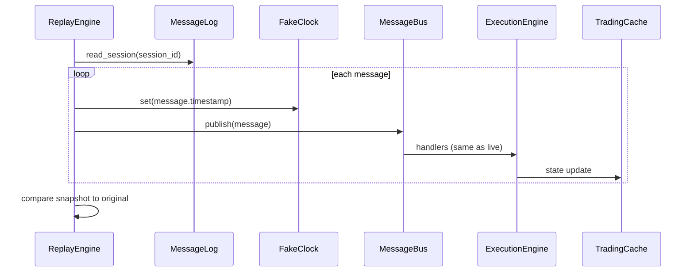

## 18. Flow — Analytics Research

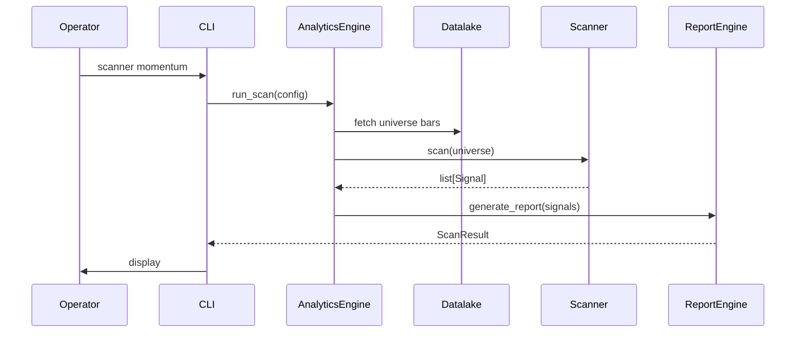

## 19. Flow — Reconciliation (Hot Path)

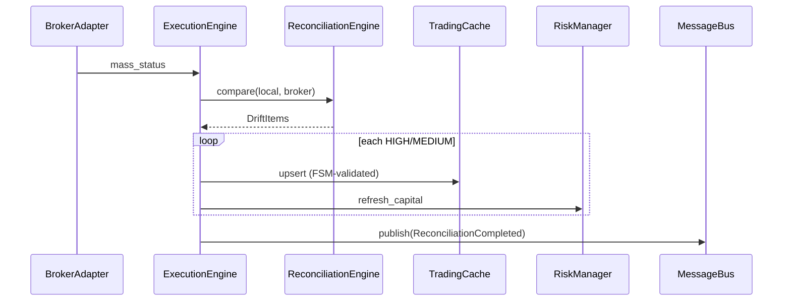

## 20. Flow — Component Lifecycle

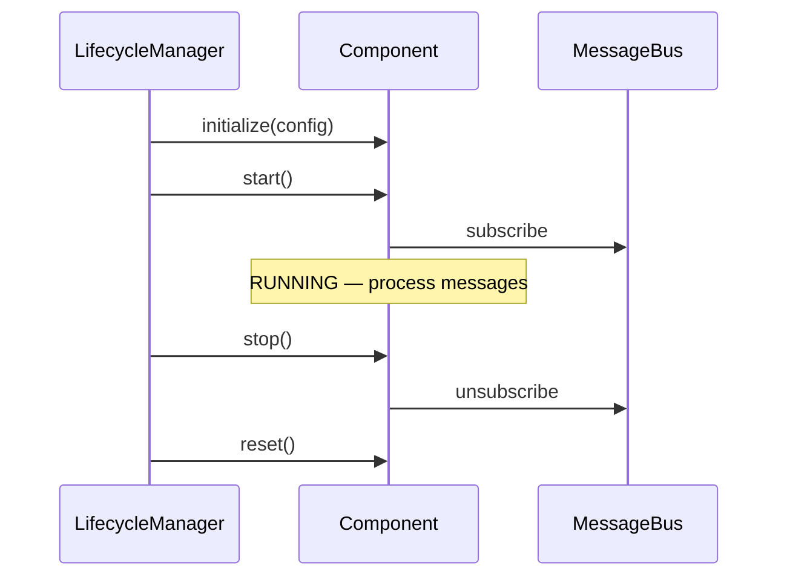

## 21. Flow — Backtest Engine

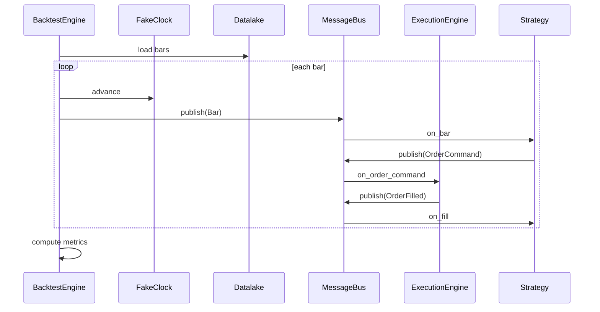

## 22. Broker API Scheduling and Cache Ownership

### Rate-Limit Call Path

1. Global QuotaScheduler — priority classes with max-wait deadlines
2. Per-broker MultiBucketRateLimiter — tokens from BrokerCapabilities

Both layers apply; callers must not bypass at transport boundary.

### Cache Ownership Summary

| Cache | Owner |
|-------|-------|
| Instrument master | Broker plugin + domain data catalog |
| Token persistence | Per-broker auth |
| Idempotency (orders) | Common broker infrastructure |
| Historical bars | Datalake |
| Quote snapshots | TradingCache via data engine |

## 23. DFD Coverage Summary

| Level | Scope | Document Section |
|-------|-------|------------------|
| 0 | System context | §2 |
| 1 | Major components | §3 |
| 2A | Brokers | §4 |
| 2B | OMS/Execution | §5 |
| 2C | Analytics | §6 |
| 2D | Datalake | §7 |
| 2E | Runtime | §8 |
| 3 | Cross-cutting flows | §9–21 |
