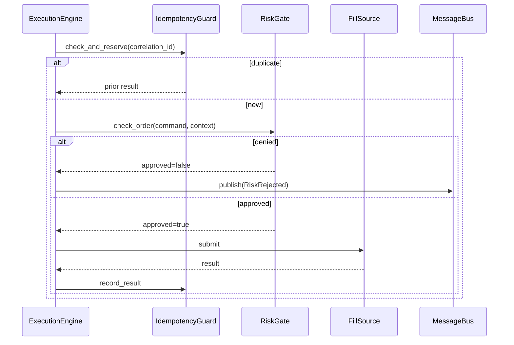

# 09 — Risk and Safety

## 1. Purpose

Risk management is mandatory for a system that trades real money. Every order path passes through RiskGate before venue I/O. Post-trade monitoring detects drawdown and triggers protective actions.

## 2. Multi-Layer Risk Model

```
┌─────────────────────────────────────────────────────────┐
│                    RISK LAYERS                           │
│                                                          │
│  Layer 1: Pre-Trade RiskGate (before venue I/O)        │
│  Layer 2: Post-Trade Monitor (position drawdown)        │
│  Layer 3: Circuit Breaker / Kill Switch                 │
│  Layer 4: Reconciliation (state drift detection)        │
└─────────────────────────────────────────────────────────┘
```

## 3. Pre-Trade RiskGate

### RiskCheckResult

```python
@dataclass(frozen=True)
class RiskCheckResult:
    approved: bool
    reason: str | None = None
    max_quantity: Decimal | None = None
    max_notional: Decimal | None = None
```

### RiskModel Protocol

```python
class RiskModel(Protocol):
    def check_order(self, command: OrderCommand, context: RiskContext) -> RiskCheckResult: ...
    def check_position(self, position: Position, context: RiskContext) -> RiskCheckResult: ...
    def check_account(self, account: Account, context: RiskContext) -> RiskCheckResult: ...
```

### Default Risk Checks

| Check | Rule | Action on Fail |
|-------|------|----------------|
| Order size | quantity <= max_order_size | RISK_REJECTED |
| Position limit | projected position <= max_position_size | RISK_REJECTED |
| Daily loss | daily_pnl >= -max_daily_loss | RISK_REJECTED |
| Order count | orders_today <= max_orders_per_day | RISK_REJECTED |
| Notional limit | quantity * price <= max_notional | RISK_REJECTED |
| Margin available | required_margin <= available_margin | RISK_REJECTED |
| Market hours | Within NSE/BSE/MCX session | RISK_REJECTED |
| Circuit limit | Price within exchange circuit band | RISK_REJECTED |
| Sector concentration | Max exposure per sector | RISK_REJECTED |
| Order rate | orders_per_minute <= limit | Throttle / RISK_REJECTED |
| STT headroom | Projected STT within daily budget | RISK_REJECTED |

### RiskContext

Snapshot at check time:

```python
@dataclass
class RiskContext:
    account: Account
    positions: dict[InstrumentId, Position]
    open_orders: list[Order]
    daily_pnl: Decimal
    order_count: dict[InstrumentId, int]
    clock: Clock
```

### Expected Behavior Contract: Pre-Trade Risk

| | |
|---|---|
| Inputs | OrderCommand, RiskContext snapshot |
| Outputs | RiskCheckResult; RISK_REJECTED event if denied |
| Timing | Synchronous; completes before venue I/O |
| Failure modes | RiskGate not bound → startup abort; check exception → deny (fail closed) |
| State transitions | Approved → proceed to FillSource; Denied → no venue call, no cache mutation |

## 4. Denial vs Rejection

| Event | Source | Reaches Venue? | Meaning |
|-------|--------|----------------|---------|
| RISK_REJECTED | Local RiskGate | No | Framework denied before I/O |
| ORDER_REJECTED | Venue | Yes (attempted) | Broker proved non-acceptance |
| UNKNOWN | Network | Ambiguous | Resolved by reconciliation only |

RISK_REJECTED must never be confused with ORDER_REJECTED.

## 5. Post-Trade Monitor

```python
class PostTradeMonitor(Component):
    def _on_position_update(self, event: PositionUpdated) -> None:
        if event.unrealized_pnl < -self._config.max_drawdown:
            self._bus.publish(RiskAlert(
                level=RiskLevel.CRITICAL,
                reason="Drawdown exceeded",
                instrument_id=event.instrument_id,
            ))
        if event.unrealized_pnl < -self._config.auto_flatten_loss:
            self._bus.publish(AutoFlattenOrder(
                instrument_id=event.instrument_id,
                reason="Auto-flatten triggered",
            ))
```

### Post-Trade Actions

| Trigger | Action |
|---------|--------|
| Drawdown exceeded | RiskAlert (CRITICAL) published |
| Auto-flatten threshold | AutoFlattenOrder published → ExecutionEngine |
| Daily loss limit | Block all new orders until next session |
| Position concentration | Warning alert to operator |

| Position concentration | Post-fill concentration | Alert |
| Greeks exposure | Option portfolio risk | Alert / hedge signal |
| Realized P&L | Daily realized loss | Alert / kill switch |
| Unrealized P&L | MTM drawdown | Alert / kill switch |

## 6. Pluggable Risk Rules Engine

Risk checks are composable via the `RiskRule` protocol:

```python
class RiskRule(Protocol):
    def check(self, command: OrderCommand, context: RiskContext) -> RiskCheckResult: ...

class RiskRulesEngine:
    def __init__(self, rules: list[RiskRule]) -> None: ...
    def check(self, command: OrderCommand, context: RiskContext) -> RiskCheckResult: ...
```

Built-in rules: PositionLimitRule, OrderSizeRule, DailyLossRule, MarginRule, MarketHoursRule, CircuitLimitRule, OrderRateRule. Custom rules register via config without modifying ExecutionEngine.

## 7. Circuit Breaker and Kill Switch

```python
class CircuitBreaker:
    def trip(self, reason: str) -> None: ...
    def reset(self) -> None: ...
    @property
    def is_tripped(self) -> bool: ...
```

When tripped:
- All new OrderCommands rejected with RISK_REJECTED
- Existing orders remain (no automatic cancel unless configured)
- Operator must explicitly reset
- KILL_SWITCH event published to MessageBus and audit log

## 8. Loss Circuit Breaker

```python
class LossCircuitBreaker:
    def check(self, daily_pnl: Decimal) -> CircuitBreakerResult: ...
    def trip(self, reason: str) -> None: ...
    def reset(self) -> None: ...
```

Trips when daily_pnl exceeds configured loss threshold. When tripped:
- All new OrderCommands rejected with RISK_REJECTED
- TradingState → HALTED
- AlertingEngine publishes CRITICAL alert
- Operator must explicitly reset

Integrated into RiskManager.check_order — evaluated on every order path.

## 9. LIVE Safety Gates

Before LIVE mode accepts order traffic, all gates must pass:

| Gate | Check |
|------|-------|
| Parity gate | Four-mode FSM parity test passed |
| Reconciliation | No HIGH drift after venue connect |
| RiskGate bound | Structural boot check confirmed |
| LIVE profile | Strict risk limits loaded |
| Operator confirm | `--confirm` flag on CLI |
| BrokerHealthMonitor | Venue connected and healthy |

Failure on any gate → abort startup or remain HALTED.

## 10. Idempotency

```python
class IdempotencyGuard(Protocol):
    def check_and_reserve(self, correlation_id: CorrelationId) -> IdempotencyResult: ...
    def record_result(self, correlation_id: CorrelationId, result: OrderResult) -> None: ...
```

### Idempotency Flow

1. OrderCommand arrives with correlation_id
2. IdempotencyGuard.check_and_reserve(correlation_id)
3. If duplicate → return prior OrderResult (no venue call)
4. If new → reserve slot, proceed to RiskGate
5. After venue response → record_result(correlation_id, result)

### Expected Behavior Contract: Idempotency

| | |
|---|---|
| Inputs | correlation_id (UUID, mandatory on OrderCommand) |
| Outputs | IdempotencyResult (NEW or DUPLICATE with prior result) |
| Timing | Checked before RiskGate and venue I/O |
| Failure modes | Missing correlation_id → reject; guard unavailable → fail closed (no order) |

## 11. Reconciliation Safety

Reconciliation detects state drift between local cache and broker:

| Severity | Examples | Action |
|----------|----------|--------|
| HIGH | Missing local/broker order, quantity mismatch | Cache heal + alarm + event |
| MEDIUM | Price/avg drift beyond tolerance | Cache heal + event |
| LOW | Cosmetic/status lag within grace | Log only |

### Safety Rules

- HIGH drift is never left silent
- Reconciliation completes before accepting new risk after reconnect
- Partial apply → TradingState DEGRADED + alarm
- Compare exception → fail-fast / HALTED

## 9. Real-Money Safety Invariants

| ID | Invariant |
|----|-----------|
| S1 | RiskGate checked before every venue I/O |
| S2 | IdempotencyGuard checked before RiskGate |
| S3 | correlation_id mandatory on all order intents |
| S4 | Fail closed: risk check exception → deny |
| S5 | Fail closed: idempotency unavailable → deny |
| S6 | UNKNOWN never mapped to REJECTED without venue proof |
| S7 | Environment.LIVE requires parity gate pass |
| S8 | Kill switch blocks all new orders when tripped |
| S9 | Reconciliation HIGH drift triggers alarm |
| S10 | No bypass path outside ExecutionEngine |
| S11 | Audit log for every order state transition |
| S13 | LIVE requires parity gate + operator confirm | Boot check |
| S14 | Loss circuit breaker blocks all orders when tripped | Integration test |

## 10. Risk Configuration

```yaml
risk:
  max_order_size: 1000
  max_position_size: 5000
  max_daily_loss: 50000
  max_orders_per_day: 100
  max_notional: 1000000
  max_drawdown: 25000
  auto_flatten_loss: 50000
  kill_switch_enabled: true
```

All limits configurable per mode profile. LIVE profiles are more restrictive than PAPER.

## 11. Risk Sequence Diagram



## 12. Trading State

| State | Meaning | Accepts Orders? |
|-------|---------|-----------------|
| READY | Normal operation | Yes |
| DEGRADED | Partial reconciliation or non-critical drift | Yes, with warnings |
| HALTED | Kill switch or critical failure | No |
| RECONCILING | Reconciliation in progress after reconnect | No |

State transitions published via MessageBus. Operator notified on DEGRADED and HALTED.

## 13. Audit Requirements

Every order lifecycle event must be auditable:

| Event | Audit Fields |
|-------|-------------|
| OrderCommand received | correlation_id, instrument, side, qty, timestamp |
| RiskCheck | approved, reason, limits checked |
| Venue submission | order_id, venue response, latency |
| Fill | trade_id, price, qty, timestamp |
| Reconciliation | drift items, severity, actions taken |
| Kill switch | reason, operator, timestamp |

Audit sink is append-only. No deletion or modification of audit records.
