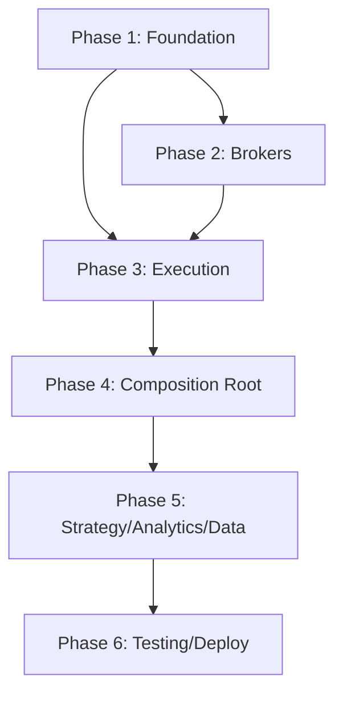

# 14 — Implementation Guide

## 1. Purpose

This document provides the end-to-end build order, target folder organization, module responsibilities, and acceptance criteria for implementing the TradeX framework as specified in documents 00–13.

## 2. Implementation Phases

### Phase 1: Foundation (Week 1–2)

**Goal:** Core infrastructure that all other components depend on.

| Task | Deliverable | Acceptance |
|------|-------------|------------|
| Domain model | Entities, value objects, enums, messages | All types importable; frozen dataclasses; Decimal for money |
| Port protocols | Strategy, BrokerAdapter, FillSource, RiskModel, Clock, EventBusPort | Protocol compliance testable |
| MessageBus | Subscribe, publish, routing, optional log | Unit tests: publish delivers to subscribers |
| Component + LifecycleManager | initialize/start/stop/reset lifecycle | Unit tests: lifecycle order enforced |
| Config schema | AppConfig Pydantic model, YAML loader | Validation rejects invalid config |
| Observability base | Structured logging, metrics interface | JSON log format verified |

**Exit criteria:** MessageBus routes messages; components follow lifecycle; config validates.

### Phase 2: Broker Adapter Framework (Week 3–4)

**Goal:** Pluggable broker connectivity with standardized gateway pattern.

| Task | Deliverable | Acceptance |
|------|-------------|------------|
| Common infrastructure | Transport, idempotency, capabilities, status mapper | Unit tests pass |
| BrokerAdapter protocol | Full port composition | Protocol compliance test |
| Paper provider | PaperGateway, PaperOrders, PaperMarketData, PaperPortfolio | AdapterTestHarness pass |
| Dhan provider | Gateway, Connection, 5 sub-adapters, wire mapper, auth | AdapterTestHarness pass (sandbox) |
| Upstox provider | Gateway, Connection, 5 sub-adapters, wire mapper, auth | AdapterTestHarness pass (sandbox) |
| Plugin registration | Entry points, self-registration | Discovery finds all 3 brokers |

**Exit criteria:** All three brokers pass AdapterTestHarness; plugin discovery works.

### Phase 3: Execution Engine (Week 5)

**Goal:** Zero-parity order lifecycle with risk and idempotency.

| Task | Deliverable | Acceptance |
|------|-------------|------------|
| OrderManager | Order FSM with validated transitions | FSM tests: all transitions + illegal rejected |
| PositionManager | Position projection from fills | Fill → correct position state |
| RiskManager | Pre-trade RiskGate with configurable limits | Risk rejection prevents venue call |
| IdempotencyGuard | correlation_id dedup | Duplicate returns prior result |
| ExecutionEngine | Orchestrates order path via MessageBus | Component test: full order spine |
| FillSource implementations | Replay, Simulated, Paper, Broker | Four-mode parity test passes |
| ReconciliationEngine | Pure compare functions | Unit tests: drift severity correct |

**Exit criteria:** Order flow works end-to-end with PaperFillSource; four-mode parity test passes; no bypass paths.

### Phase 4: Composition Root (Week 6)

**Goal:** Wire everything together; four-mode resolution.

| Task | Deliverable | Acceptance |
|------|-------------|------------|
| RuntimeFactory | Build from AppConfig | All components wired correctly |
| PluginDiscovery | Entry-point broker/exchange resolution | BrokerId enum resolution |
| ExecutionTargetResolver | FillSource + Clock per mode | REPLAY/BACKTEST/PAPER/LIVE matrix correct |
| TradingCache | Authoritative in-memory state | Cache-then-publish verified |
| MessageLog | Durable event store | Append + replay verified |
| Startup flow | Boot checks, environment freeze | Missing RiskGate → abort |
| YAML profiles | replay, backtest, paper, live configs | Profile validation passes |

**Exit criteria:** `tradex replay`, `tradex backtest`, and `tradex paper` run full sessions.

### Phase 5: Strategy, Analytics, and Data (Week 7–8)

**Goal:** Full analytics suite and research pipeline.

| Task | Deliverable | Acceptance |
|------|-------------|------------|
| FeaturePipeline | Market Data → features → indicators | Pipeline ordering test |
| StrategyEngine | Register, route messages, emit orders | Strategy receives enriched bars |
| ReplayEngine | Event-sourced replay from MessageLog | Deterministic replay test |
| BacktestEngine | Historical simulation | Backtest produces metrics |
| PaperTradingEngine | Live data + paper fills | Paper session test |
| LiveTradingEngine | Live data + broker fills | Live safety gates test |
| Scanner suite | Momentum, breakout, volume, RS | Scan pipeline test |
| Analytics modules | Ranking, sector, options, futures, volatility, orderflow, breadth, volume profile, probability, fundamentals | Each module integration test |
| WalkForwardEngine | Parameter optimization | Walk-forward test |
| ReportEngine | PnL, drawdown, Sharpe | Report generation test |
| MarketDataEngine | Live quote flow, cache-then-publish | Quote flow contract test |
| Datalake core | Parquet, DuckDB, ingestion, quality, corporate actions | Data roundtrip test |
| SourceSelectionPolicy | Federated history resolution | Source selection test |
| NSE exchange plugin | Calendar, trading hours | Trading day checks |
| MCP server | Datalake query tools | MCP integration test |
| Analytics-first CLI | Full command tree | All commands functional |
| TUI + FastAPI | Terminal and REST surfaces | Interface smoke tests |

**Exit criteria:** Full replay → backtest → paper → live workflow demonstrable.

### Phase 6: Testing, Observability, and Deployment (Week 9–10)

**Goal:** Production readiness.

| Task | Deliverable | Acceptance |
|------|-------------|------------|
| Architecture tests | Import linter, flow contracts | CI-blocking pass |
| Parity gate | Four-mode FSM test | Never skipped in LIVE |
| Bypass path scan | Architecture test | Zero alternate order paths |
| Replay determinism | Log replay → identical cache | Nightly pass |
| E2E tests | Full session flows | Startup → order → fill → reconcile |
| Observability | Metrics, tracing, health endpoints | Prometheus scrape works |
| Audit sink | Append-only order audit | All transitions logged |
| Dockerfile | Multi-stage, non-root | Image builds and runs |
| CI pipeline | All stages configured | Green build on main |
| Documentation | API docs, CLI help | Complete and accurate |

**Exit criteria:** CI green; Docker image runs; 147/147 capabilities COVERED; production checklist complete.

## 3. Target Folder Organization

```
tradex/
├── src/
│   ├── tradex/                          # Public SDK
│   │   ├── __init__.py                  # TradingNode, connect(), __version__
│   │   ├── node.py                      # TradingNode entry point
│   │   ├── cli.py                       # Click CLI
│   │   └── session.py                   # Session management
│   │
│   ├── domain/                          # Pure business logic
│   │   ├── entities.py                  # Order, Position, Quote, Instrument
│   │   ├── events.py                    # DomainEvent, EventType
│   │   ├── ports.py                     # All Protocol definitions
│   │   ├── enums.py                     # ExchangeId, OrderSide, Environment
│   │   ├── value_objects.py             # Money, Price, Quantity, IDs
│   │   ├── messages.py                  # Message hierarchy
│   │   ├── risk.py                      # RiskConfig, RiskCheckResult
│   │   ├── reconciliation.py            # ReconciliationEngine (pure)
│   │   └── indicators.py               # Pure indicator functions
│   │
│   ├── application/                     # Use-cases
│   │   ├── oms/                         # OrderManager, PositionManager, RiskManager
│   │   ├── execution/                   # ExecutionEngine, FillSource
│   │   ├── trading/                     # TradingOrchestrator
│   │   ├── portfolio/                   # PortfolioModel implementations
│   │   ├── data/                        # MarketDataEngine
│   │   └── scheduling/                  # QuotaScheduler
│   │
│   ├── analytics/                       # Full analytics suite
│   │   ├── backtest/                    # BacktestEngine
│   │   ├── replay/                      # ReplayEngine
│   │   ├── paper/                       # PaperTradingEngine
│   │   ├── pipeline/                    # FeaturePipeline
│   │   ├── scanner/                     # Scanner suite
│   │   ├── strategy/                    # StrategyPipeline
│   │   ├── ranking/ sector/ options/ futures/
│   │   ├── volatility/ orderflow/ market_breadth/
│   │   ├── volume_profile/ probability/ fundamentals/
│   │   ├── walk_forward/ reports/ indicators/
│   │   └── facade.py                    # Analytics entry
│   │
│   ├── infrastructure/                  # Adapters
│   │   ├── message_bus.py               # MessageBus, MessageRouter
│   │   ├── component.py                 # Component, LifecycleManager
│   │   ├── idempotency.py               # IdempotencyGuard
│   │   ├── auth/                        # TokenStore, credential resolution
│   │   ├── io/                          # ParquetWriter, atomic writes
│   │   ├── resilience/                  # CircuitBreaker, RateLimiter
│   │   ├── observability/               # Logging, metrics, tracing, audit
│   │   ├── lifecycle.py                 # LifecycleManager
│   │   └── clock.py                     # SystemClock, FakeClock
│   │
│   ├── runtime/                         # Composition root
│   │   ├── factory.py                   # RuntimeFactory.build()
│   │   ├── discovery.py                 # Plugin discovery
│   │   ├── execution_target.py          # FillSource + Clock resolution
│   │   ├── runtime.py                   # Runtime dataclass
│   │   └── registry.py                  # ComponentRegistry
│   │
│   ├── plugins/                         # Broker + exchange plugins
│   │   ├── brokers/
│   │   │   ├── common/                  # Shared infrastructure (5 files)
│   │   │   ├── dhan/                    # 8 files: gateway, connection, sub-adapters
│   │   │   ├── upstox/                  # 8 files
│   │   │   └── paper/                   # 6 files
│   │   └── exchanges/
│   │       └── nse/                     # ExchangeAdapter, TradingCalendar
│   │
│   ├── datalake/                        # Data lake
│   │   ├── core/                        # Schema, migrations, IO
│   │   ├── ingestion/                   # Federated sync
│   │   ├── storage/                     # Parquet catalog, DuckDB
│   │   ├── quality/                     # Validation, health
│   │   ├── analytics/                   # SQL views
│   │   ├── mcp/                         # MCP server
│   │   └── gateway.py                   # DataLakeGateway
│   │
│   ├── interface/                       # Presentation
│   │   ├── api/                         # FastAPI routers
│   │   └── ui/                          # Textual TUI, CLI commands
│   │
│   └── config/                          # AppConfig schema + profiles
│
├── tests/
│   ├── unit/                            # Domain, FSM, messages
│   ├── component/                       # OMS, execution, risk
│   ├── integration/                     # Broker sandbox, datalake
│   ├── e2e/                             # Full session flows
│   └── architecture/                    # Import linter, flow contracts
│
├── config/
│   ├── trading.yaml                     # Base config
│   ├── backtest.yaml                    # Backtest profile
│   ├── sandbox.yaml                     # Sandbox profile
│   └── live.yaml                        # Live profile
│
├── Dockerfile
├── pyproject.toml
└── specs/                               # This documentation suite
```

## 4. Module Responsibilities

| Module | Files (target) | Owns |
|--------|----------------|------|
| domain/ | ~10 | Entities, messages, ports, pure logic |
| application/ | ~15 | OMS, execution, strategy, analytics, data |
| infrastructure/ | ~15 | MessageBus, auth, IO, resilience, observability |
| runtime/ | ~5 | Composition root, discovery, mode resolution |
| plugins/brokers/ | ~27 | 3 providers + common |
| plugins/exchanges/ | ~3 | NSE adapter + calendar |
| datalake/ | ~10 | Storage, ingestion, quality, analytics |
| interface/ | ~8 | CLI, TUI, API |
| config/ | ~3 | Schema + profiles |
| tradex/ | ~4 | Public SDK + CLI entry |
| **Total** | **~100** | Full framework |

## 5. Build Order Dependency Graph



## 6. Acceptance Criteria Summary

| Phase | Key Acceptance |
|-------|----------------|
| 1 | MessageBus routes; MessageLog append; lifecycle works |
| 2 | 3 venue plugins pass AdapterTestHarness |
| 3 | Order spine works; four-mode parity; no bypass paths |
| 4 | replay + backtest + paper sessions run |
| 5 | Full analytics suite; replay → backtest → paper → live |
| 6 | CI green; 147/147 COVERED; production checklist done |

## 7. Implementation Principles

1. **Build bottom-up** — domain first, then application, then infrastructure, then runtime
2. **Test each phase** — do not proceed until exit criteria met
3. **Paper before live** — always validate with PaperFillSource before BrokerFillSource
4. **One broker at a time** — Paper first, then Dhan, then Upstox
5. **Zero-parity from day one** — never create a separate backtest order path
6. **Fail closed** — risk and idempotency deny by default on error
7. **No shortcuts** — every order path goes through ExecutionEngine

## 8. Coverage Cross-Reference

| Topic | Primary Spec | Phase |
|-------|-------------|-------|
| Scope and vision | 00 | — |
| Architecture HLD | 01 | 1, 4 |
| Domain model | 02 | 1 |
| Message bus | 03 | 1 |
| Execution/OMS | 04 | 3 |
| Strategy/analytics | 05 | 5 |
| Broker adapters | 06 | 2 |
| Data infrastructure | 07 | 5 |
| Flows/DFDs | 08 | 3, 4, 5 |
| Risk/safety | 09 | 3 |
| Observability | 10 | 1, 6 |
| Configuration | 11 | 4 |
| Testing | 12 | 6 |
| Deployment | 13 | 6 |
| This guide | 14 | All |

## 9. Framework Contract Verification

Before declaring implementation complete, verify:

- [ ] Strategy code runs unchanged in REPLAY, BACKTEST, PAPER, LIVE
- [ ] No order path bypasses ExecutionEngine
- [ ] RiskGate blocks venue I/O on denial
- [ ] Four-mode parity gate passes
- [ ] ReplayEngine reproduces identical state from MessageLog
- [ ] 147/147 capabilities COVERED in ledger
- [ ] IdempotencyGuard prevents duplicate submissions
- [ ] Reconciliation heals HIGH drift
- [ ] Environment frozen at boot
- [ ] All brokers pass AdapterTestHarness
- [ ] Replay determinism test passes
- [ ] Architecture import contracts enforced
- [ ] Audit log captures all order transitions
- [ ] Health probes respond correctly
- [ ] LIVE requires explicit confirmation
