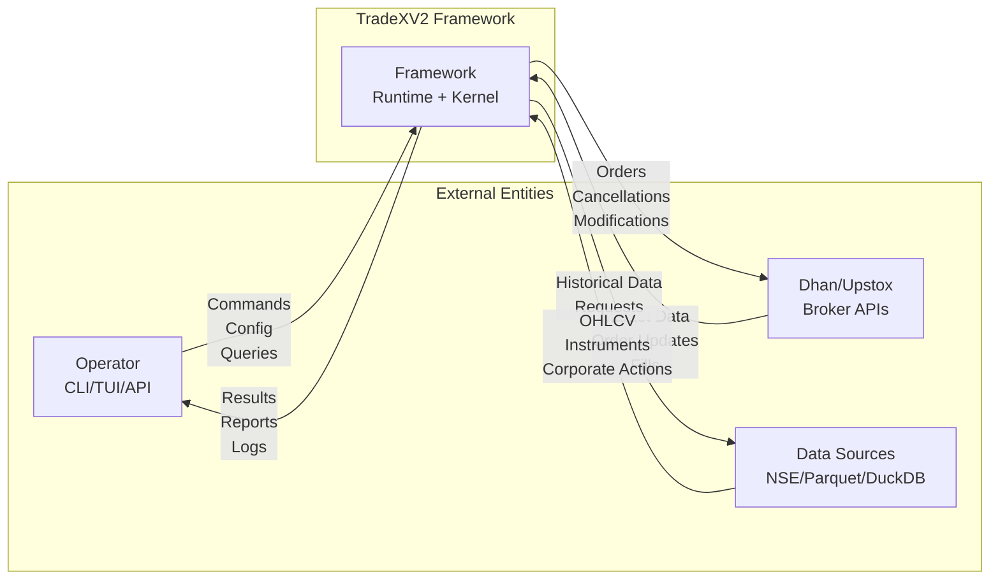
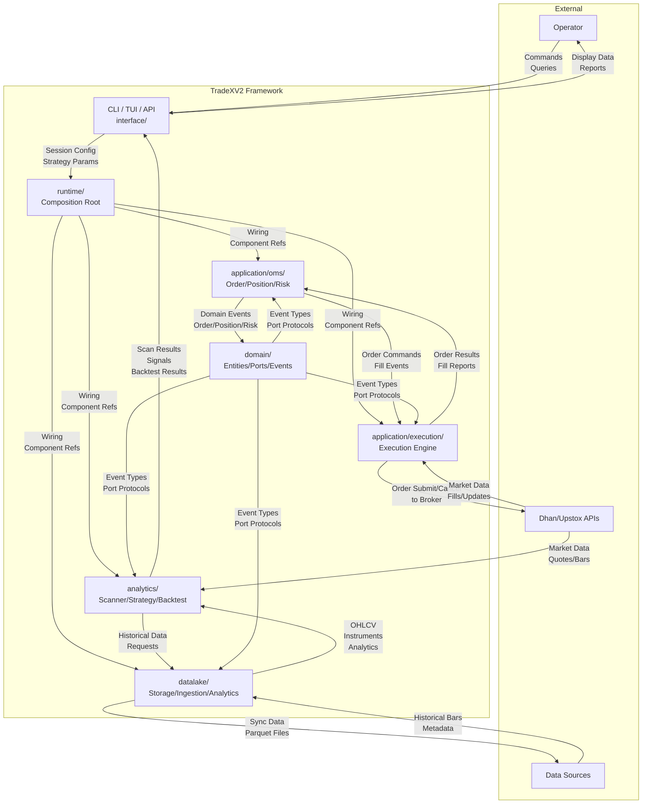
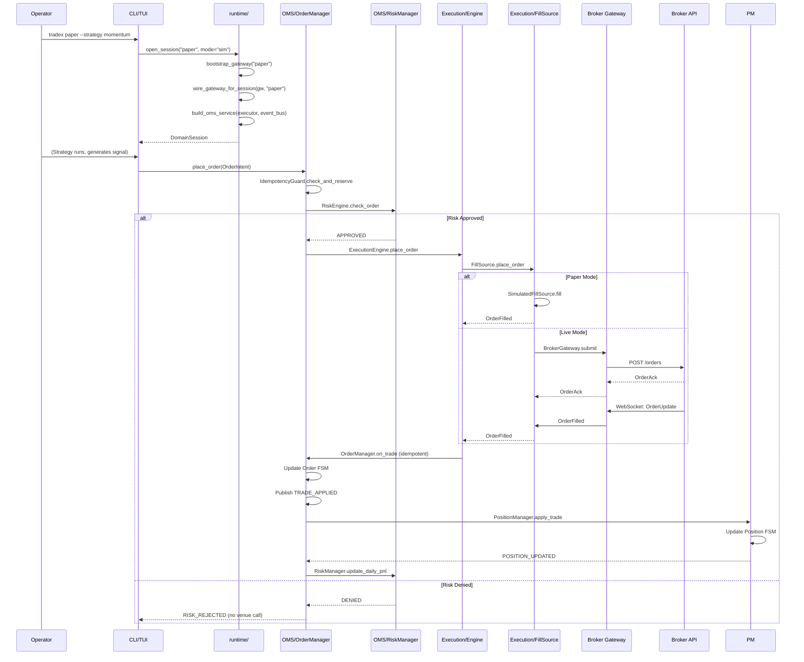
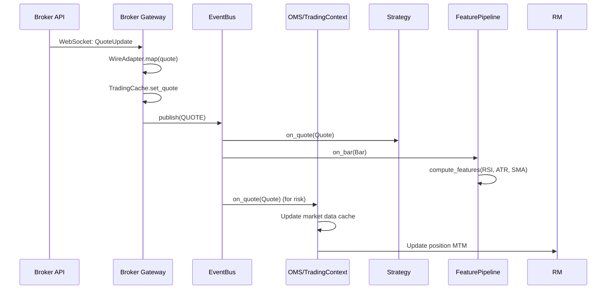
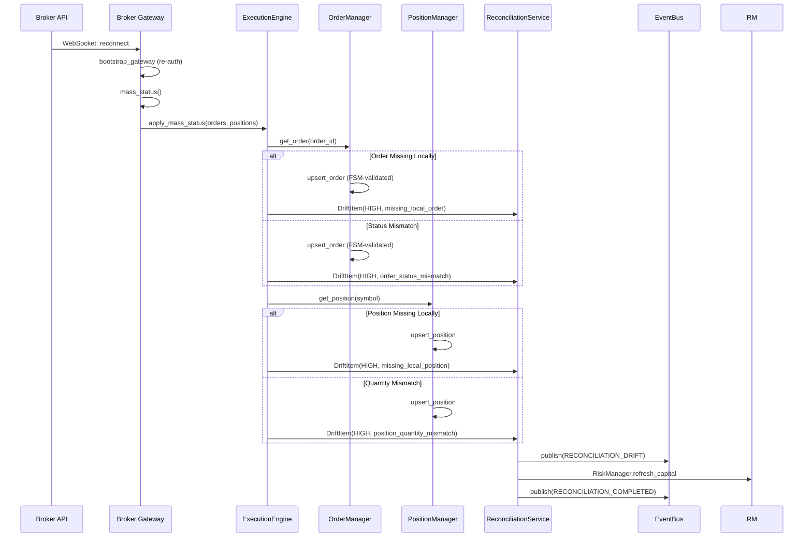

# Building a Trading Framework Like NautilusTrader — From-Scratch Design

Let me design this as a **professional, high-performance, event-driven trading framework** inspired by NautilusTrader's architecture, but tailored for the Indian markets context and modern Python.

---

## 1. Core Architecture Vision

### Design Principles

1. **Message-Driven Everything** — All communication between components flows through a typed message bus. No direct method calls between subsystems.
2. **Component Model** — Strategy, Risk, Execution, Portfolio, Data are pluggable components with well-defined interfaces.
3. **Deterministic Replay** — Backtest is a first-class citizen; every event is timestamped and reproducible.
4. **Zero-Allocation Hot Paths** — Critical path (order placement, fill processing) minimizes object creation.
5. **Multi-Asset, Multi-Market** — Not just Indian exchanges; extensible to any market.
6. **Type Safety First** — Extensive use of `Protocol`, `TypedDict`, `dataclass`, and runtime validation.
7. **Observability Built-In** — Metrics, tracing, and audit are structural, not added later.

### High-Level Architecture

```
┌─────────────────────────────────────────────────────────────────────────┐
│                              CLIENTS                                    │
│  ┌─────────┐  ┌─────────┐  ┌─────────┐  ┌─────────┐  ┌─────────┐       │
│  │  REST   │  │  gRPC   │  │  WebSocket│  │  CLI    │  │  TUI    │       │
│  └─────────┘  └─────────┘  └─────────┘  └─────────┘  └─────────┘       │
└──────────────────────────────┬──────────────────────────────────────────┘
                               │
┌──────────────────────────────▼──────────────────────────────────────────┐
│                        FACADE / ENTRY POINT                             │
│  ┌───────────────────────────────────────────────────────────────────┐  │
│  │  tradex.TradingNode  —  Single entry point for all capabilities   │  │
│  │  • configure(components, risk, execution, data)                    │  │
│  │  • start() / stop() / run()                                        │  │
│  │  • submit_order() / cancel_order() / query()                       │  │
│  └───────────────────────────────────────────────────────────────────┘  │
└──────────────────────────────┬──────────────────────────────────────────┘
                               │
┌──────────────────────────────▼──────────────────────────────────────────┐
│                        MESSAGE BUS (Event Engine)                      │
│  ┌───────────────────────────────────────────────────────────────────┐  │
│  │  EventBus  —  Typed, async, ordered, persistent (optional)        │  │
│  │  • subscribe(handler, msg_type)                                    │  │
│  │  • publish(msg)                                                    │  │
│  │  • replay(from_ts, to_ts)                                          │  │
│  │  • dead_letter_queue                                               │  │
│  └───────────────────────────────────────────────────────────────────┘  │
└──────────────────────────────┬──────────────────────────────────────────┘
                               │
    ┌──────────────────────────┼──────────────────────────┐
    │                          │                          │
    ▼                          ▼                          ▼
┌──────────────┐      ┌──────────────┐      ┌──────────────┐
│   STRATEGY   │      │    RISK      │      │  EXECUTION   │
│  Component   │      │  Component   │      │  Component   │
│              │      │              │      │              │
│ • on_bar()   │      │ • check()    │      │ • submit()   │
│ • on_fill()  │      │ • approve()  │      │ • cancel()   │
│ • on_order() │      │ • reject()   │      │ • modify()   │
└──────────────┘      └──────────────┘      └──────────────┘
    │                          │                          │
    ▼                          ▼                          ▼
┌──────────────┐      ┌──────────────┐      ┌──────────────┐
│  PORTFOLIO   │      │   DATA       │      │  BROKER      │
│  Component   │      │  Component   │      │  ADAPTERS    │
│              │      │              │      │              │
│ • position() │      │ • stream()   │      │ • dhan       │
│ • pnl()      │      │ • history()  │      │ • upstox     │
│ • equity()   │      │ • lookup()   │      │ • paper      │
└──────────────┘      └──────────────┘      └──────────────┘
```

---

## 2. Project Structure

```
tradex/
├── src/
│   ├── tradex/                          # Public SDK (thin facade)
│   │   ├── __init__.py                  # TradingNode, connect(), __version__
│   │   ├── node.py                      # TradingNode — main entry point
│   │   ├── cli.py                       # Click CLI
│   │   └── session.py                   # Session management
│   │
│   ├── tradex_core/                     # Core framework (no I/O, no broker deps)
│   │   ├── __init__.py
│   │   ├── messages/                    # Typed message definitions
│   │   │   ├── __init__.py
│   │   │   ├── base.py                  # Message, Header, MsgType enum
│   │   │   ├── market.py                # Quote, Trade, Bar, OrderBook
│   │   │   ├── order.py                 # Order, OrderType, Side, TimeInForce
│   │   │   ├── execution.py             # Fill, ExecType, Liquidity
│   │   │   ├── portfolio.py             # Position, PnL, AccountState
│   │   │   ├── risk.py                  # RiskCheck, RiskReject, RiskParams
│   │   │   ├── system.py                # Startup, Shutdown, Config
│   │   │   └── factory.py               # MessageFactory — zero-alloc construction
│   │   │
│   │   ├── common/                      # Shared utilities
│   │   │   ├── __init__.py
│   │   │   ├── enums.py                 # InstrumentType, Exchange, Currency, etc.
│   │   │   ├── types.py                 # InstrumentId, AccountId, StrategyId, etc.
│   │   │   ├── money.py                 # Price, Quantity, Money (Decimal-based)
│   │   │   ├── clock.py                 # Clock protocol, SystemClock, FakeClock
│   │   │   ├── uuid.py                  # Fast UUID generation
│   │   │   └── logging.py               # Structured logging
│   │   │
│   │   ├── model/                       # Domain model (entities, value objects)
│   │   │   ├── __init__.py
│   │   │   ├── instrument.py            # Instrument, InstrumentMaster
│   │   │   ├── order.py                 # Order, OrderState, OrderStatus
│   │   │   ├── position.py              # Position, PositionSide, PositionType
│   │   │   ├── account.py               # Account, Balance, Margin
│   │   │   └── strategy.py              # StrategyConfig, StrategyState
│   │   │
│   │   ├── ports/                       # Abstract interfaces (Protocols)
│   │   │   ├── __init__.py
│   │   │   ├── data.py                  # DataProvider, HistoricalData
│   │   │   ├── execution.py             # ExecutionProvider, FillSource
│   │   │   ├── broker.py                # BrokerAdapter, BrokerInfo
│   │   │   ├── persistence.py           # EventStore, OrderStore, PositionStore
│   │   │   ├── logging.py               # Logger, EventLogger
│   │   │   └── metrics.py               # MetricsCollector
│   │   │
│   │   ├── engine/                      # Core engines
│   │   │   ├── __init__.py
│   │   │   ├── event_bus.py             # EventBus, Subscription, Handler
│   │   │   ├── message_processor.py     # MP — processes messages in order
│   │   │   ├── risk_engine.py           # RiskEngine — pre-trade checks
│   │   │   ├── execution_engine.py      # ExecutionEngine — order lifecycle
│   │   │   ├── order_manager.py         # OrderManager — FSM, idempotency
│   │   │   ├── position_manager.py      # PositionManager — PnL, exposure
│   │   │   ├── portfolio_engine.py      # PortfolioEngine — multi-account
│   │   │   ├── data_engine.py           # DataEngine — market data aggregation
│   │   │   └── strategy_engine.py       # StrategyEngine — strategy lifecycle
│   │   │
│   │   ├── risk/                        # Risk management
│   │   │   ├── __init__.py
│   │   │   ├── policy.py                # RiskPolicy, RiskRule
│   │   │   ├── controls.py              # MaxPosition, MaxOrderSize, etc.
│   │   │   ├── circuit_breaker.py       # CircuitBreaker, KillSwitch
│   │   │   └── limits.py                # DailyLimit, OrderLimit, LossLimit
│   │   │
│   │   ├── indicators/                  # Technical indicators (pure functions)
│   │   │   ├── __init__.py
│   │   │   ├── trend.py                 # SMA, EMA, WMA, VWMA
│   │   │   ├── momentum.py              # RSI, MACD, ROC, CCI
│   │   │   ├── volatility.py             # ATR, Bollinger, Keltner
│   │   │   ├── volume.py                # OBV, VWAP, MFI
│   │   │   └── pattern.py               # Candlestick patterns
│   │   │
│   │   ├── data/                        # Data structures
│   │   │   ├── __init__.py
│   │   │   ├── bar.py                   # Bar, BarType, BarSeries
│   │   │   ├── quote.py                 # Quote, QuoteDelta
│   │   │   ├── book.py                  # OrderBook, BookLevel, BookDelta
│   │   │   ├── trade.py                 # Trade, TradeTick
│   │   │   └── series.py                # Series, DataFrame, Resampler
│   │   │
│   │   ├── utils/                       # Utilities
│   │   │   ├── __init__.py
│   │   │   ├── cache.py                 # LRUCache, TTLCache
│   │   │   ├── pipeline.py              # Pipeline, Stage
│   │   │   ├── timer.py                 # Timer, TimerTask
│   │   │   └── buffer.py                # RingBuffer, MessageBuffer
│   │   │
│   │   └── config.py                    # Configuration (Pydantic)
│   │
│   ├── tradex_components/               # Pluggable components
│   │   ├── __init__.py
│   │   ├── base.py                      # Component, ComponentType, Lifecycle
│   │   ├── strategy/                    # Strategy base class
│   │   │   ├── __init__.py
│   │   │   ├── base.py                  # Strategy — on_start, on_stop, on_event
│   │   │   ├── context.py               # StrategyContext — injected services
│   │   │   ├── registry.py              # StrategyRegistry — discover strategies
│   │   │   └── builtins/                # Built-in strategies
│   │   ├── risk/                        # Risk component
│   │   │   ├── __init__.py
│   │   │   ├── engine.py                # RiskComponent — wraps RiskEngine
│   │   │   └── rules/                   # Pre-built risk rules
│   │   ├── execution/                   # Execution component
│   │   │   ├── __init__.py
│   │   │   ├── engine.py                # ExecutionComponent
│   │   │   └── algorithms/              # VWAP, TWAP, Iceberg, etc.
│   │   └── portfolio/                   # Portfolio component
│   │       ├── __init__.py
│   │       └── engine.py                # PortfolioComponent
│   │
│   ├── tradex_adapters/                 # Broker/exchange adapters (plugins)
│   │   ├── __init__.py
│   │   ├── base.py                      # AdapterBase, register_adapter()
│   │   ├── dhan/                        # Dhan adapter
│   │   │   ├── __init__.py
│   │   │   ├── gateway.py               # DhanGateway
│   │   │   ├── data.py                  # DhanDataClient
│   │   │   ├── orders.py                # DhanOrderClient
│   │   │   ├── streaming.py             # DhanStreamClient
│   │   │   └── config.py                # DhanConfig
│   │   ├── upstox/                      # Upstox adapter
│   │   │   ├── __init__.py
│   │   │   ├── gateway.py               # UpstoxGateway
│   │   │   ├── data.py                  # UpstoxDataClient
│   │   │   ├── orders.py                # UpstoxOrderClient
│   │   │   ├── streaming.py             # UpstoxStreamClient
│   │   │   └── config.py                # UpstoxConfig
│   │   ├── paper/                       # Paper trading adapter
│   │   │   ├── __init__.py
│   │   │   ├── gateway.py               # PaperGateway
│   │   │   ├── execution.py             # PaperFillSource
│   │   │   └── config.py                # PaperConfig
│   │   └── datalake/                    # Data lake adapter
│   │       ├── __init__.py
│   │       ├── gateway.py               # DataLakeGateway
│   │       └── config.py                # DataLakeConfig
│   │
│   ├── tradex_infra/                    # Infrastructure (I/O, persistence)
│   │   ├── __init__.py
│   │   ├── event_bus/                   # EventBus implementations
│   │   │   ├── __init__.py
│   │   │   ├── async_bus.py             # AsyncEventBus
│   │   │   ├── sync_bus.py              # SyncEventBus (for backtest)
│   │   │   └── replay_bus.py            # ReplayEventBus
│   │   ├── persistence/                 # Storage backends
│   │   │   ├── __init__.py
│   │   │   ├── parquet/                 # ParquetWriter, ParquetReader
│   │   │   ├── sqlite/                  # SQLiteOrderStore, SQLiteEventStore
│   │   │   └── duckdb/                  # DuckDBClient, DuckDBViews
│   │   ├── resilience/                  # Circuit breaker, rate limiter, retry
│   │   │   ├── __init__.py
│   │   │   ├── circuit_breaker.py
│   │   │   ├── rate_limiter.py
│   │   │   └── retry.py
│   │   ├── observability/               # Metrics, tracing, audit
│   │   │   ├── __init__.py
│   │   │   ├── metrics.py               # PrometheusMetrics, StatsDMetrics
│   │   │   ├── tracing.py               # OpenTelemetryTracer
│   │   │   └── audit.py                 # AuditLogger
│   │   ├── auth/                        # Authentication
│   │   │   ├── __init__.py
│   │   │   ├── token_store.py           # TokenStore, JsonTokenStore
│   │   │   ├── totp.py                  # TOTPClient
│   │   │   └── credential.py            # CredentialResolver
│   │   ├── lifecycle.py                 # LifecycleManager
│   │   ├── clock.py                     # SystemClock, FakeClock implementations
│   │   └── io/                          # I/O utilities
│   │       ├── __init__.py
│   │       ├── parquet.py               # atomic_parquet_write
│   │       └── file.py                  # atomic_write, file_lock
│   │
│   ├── tradex_runtime/                  # Composition root (ONLY concrete imports)
│   │   ├── __init__.py
│   │   ├── factory.py                   # build_node() — wires everything
│   │   ├── discovery.py                 # discover_adapters(), discover_strategies()
│   │   ├── config.py                    # NodeConfig, ComponentConfig
│   │   ├── backtest.py                  # BacktestRunner — deterministic replay
│   │   └── live.py                      # LiveRunner — real-time execution
│   │
│   ├── tradex_interface/                # Presentation layers
│   │   ├── __init__.py
│   │   ├── api/                         # FastAPI
│   │   │   ├── __init__.py
│   │   │   ├── app.py                   # FastAPI app
│   │   │   ├── routers/                 # API routers
│   │   │   ├── websocket.py             # WebSocket endpoints
│   │   │   └── middleware.py            # Auth, rate limiting, CORS
│   │   ├── cli/                         # CLI commands
│   │   │   ├── __init__.py
│   │   │   ├── analytics.py             # Scanner, backtest, paper
│   │   │   ├── broker.py                # Broker management
│   │   │   ├── doctor.py                # Health checks
│   │   │   └── config.py                # Configuration management
│   │   ├── mcp/                         # MCP server
│   │   │   ├── __init__.py
│   │   │   └── server.py                # MCP server implementation
│   │   └── tui/                         # Textual TUI (optional)
│   │       ├── __init__.py
│   │       └── app.py                   # Textual app
│   │
│   └── tradex_datalake/                 # Data lake (analytics, storage)
│       ├── __init__.py
│       ├── catalog.py                   # DataCatalog
│       ├── ingestion/                   # Data ingestion
│       │   ├── __init__.py
│       │   ├── sync.py                  # Federated sync
│       │   └── quality.py               # Data quality checks
│       ├── analytics/                   # Analytics views
│       │   ├── __init__.py
│       │   ├── features.py              # Feature views
│       │   ├── scanner.py               # Scanner views
│       │   └── reports.py               # Report views
│       └── research/                    # Research tools
│           ├── __init__.py
│           └── notebook.py              # Jupyter integration
│
├── tests/
│   ├── unit/                           # Pure logic tests
│   ├── component/                      # Single-component tests
│   ├── integration/                    # Multi-component tests
│   ├── e2e/                            # End-to-end flow tests
│   ├── architecture/                   # Architecture guard tests
│   ├── property/                       # Property-based tests (hypothesis)
│   ├── mutation/                       # Mutation testing
│   └── conftest.py
│
├── docs/
│   ├── constitution/                   # Product + architecture canon
│   ├── adr/                            # Architecture decision records
│   ├── flows.md                        # Flow contracts
│   └── api/                            # API reference
│
├── pyproject.toml                      # Single source of truth
├── Dockerfile
├── docker-compose.yml
├── Makefile
└── .github/workflows/                  # CI/CD
```

---

## 3. Message-Driven Architecture (The Heart of the Framework)

### Message Types

```python
# tradex_core/messages/base.py
from dataclasses import dataclass, field
from enum import Enum
from typing import Protocol


class MsgType(Enum):
    # System
    STARTUP = "STARTUP"
    SHUTDOWN = "SHUTDOWN"
    CONFIG = "CONFIG"
    
    # Market Data
    BAR = "BAR"

# Building TradeXV2 as a Framework Like Nautilus Trader

Thinking like I'm building a **framework** (not just an application) — where the framework owns the execution lifecycle and users plug in strategies, adapters, and risk models. Let me redesign TradeXV2 with Nautilus Trader's architectural DNA.

---

## Core Framework Philosophy

### What Makes a Framework Different from an Application?
- **Inversion of Control**: The framework calls *your* code (strategies, adapters), not the other way around
- **Pluggable components**: Every major subsystem is a replaceable component with a well-defined interface
- **Message-driven**: Components communicate via an internal message bus, not direct method calls
- **Zero-parity is structural**: The same engine runs backtests and live — only the data/adapter layer changes

---

## 1. Architecture: Component-Based Event-Driven Framework

```
┌─────────────────────────────────────────────────────────────────────┐
│                        TRADEX FRAMEWORK                             │
│                                                                     │
│  ┌─────────────┐  ┌─────────────┐  ┌─────────────┐  ┌─────────────┐ │
│  │  Strategy   │  │   Adapter   │  │ Risk Engine │  │  Portfolio  │ │
│  │  (User)     │  │  (Pluggable)│  │  (Pluggable)│  │  (Pluggable)│ │
│  └──────┬──────┘  └──────┬──────┘  └──────┬──────┘  └──────┬──────┘ │
│         │                │                │                │        │
│         ▼                ▼                ▼                ▼        │
│  ┌──────────────────────────────────────────────────────────────┐   │
│  │                    MESSAGE BUS (EventBus)                    │   │
│  │  ┌──────────┐  ┌──────────┐  ┌──────────┐  ┌─────────────┐   │   │
│  │  │  Order   │  │ Position │  │   Risk   │  │   Strategy  │   │   │
│  │  │ Messages │  │ Messages │  │ Messages │  │  Messages   │   │   │
│  │  └──────────┘  └──────────┘  └──────────┘  └─────────────┘   │   │
│  └──────────────────────────────────────────────────────────────┘   │
│                          │                                          │
│                          ▼                                          │
│  ┌──────────────────────────────────────────────────────────────┐   │
│  │                   EXECUTION ENGINE                           │   │
│  │  ┌──────────┐  ┌──────────┐  ┌──────────┐  ┌─────────────┐   │   │
│  │  │  Order   │  │  Fill    │  │ Position │  │   Account   │   │   │
│  │  │ Manager  │  │ Manager  │  │ Manager  │  │  Manager    │   │   │
│  │  └──────────┘  └──────────┘  └──────────┘  └─────────────┘   │   │
│  └──────────────────────────────────────────────────────────────┘   │
│                          │                                          │
│                          ▼                                          │
│  ┌──────────────────────────────────────────────────────────────┐   │
│  │                  DATA INFRASTRUCTURE                        │   │
│  │  ┌──────────┐  ┌──────────┐  ┌──────────┐  ┌─────────────┐   │   │
│  │  │  Market  │  │  Historical│  │  Live    │  │  Instrument │   │   │
│  │  │  Data    │  │  Data    │  │  Stream  │  │  Master     │   │   │
│  │  └──────────┘  └──────────┘  └──────────┘  └─────────────┘   │   │
│  └──────────────────────────────────────────────────────────────┘   │
└─────────────────────────────────────────────────────────────────────┘
```

### Key Architectural Patterns

1. **Message-Passing Architecture** — All inter-component communication goes through a central `MessageBus`. No direct method calls between components. This enables:
   - Easy testing (inject fake bus)
   - Easy parallelism (components run in separate threads/processes)
   - Easy replay (replay message log to rebuild state)
   - Easy monitoring (bus is the single observability point)

2. **Component Lifecycle** — Every component implements a standard lifecycle:
   ```
   initialize() → start() → [process messages] → stop() → reset()
   ```

3. **Strategy Pattern for Pluggability** — Every major subsystem is a strategy:
   - `ExecutionModel` (live broker, paper, simulated)
   - `RiskModel` (pre-trade checks, position limits, loss limits)
   - `PortfolioModel` (equal weight, risk parity, custom)
   - `DataAdapter` (Dhan, Upstox, DataLake, CSV)

---

## 2. Core Domain Model (Framework-Level)

### Message Hierarchy (the framework's lingua franca)

```python
# domain/messages.py
@dataclass(frozen=True)
class Message:
    """Base message — all framework messages inherit this."""
    timestamp: pd.Timestamp  # UTC, nanosecond precision
    correlation_id: UUID | None = None
    source: ComponentId | None = None

# ── Data Messages ──────────────────────────────────────────────────────────
@dataclass(frozen=True)
class Quote:
    instrument_id: InstrumentId
    bid_price: Decimal
    ask_price: Decimal
    bid_size: int
    ask_size: int

@dataclass(frozen=True)
class Trade:
    instrument_id: InstrumentId
    price: Decimal
    size: int

@dataclass(frozen=True)
class Bar:
    instrument_id: InstrumentId
    open: Decimal
    high: Decimal
    low: Decimal
    close: Decimal
    volume: int
    timeframe: TimeFrame

# ── Order Messages ─────────────────────────────────────────────────────────
@dataclass(frozen=True)
class OrderCommand(Message):
    instrument_id: InstrumentId
    side: OrderSide
    order_type: OrderType
    quantity: Decimal
    price: Decimal | None
    time_in_force: TimeInPlace

@dataclass(frozen=True)
class OrderFilled(Message):
    order_id: OrderId
    instrument_id: InstrumentId
    side: OrderSide
    filled_qty: Decimal
    avg_price: Decimal

@dataclass(frozen=True)
class PositionUpdated(Message):
    account_id: AccountId
    instrument_id: InstrumentId
    quantity: Decimal
    avg_price: Decimal
    realized_pnl: Decimal
    unrealized_pnl: Decimal
```

### Component Interfaces (Protocols)

```python
# domain/ports.py
class Strategy(Protocol):
    """User implements this — framework calls on_event()."""
    strategy_id: StrategyId
    
    def on_start(self, event: StartEvent) -> None: ...
    def on_event(self, event: Event) -> None: ...
    def on_stop(self, event: StopEvent) -> None: ...
    def on_quote(self, quote: Quote) -> None: ...
    def on_bar(self, bar: Bar) -> None: ...
    def on_fill(self, fill: OrderFilled) -> None: ...

class DataAdapter(Protocol):
    """Pluggable market data source."""
    def subscribe(self, instrument: Instrument, timeframe: TimeFrame) -> None: ...
    def unsubscribe(self, instrument: Instrument) -> None: ...
    def request_history(
        self, instrument: Instrument, start: pd.Timestamp, end: pd.Timestamp
    ) -> Iterator[Bar]: ...

class ExecutionAdapter(Protocol):
    """Pluggable order execution backend."""
    def submit_order(self, command: OrderCommand) -> OrderId: ...
    def cancel_order(self, order_id: OrderId) -> None: ...
    def modify_order(self, order_id: OrderId, command: OrderCommand) -> None: ...

class RiskModel(Protocol):
    """Pluggable pre-trade risk checks."""
    def check_order(self, command: OrderCommand) -> RiskCheckResult: ...
    def check_position(self, position: Position) -> RiskCheckResult: ...

class PortfolioModel(Protocol):
    """Pluggable portfolio construction."""
    def rebalance(self, signals: list[Signal]) -> list[OrderCommand]: ...
```

---

## 3. Execution Engine (the framework's heart)

```python
# application/execution/engine.py
class ExecutionEngine:
    """
    The framework's core — owns order lifecycle, position tracking,
    and risk enforcement. Runs identically in backtest and live.
    
    Zero-parity is structural: the engine doesn't know if it's
    running against a simulator or a live broker.
    """
    
    def __init__(
        self,
        message_bus: MessageBus,
        risk_model: RiskModel,
        execution_adapter: ExecutionAdapter,
        portfolio_model: PortfolioModel | None = None,
    ):
        self._bus = message_bus
        self._risk = risk_model
        self._adapter = execution_adapter
        self._portfolio = portfolio_model
        self._order_manager = OrderManager()
        self._position_manager = PositionManager()
        self._account_manager = AccountManager()
    
    def on_order_command(self, command: OrderCommand) -> None:
        """Entry point — called by MessageBus when an OrderCommand arrives."""
        # 1. Pre-trade risk check
        result = self._risk.check_order(command)
        if not result.approved:
            self._bus.publish(RiskRejected(command, result.reason))
            return
        
        # 2. Submit to execution adapter (simulated or live)
        order_id = self._adapter.submit_order(command)
        
        # 3. Track in order manager
        self._order_manager.register(order_id, command)
        
        # 4. Publish acknowledgment
        self._bus.publish(OrderSubmitted(order_id, command))
    
    def on_fill(self, fill: OrderFilled) -> None:
        """Called when a fill arrives (from adapter or simulator)."""
        # 1. Update order state (idempotent on fill ID)
        self._order_manager.apply_fill(fill)
        
        # 2. Update position
        position = self._position_manager.apply_fill(fill)
        
        # 3. Update account (cash, equity)
        self._account_manager.apply_fill(fill)
        
        # 4. Publish events
        self._bus.publish(fill)
        self._bus.publish(PositionUpdated(position))
```

---

## 4. Strategy System (User Code)

```python
# examples/strategies/momentum.py
from tradex import Strategy, OrderSide, TimeInForce

class MomentumStrategy(Strategy):
    """
    User writes a strategy — the framework calls on_bar/on_quote.
    No framework knowledge needed beyond the base class.
    """
    
    def __init__(self, strategy_id: str, params: dict):
        super().__init__(strategy_id)
        self._lookback = params.get("lookback", 20)
        self._threshold = params.get("threshold", 0.02)
        self._prices: dict[str, list[Decimal]] = defaultdict(list)
    
    def on_start(self, event: StartEvent) -> None:
        # Subscribe to data
        for instrument in self._instruments:
            self.subscribe(instrument, TimeFrame.MINUTE)
    
    def on_bar(self, bar: Bar) -> None:
        prices = self._prices[bar.instrument_id.value]
        prices.append(bar.close)
        
        if len(prices) < self._lookback:
            return
        
        # Simple momentum: if price > lookback average + threshold, buy
        avg = sum(prices[-self._lookback:]) / self._lookback
        if bar.close > avg * (1 + self._threshold):
            self.submit_order(
                instrument_id=bar.instrument_id,
                side=OrderSide.BUY,
                quantity=Decimal("10"),
                order_type=OrderType.MARKET,
                time_in_force=TimeInForce.DAY,
            )
```

---

## 5. Adapter System (Pluggable Connectivity)

### Base Adapter Interface

```python
# plugins/adapters/base.py
class Adapter(ABC):
    """Base class for all framework adapters."""
    
    @abstractmethod
    def initialize(self, config: AdapterConfig) -> None: ...
    
    @abstractmethod
    def start(self) -> None: ...
    
    @abstractmethod
    def stop(self) -> None: ...
    
    @abstractmethod
    def reset(self) -> None: ...

class DataAdapter(Adapter, Protocol):
    """Market data adapter — feeds Quote/Trade/Bar messages to the bus."""
    
    @abstractmethod
    def subscribe(self, instrument: Instrument, timeframe: TimeFrame) -> None: ...
    
    @abstractmethod
    def request_history(
        self, instrument: Instrument, start: pd.Timestamp, end: pd.Timestamp
    ) -> Iterator[Bar]: ...

class ExecutionAdapter(Adapter, Protocol):
    """Order execution adapter — submits OrderCommand, receives OrderFilled."""
    
    @abstractmethod
    def submit_order(self, command: OrderCommand) -> OrderId: ...
    
    @abstractmethod
    def cancel_order(self, order_id: OrderId) -> None: ...
```

### Broker Adapter Example (Dhan)

```python
# plugins/adapters/dhan/data.py
class DhanDataAdapter(DataAdapter):
    """Dhan market data adapter — streams quotes/bars via WebSocket."""
    
    def __init__(self, config: DhanConfig):
        self._config = config
        self._ws: DhanWebSocket | None = None
        self._subscribed: dict[InstrumentId, Subscription] = {}
    
    def start(self) -> None:
        self._ws = DhanWebSocket(
            api_key=self._config.api_key,
            access_token=self._config.access_token,
        )
        self._ws.on_quote = self._on_quote
        self._ws.on_trade = self._on_trade
        self._ws.connect()
    
    def _on_quote(self, payload: dict) -> None:
        quote = Quote(
            instrument_id=self._resolve(payload["symbol"]),
            bid_price=Decimal(payload["bid"]),
            ask_price=Decimal(payload["ask"]),
            bid_size=int(payload["bid_size"]),
            ask_size=int(payload["ask_size"]),
            timestamp=pd.Timestamp(payload["timestamp"], tz="UTC"),
        )
        self._bus.publish(quote)
```

---

## 6. Configuration & Component Wiring

### Declarative Configuration (YAML)

```yaml
# config/trading.yaml
framework:
  log_level: INFO
  timezone: "Asia/Kolkata"
  
components:
  data_adapter:
    type: "dhan"
    config:
      api_key: "${DHAN_API_KEY}"
      access_token: "${DHAN_ACCESS_TOKEN}"
  
  execution_adapter:
    type: "paper"  # paper | dhan | upstox
    config:
      initial_capital: 1000000.00
  
  risk_model:
    type: "default"
    config:
      max_position_size: 100000.00
      max_daily_loss: 5000.00
      max_orders_per_day: 50

strategies:
  - id: "momentum_1"
    type: "momentum"
    instruments: ["RELIANCE", "TCS", "INFY"]
    params:
      lookback: 20
      threshold: 0.02
```

### Component Factory

```python
# runtime/factory.py
class ComponentFactory:
    """Builds framework components from configuration."""
    
    _adapters: dict[str, type[Adapter]] = {}
    _strategies: dict[str, type[Strategy]] = {}
    _risk_models: dict[str, type[RiskModel]] = {}
    
    @classmethod
    def register_adapter(cls, name: str, adapter_cls: type[Adapter]) -> None:
        cls._adapters[name] = adapter_cls
    
    @classmethod
    def build_adapter(cls, config: ComponentConfig) -> Adapter:
        cls = cls._adapters[config.type]
        return cls(config.config)
    
    @classmethod
    def build_strategy(cls, config: StrategyConfig) -> Strategy:
        cls = cls._strategies[config.type]
        return cls(config.id, config.params)
```

### Entry Point

```python
# tradex/__init__.py
def run(config_path: str = "config/trading.yaml") -> None:
    """Framework entry point — loads config, builds components, runs."""
    config = load_config(config_path)
    
    # 1. Build message bus
    bus = MessageBus()
    
    # 2. Build components from config
    data_adapter = ComponentFactory.build_adapter(config.data_adapter)
    execution_adapter = ComponentFactory.build_adapter(config.execution_adapter)
    risk_model = ComponentFactory.build_risk_model(config.risk_model)
    strategies = [ComponentFactory.build_strategy(s) for s in config.strategies]
    
    # 3. Build execution engine
    engine = ExecutionEngine(bus, risk_model, execution_adapter)
    
    # 4. Wire up message routing
    bus.subscribe(OrderCommand, engine.on_order_command)
    bus.subscribe(OrderFilled, engine.on_fill)
    
    # 5. Start everything
    data_adapter.start()
    execution_adapter.start()
    
    for strategy in strategies:
        strategy.initialize(bus)
        strategy.start()
    
    # 6. Run event loop
    bus.run()
```

---

## 7. Zero-Parity Engine (Backtest + Live)

### The Key Insight: Same Engine, Different Adapters

```python
# application/backtest/simulated_execution.py
class SimulatedExecutionAdapter(ExecutionAdapter):
    """Simulates order fills for backtesting — same interface as live."""
    
    def __init__(self, market_data: HistoricalData, slippage: Decimal = Decimal("0.001")):
        self._market_data = market_data
        self._slippage = slippage
        self._clock: FakeClock | None = None
    
    def submit_order(self, command: OrderCommand) -> OrderId:
        # Simulate fill using historical data
        # Same OrderCommand → same OrderFilled message format
        # The ExecutionEngine processes it identically
        pass

# application/backtest/backtest_engine.py
class BacktestEngine:
    """Runs a strategy against historical data using the same ExecutionEngine."""
    
    def __init__(self, config: BacktestConfig):
        self._config = config
        self._clock = FakeClock(start=config.start_date, end=config.end_date)
        self._data = HistoricalDataAdapter(config.data_path)
        self._simulated_exec = SimulatedExecutionAdapter(self._data)
        self._risk = DefaultRiskModel(config.risk_config)
        
        # SAME engine as live!
        self._engine = ExecutionEngine(
            message_bus=self._bus,
            risk_model=self._risk,
            execution_adapter=self._simulated_exec,
        )
    
    def run(self) -> BacktestResult:
        # Replay historical data through the same engine
        for bar in self._data.replay(self._config.instruments):
            self._clock.advance(bar.timestamp)
            self._bus.publish(bar)
        
        return self._collect_results()
```

**The framework guarantees**: if your strategy produces the same `OrderCommand` messages in backtest and live, the `ExecutionEngine` will process them identically. The only difference is whether `OrderFilled` comes from a simulator or a broker.

---

## 8. Testing Strategy (Framework-Level)

### Test Pyramid

```
tests/
├── unit/                    # Component-level tests (no I/O)
│   ├── test_order_manager.py
│   ├── test_position_manager.py
│   ├── test_risk_model.py
│   └── test_message_bus.py
│
├── integration/             # Adapter + engine integration
│   ├── test_dhan_adapter.py
│   ├── test_upstox_adapter.py
│   └── test_paper_adapter.py
│
├── backtest/                # Strategy backtesting
│   ├── test_momentum_strategy.py
│   ├── test_strategy_parity.py
│   └── test_backtest_engine.py
│
├── e2e/                     # Full framework lifecycle
│   ├── test_full_lifecycle.py
│   ├── test_paper_trading.py
│   └── test_live_smoke.py
│
├── property/                # Hypothesis property-based tests
│   ├── test_order_idempotency.py
│   ├── test_position_invariants.py
│   └── test_risk_bounds.py
│
├── mutation/                # Mutmut (90% kill rate)
│
└── architecture/            # Import-linter + dependency rules
    ├── test_layer_isolation.py
    ├── test_no_broker_imports.py
    └── test_zero_parity.py
```

### Key Test Patterns

```python
# tests/unit/test_execution_engine.py
class TestExecutionEngine:
    """Test the engine with a fake adapter — no broker needed."""
    
    def test_order_fill_updates_position(self):
        # Arrange
        bus = FakeMessageBus()
        risk = AlwaysApproveRisk()
        adapter = FakeExecutionAdapter(fills=[Fill(price=100, qty=10)])
        engine = ExecutionEngine(bus, risk, adapter)
        
        # Act
        engine.on_order_command(OrderCommand(
            instrument_id=InstrumentId("RELIANCE"),
            side=OrderSide.BUY,
            quantity=Decimal("10"),
            order_type=OrderType.MARKET,
        ))
        
        # Assert
        position = engine._position_manager.get_position("RELIANCE")
        assert position.quantity == Decimal("10")
        assert position.avg_price == Decimal("100")

# tests/backtest/test_strategy_parity.py
class TestStrategyParity:
    """Verify backtest and live produce identical results."""
    
    def test_parity_momentum_strategy(self):
        # Run same strategy in backtest and paper mode
        backtest_result = BacktestEngine(config_bt).run(MomentumStrategy())
        paper_result = PaperTradingEngine(config_paper).run(MomentumStrategy())
        
        # Same signals → same fills → same PnL
        assert backtest_result.pnl == paper_result.pnl
```

---

## 9. CI/CD Pipeline

```yaml
# .github/workflows/ci.yml
name: CI

on: [push, pull_request]

jobs:
  test:
    runs-on: ubuntu-latest
    steps:
      - uses: actions/checkout@v4
      - uses: actions/setup-python@v5
        with: {python-version: "3.12"}
      
      - name: Install
        run: |
          pip install -e ".[dev]"
          pip install -e ".[dhan,upstox]"
      
      - name: Lint (ruff)
        run: ruff check src/ tests/
      
      - name: Type Check (mypy)
        run: mypy src/ --strict
      
      - name: Architecture Tests
        run: pytest tests/architecture/ -v
      
      - name: Unit Tests
        run: pytest tests/unit/ -x -q --cov=src --cov-fail-under=85
      
      - name: Integration Tests (gated)
        if: github.event_name == 'pull_request'
        run: pytest tests/integration/ -m "not live" -q
      
      - name: Mutation Tests (nightly)
        if: github.event_name == 'schedule'
        run: mutmut run

  build:
    needs: test
    runs-on: ubuntu-latest
    steps:
      - uses: actions/checkout@v4
      - name: Build package
        run: python -m build
      - name: Publish to PyPI
        if: github.ref == 'refs/heads/main'
        run: twine upload dist/*
```

---

## 10. Developer Experience

### Makefile (Common Commands)

```makefile
.PHONY: install test lint type-check backtest run clean

install:
	pip install -e ".[dev,dhan,upstox,tui,mcp]"

test:
	pytest tests/ -x -q --tb=short

test-unit:
	pytest tests/unit/ -q

test-backtest:
	pytest tests/backtest/ -q

lint:
	ruff check src/ tests/
	ruff format --check src/ tests/

type-check:
	mypy src/ --strict

backtest:
	python -m tradex run --config config/backtest.yaml

run:
	python -m tradex run --config config/paper.yaml

clean:
	find . -type d -name __pycache__ -exec rm -rf {} +
	find . -type f -name "*.pyc" -delete
```

### CLI (Framework Entry Points)

```bash
# Run a backtest
tradex backtest --strategy momentum --start 2024-01-01 --end 2024-06-01

# Run paper trading
tradex paper --strategy momentum --broker dhan

# Run live (with safety checks)
tradex live --strategy momentum --broker dhan --confirm

# List available adapters
tradex adapters list

# Run a custom strategy
tradex run --config my_strategy.yaml

# Generate boilerplate
tradex new strategy my_strategy
tradex new adapter my_broker
```

---

## 11. What I'd Do Differently From the Current Codebase

| Area | Current | My Framework Design |
|---|---|---|
| **Communication** | Direct method calls between components | Message bus (event-driven) |
| **Component model** | Implicit wiring in runtime/ | Explicit `ComponentFactory` with registration |
| **Strategy interface** | Scattered across analytics/ | Single `Strategy` base class with lifecycle |
| **Configuration** | Pydantic AppConfig + .env files | Declarative YAML + env var substitution |
| **Testing** | Good but scattered | Structured pyramid with parity tests |
| **CLI** | Thin dispatcher to UI | Rich CLI with subcommands


# Building TradeXV2 as a Framework Like Nautilus Trader (Continued)

---

## 11. What I'd Do Differently From the Current Codebase (Continued)

| Area | Current | My Framework Design |
|---|---|---|
| **Communication** | Direct method calls between components | Message bus (event-driven) |
| **Component model** | Implicit wiring in runtime/ | Explicit `ComponentFactory` with registration |
| **Strategy interface** | Scattered across analytics/ | Single `Strategy` base class with lifecycle |
| **Configuration** | Pydantic AppConfig + .env files | Declarative YAML + env var substitution |
| **Testing** | Good but scattered | Structured pyramid with parity tests |
| **CLI** | Thin dispatcher to UI | Rich CLI with subcommands |
| **Data model** | Multiple Quote/Order representations | Single canonical `Message` hierarchy |
| **Plugin discovery** | Entry points + manual registration | Unified `ComponentFactory.register()` |
| **Error handling** | Mix of exceptions and return codes | Structured `FrameworkError` hierarchy |
| **Observability** | Scattered audit/metrics calls | Centralized through MessageBus |

---

## 12. Performance & Scalability

### Multi-Tier Architecture for Scale

```
┌─────────────────────────────────────────────────────────────────────┐
│                    CLIENT / STRATEGY LAYER                          │
│  ┌─────────────┐  ┌─────────────┐  ┌─────────────┐                  │
│  │  Strategy   │  │   Adapter   │  │ Risk Engine │                  │
│  └─────────────┘  └─────────────┘  └─────────────┘                  │
└──────────────────────────────┬──────────────────────────────────────┘
                               │ Message Bus (ZeroMQ / Redis Streams)
┌──────────────────────────────▼──────────────────────────────────────┐
│                    FRAMEWORK CORE (Rust/Python)                    │
│  ┌─────────────┐  ┌─────────────┐  ┌─────────────┐  ┌─────────────┐ │
│  │  Order Mgr  │  │ Position Mgr│  │ Account Mgr │  │  Risk Mgr   │ │
│  └─────────────┘  └─────────────┘  └─────────────┘  └─────────────┘ │
└──────────────────────────────┬──────────────────────────────────────┘
                               │
┌──────────────────────────────▼──────────────────────────────────────┐
│                    DATA / CONNECTIVITY LAYER                        │
│  ┌─────────────┐  ┌─────────────┐  ┌─────────────┐  ┌─────────────┐ │
│  │  Market Data│  │ Historical  │  │   Live      │  │  Instrument │ │
│  │  Feed       │  │  Store      │  │  Stream     │  │  Master     │ │
│  └─────────────┘  └─────────────┘  └─────────────┘  └─────────────┘ │
└─────────────────────────────────────────────────────────────────────┘
```

### Key Performance Decisions

1. **Rust core for hot paths** — Order matching, position tracking, and message routing in Rust (via PyO3). Python for strategy logic and adapters.

2. **Zero-copy message passing** — Messages are immutable frozen dataclasses. The bus passes references, not copies.

3. **Batch processing** — Bar aggregation, order batching, and position updates are batched to reduce bus traffic.

4. **Columnar data** — All historical data stored as Apache Arrow/Parquet. In-memory processing uses Arrow arrays.

5. **Async I/O** — WebSocket connections, HTTP requests, and file I/O are async. CPU-bound work runs in a thread pool.

```python
# performance/async_data_adapter.py
class AsyncDataAdapter(DataAdapter):
    """Async data adapter with batching and backpressure."""
    
    def __init__(self, config: DataConfig):
        self._batch_size = config.batch_size
        self._max_batch_delay = config.max_batch_delay_ms
        self._pending: deque[Quote] = deque()
        self._batch_timer: asyncio.TimerHandle | None = None
    
    async def on_quote(self, payload: dict) -> None:
        quote = self._parse_quote(payload)
        self._pending.append(quote)
        
        if len(self._pending) >= self._batch_size:
            await self._flush_batch()
        elif self._batch_timer is None:
            self._batch_timer = asyncio.get_event_loop().call_later(
                self._max_batch_delay / 1000,
                lambda: asyncio.create_task(self._flush_batch())
            )
    
    async def _flush_batch(self) -> None:
        if not self._pending:
            return
        
        batch = list(self._pending)
        self._pending.clear()
        self._batch_timer = None
        
        # Publish batch as a single message to reduce bus traffic
        self._bus.publish(QuoteBatch(quotes=batch))
```

---

## 13. Risk Management System

### Multi-Layer Risk Model

```python
# domain/risk.py
@dataclass(frozen=True)
class RiskCheck:
    """Result of a pre-trade risk check."""
    approved: bool
    reason: str | None = None
    max_quantity: Decimal | None = None
    max_notional: Decimal | None = None

class RiskModel(Protocol):
    """Pluggable risk model — framework calls check_order/check_position."""
    def check_order(self, command: OrderCommand, context: RiskContext) -> RiskCheck: ...
    def check_position(self, position: Position, context: RiskContext) -> RiskCheck: ...
    def check_account(self, account: Account, context: RiskContext) -> RiskCheck: ...

# application/risk/default_risk_model.py
class DefaultRiskModel(RiskModel):
    """Default risk model with configurable limits."""
    
    def __init__(self, config: RiskConfig):
        self._max_order_size = config.max_order_size
        self._max_position_size = config.max_position_size
        self._max_daily_loss = config.max_daily_loss
        self._max_orders_per_day = config.max_orders_per_day
        self._order_count = Counter()
        self._daily_pnl = Decimal("0")
    
    def check_order(self, command: OrderCommand, context: RiskContext) -> RiskCheck:
        # 1. Order size limit
        if command.quantity > self._max_order_size:
            return RiskCheck(False, "Order exceeds max size")
        
        # 2. Position limit (after fill)
        current_pos = context.get_position(command.instrument_id)
        projected_pos = current_pos.quantity + (command.quantity if command.side == OrderSide.BUY else -command.quantity)
        if abs(projected_pos) > self._max_position_size:
            return RiskCheck(False, "Position exceeds max size")
        
        # 3. Daily loss limit
        if self._daily_pnl < -self._max_daily_loss:
            return RiskCheck(False, "Daily loss limit exceeded")
        
        # 4. Order count limit
        if self._order_count[command.instrument_id.value] >= self._max_orders_per_day:
            return RiskCheck(False, "Max orders per day exceeded")
        
        return RiskCheck(True)
```

### Post-Trade Risk

```python
# application/risk/post_trade_monitor.py
class PostTradeMonitor:
    """Monitors positions and triggers risk actions."""
    
    def __init__(self, bus: MessageBus, config: RiskConfig):
        self._bus = bus
        self._config = config
        self._positions: dict[InstrumentId, Position] = {}
        
        bus.subscribe(PositionUpdated, self._on_position_update)
        bus.subscribe(OrderFilled, self._on_fill)
    
    def _on_position_update(self, event: PositionUpdated) -> None:
        self._positions[event.instrument_id] = event.position
        
        # Check drawdown
        if event.unrealized_pnl < -self._config.max_drawdown:
            self._bus.publish(RiskAlert(
                level=RiskLevel.CRITICAL,
                reason="Drawdown exceeded",
                instrument_id=event.instrument_id,
            ))
        
        # Auto-flatten if loss exceeds threshold
        if event.unrealized_pnl < -self._config.auto_flatten_loss:
            self._bus.publish(AutoFlattenOrder(
                instrument_id=event.instrument_id,
                reason="Auto-flatten triggered",
            ))
```

---

## 14. Portfolio Construction System

```python
# domain/portfolio.py
class PortfolioModel(Protocol):
    """Pluggable portfolio construction."""
    def rebalance(
        self, signals: list[Signal], context: PortfolioContext
    ) -> list[OrderCommand]: ...
    
    def optimize(
        self, signals: list[Signal], context: PortfolioContext
    ) -> list[OrderCommand]: ...

# application/portfolio/equal_weight.py
class EqualWeightPortfolio(PortfolioModel):
    """Equal-weight portfolio construction."""
    
    def rebalance(self, signals: list[Signal], context: PortfolioContext) -> list[OrderCommand]:
        # Filter to buy signals
        buy_signals = [s for s in signals if s.direction == SignalDirection.BUY]
        
        if not buy_signals:
            return []
        
        # Calculate equal weight
        total_capital = context.account.equity
        per_instrument = total_capital / len(buy_signals)
        
        orders = []
        for signal in buy_signals:
            instrument = signal.instrument
            current_price = context.get_quote(instrument).midpoint
            target_qty = (per_instrument / current_price).to_integral_value()
            current_qty = context.get_position(instrument).quantity
            
            if target_qty > current_qty:
                orders.append(OrderCommand(
                    instrument_id=instrument.id,
                    side=OrderSide.BUY,
                    quantity=target_qty - current_qty,
                    order_type=OrderType.MARKET,
                    time_in_force=TimeInForce.DAY,
                ))
        
        return orders
```

---

## 15. Data Infrastructure

### Canonical Data Model

```python
# domain/data.py
@dataclass(frozen=True)
class Instrument:
    """Canonical instrument definition."""
    id: InstrumentId
    symbol: str
    exchange: ExchangeId
    asset_class: AssetClass
    currency: Currency
    instrument_type: InstrumentType
    # Optional fields for derivatives
    underlying_id: InstrumentId | None = None
    strike: Decimal | None = None
    expiry: pd.Timestamp | None = None
    option_type: OptionType | None = None

@dataclass(frozen=True)
class InstrumentMaster:
    """Master record for all instruments."""
    instruments: dict[InstrumentId, Instrument]
    symbol_map: dict[str, InstrumentId]
    sector_map: dict[InstrumentId, str]
    metadata: dict[str, Any]
```

### Data Pipeline

```python
# infrastructure/data/pipeline.py
class DataPipeline:
    """ETL pipeline for market data."""
    
    def __init__(self, config: DataConfig):
        self._sources = config.sources
        self._storage = config.storage
        self._quality = config.quality
    
    async def run(self) -> None:
        """Run the full ETL pipeline."""
        # 1. Extract from all sources
        raw_data = await self._extract()
        
        # 2. Transform (normalize, validate, enrich)
        clean_data = await self._transform(raw_data)
        
        # 3. Load into storage
        await self._load(clean_data)
        
        # 4. Quality checks
        await self._quality.check()
        
        # 5. Materialize views
        await self._materialize_views()
    
    async def _extract(self) -> dict[str, pd.DataFrame]:
        """Extract from all configured sources."""
        tasks = []
        for source in self._sources:
            tasks.append(self._extract_source(source))
        results = await asyncio.gather(*tasks)
        return {s.name: r for s, r in zip(self._sources, results)}
```

---

## 16. Observability & Monitoring

### Structured Logging

```python
# infrastructure/logging.py
class StructuredLogger:
    """JSON structured logging with correlation IDs."""
    
    def __init__(self, name: str):
        self._logger = logging.getLogger(name)
        self._correlation_id: str | None = None
    
    def bind(self, **kwargs) -> "StructuredLogger":
        """Bind context to logger."""
        child = StructuredLogger(self._logger.name)
        child._context = {**self._context, **kwargs}
        return child
    
    def info(self, msg: str, **kwargs) -> None:
        self._logger.info(msg, extra={"context": {**self._context, **kwargs}})
```

### Metrics

```python
# infrastructure/metrics.py
class MetricsCollector:
    """Collects framework metrics."""
    
    def __init__(self):
        self._counters: dict[str, Counter] = defaultdict(Counter)
        self._gauges: dict[str, float] = {}
        self._histograms: dict[str, list[float]] = defaultdict(list)
    
    def increment(self, name: str, value: int = 1, **labels) -> None:
        key = self._make_key(name, labels)
        self._counters[key] += value
    
    def gauge(self, name: str, value: float, **labels) -> None:
        key = self._make_key(name, labels)
        self._gauges[key] = value
    
    def histogram(self, name: str, value: float, **labels) -> None:
        key = self._make_key(name, labels)
        self._histograms[key].append(value)
    
    def snapshot(self) -> dict[str, Any]:
        return {
            "counters": dict(self._counters),
            "gauges": dict(self._gauges),
            "histograms": {
                k: {
                    "count": len(v),
                    "min": min(v) if v else 0,
                    "max": max(v) if v else 0,
                    "avg": sum(v) / len(v) if v else 0,
                }
                for k, v in self._histograms.items()
            },
        }
```

### Tracing

```python
# infrastructure/tracing.py
class TraceContext:
    """Distributed tracing context."""
    
    def __init__(self, trace_id: str | None = None, span_id: str | None = None):
        self.trace_id = trace_id or uuid.uuid4().hex
        self.span_id = span_id or uuid.uuid4().hex[:16]
    
    @contextmanager
    def span(self, name: str, **attributes) -> Iterator[None]:
        """Create a tracing span."""
        start = time.perf_counter_ns()
        try:
            yield
        finally:
            duration = time.perf_counter_ns() - start
            logger.info(
                "span",
                extra={
                    "trace_id": self.trace_id,
                    "span_id": self.span_id,
                    "span_name": name,
                    "duration_ns": duration,
                    "attributes": attributes,
                },
            )
```

---

## 17. Documentation & Developer Experience

### Auto-Generated API Docs

```python
# docs/generate.py
class APIDocumentationGenerator:
    """Generates API documentation from type hints."""
    
    def generate(self, module: ModuleType) -> dict[str, Any]:
        """Generate documentation for a module."""
        docs = {}
        for name, obj in inspect.getmembers(module):
            if inspect.isclass(obj) and obj.__module__ == module.__name__:
                docs[name] = {
                    "docstring": obj.__doc__,
                    "methods": self._document_methods(obj),
                    "attributes": self._document_attributes(obj),
                }
        return docs
```

### Interactive Shell

```python
# tradex/shell.py
class TradingShell(cmd.Cmd):
    """Interactive trading shell."""
    
    intro = "TradeX Framework Shell. Type help or ? to list commands.\n"
    prompt = "(tradex) "
    
    def do_run(self, arg):
        """Run a strategy: run momentum --broker dhan"""
        config = parse_config(arg)
        run(config)
    
    def do_backtest(self, arg):
        """Run a backtest: backtest momentum --start 2024-01-01"""
        config = parse_backtest_config(arg)
        backtest(config)
    
    def do_adapters(self, arg):
        """List available adapters"""
        for name, cls in ComponentFactory._adapters.items():
            print(f"  {name}: {cls.__doc__}")
    
    def do_strategies(self, arg):
        """List available strategies"""
        for name, cls in ComponentFactory._strategies.items():
            print(f"  {name}: {cls.__doc

# Building TradeXV2 as a Framework Like Nautilus Trader (Continued)

## 11. Message Bus Implementation (Framework Core)

The message bus is the **spinal cord** of the framework. Every component publishes and subscribes to messages through it.

```python
# application/message_bus.py
class MessageBus:
    """
    Central message dispatcher — all framework communication flows through here.
    
    Design principles:
    - Zero-copy: messages are frozen dataclasses (immutable)
    - Async by default: subscribers run in separate threads
    - Backpressure: queue size limits prevent memory exhaustion
    - Replay: message log can be replayed for backtesting
    """
    
    def __init__(self, max_queue_size: int = 10_000):
        self._subscribers: dict[type, list[MessageHandler]] = defaultdict(list)
        self._queues: dict[ComponentId, asyncio.Queue] = {}
        self._running = False
        self._log: MessageLog | None = None  # Optional persistent log
    
    def subscribe(self, msg_type: type, handler: MessageHandler) -> Subscription:
        """Register a handler for a message type."""
        subscription = Subscription(msg_type, handler)
        self._subscribers[msg_type].append(subscription)
        return subscription
    
    def publish(self, message: Message) -> None:
        """Publish a message to all subscribers."""
        if self._log is not None:
            self._log.append(message)
        
        for handler in self._subscribers[type(message)]:
            if handler.filter(message):
                handler.enqueue(message)
    
    async def run(self) -> None:
        """Start the event loop — processes messages until stopped."""
        self._running = True
        tasks = [
            asyncio.create_task(self._process_queue(queue))
            for queue in self._queues.values()
        ]
        await asyncio.gather(*tasks)
    
    def replay(self, start: pd.Timestamp, end: pd.Timestamp) -> None:
        """Replay messages from the log for backtesting."""
        for message in self._log.read(start, end):
            self.publish(message)
```

### Message Routing with Filters

```python
# application/routing.py
class MessageRouter:
    """Routes messages to the correct component based on filters."""
    
    def __init__(self, bus: MessageBus):
        self._bus = bus
        self._routes: list[Route] = []
    
    def route(
        self,
        msg_type: type,
        *,
        instrument: InstrumentId | None = None,
        strategy: StrategyId | None = None,
        account: AccountId | None = None,
    ) -> RouteBuilder:
        """Define a routing rule."""
        return RouteBuilder(self, msg_type, instrument, strategy, account)
    
    def wire(
        self,
        msg_type: type,
        handler: MessageHandler,
        *,
        instrument: InstrumentId | None = None,
        strategy: StrategyId | None = None,
    ) -> None:
        """Convenience: route + subscribe in one call."""
        self._bus.subscribe(
            msg_type,
            FilteredHandler(handler, instrument=instrument, strategy=strategy)
        )

# Usage in framework setup:
router = MessageRouter(bus)

# Route all order commands to the execution engine
router.wire(OrderCommand, engine.on_order_command)

# Route fills for specific instruments to specific strategies
router.route(OrderFilled, instrument="RELIANCE").to(strategy_1.on_fill)
router.route(OrderFilled, instrument="TCS").to(strategy_2.on_fill)

# Route all bars to all strategies
router.wire(Bar, lambda bar: [s.on_bar(bar) for s in strategies])
```

---

## 12. Component Lifecycle Management

Every framework component follows a standardized lifecycle:

```python
# application/component.py
class Component(ABC):
    """
    Base class for all framework components.
    
    Lifecycle:
    1. initialize(config) — validate config, set up internal state
    2. start() — start background threads, connect to external services
    3. [running] — process messages, execute logic
    4. stop() — flush pending work, close connections
    5. reset() — clear all state (for testing/reuse)
    """
    
    component_id: ComponentId
    state: ComponentState = ComponentState.INITIALIZED
    
    @abstractmethod
    def initialize(self, config: ComponentConfig) -> None: ...
    
    @abstractmethod
    def start(self) -> None: ...
    
    @abstractmethod
    def stop(self) -> None: ...
    
    @abstractmethod
    def reset(self) -> None: ...
    
    def health_check(self) -> ComponentHealth:
        """Return health status for monitoring."""
        return ComponentHealth(
            component_id=self.component_id,
            state=self.state,
            metrics=self._collect_metrics(),
        )

class LifecycleManager:
    """Manages the lifecycle of all framework components."""
    
    def __init__(self):
        self._components: list[Component] = []
        self._started: set[ComponentId] = set()
    
    def register(self, component: Component) -> None:
        self._components.append(component)
    
    def initialize_all(self, config: FrameworkConfig) -> None:
        for component in self._components:
            component.initialize(config.for_component(component.component_id))
            component.state = ComponentState.INITIALIZED
    
    def start_all(self) -> None:
        for component in self._components:
            component.start()
            component.state = ComponentState.RUNNING
            self._started.add(component.component_id)
    
    def stop_all(self) -> None:
        # Stop in reverse order
        for component in reversed(self._components):
            component.stop()
            component.state = ComponentState.STOPPED
    
    def health(self) -> list[ComponentHealth]:
        return [c.health_check() for c in self._components]
```

---

## 13. Instrument & Market Data Model

```python
# domain/instrument.py
@dataclass(frozen=True)
class Instrument:
    """A financial instrument — the framework's primary data entity."""
    instrument_id: InstrumentId
    symbol: str
    exchange: Exchange
    asset_class: AssetClass
    currency: Currency
    instrument_type: InstrumentType  # EQUITY, OPTION, FUTURE, FOREX, etc.
    
    # Optional fields for derivatives
    underlying: InstrumentId | None = None
    strike: Decimal | None = None
    expiry: pd.Timestamp | None = None
    option_type: OptionType | None = None  # CALL, PUT
    
    # Market data metadata
    tick_size: Decimal = Decimal("0.01")
    tick_value: Decimal = Decimal("1.00")
    contract_size: int = 1
    margin_requirement: Decimal = Decimal("0.00")  # For futures/options

class InstrumentMaster:
    """Central registry of all known instruments."""
    
    def __init__(self):
        self._instruments: dict[InstrumentId, Instrument] = {}
        self._by_symbol: dict[str, InstrumentId] = {}
    
    def register(self, instrument: Instrument) -> None:
        self._instruments[instrument.instrument_id] = instrument
        self._by_symbol[instrument.symbol] = instrument.instrument_id
    
    def resolve(self, symbol: str, exchange: Exchange) -> InstrumentId:
        key = f"{exchange.value}:{symbol}"
        return self._by_symbol[key]
    
    def get(self, instrument_id: InstrumentId) -> Instrument:
        return self._instruments[instrument_id]
```

### TimeFrame & Bar Aggregation

```python
# domain/timeframe.py
class TimeFrame:
    """Represents a bar aggregation interval."""
    
    # Predefined timeframes
    TICK = "tick"
    SECOND = "1s"
    MINUTE = "1m"
    MINUTE_5 = "5m"
    MINUTE_15 = "15m"
    MINUTE_30 = "30m"
    HOUR = "1h"
    HOUR_4 = "4h"
    DAY = "1d"
    WEEK = "1w"
    MONTH = "1mo"
    
    def __init__(self, value: str):
        self._value = value
        self._nanos = self._parse_to_nanos(value)
    
    def to_nanoseconds(self) -> int:
        return self._nanos
    
    def __lt__(self, other: "TimeFrame") -> bool:
        return self._nanos < other._nanos

class BarAggregator:
    """Aggregates tick/trade data into bars."""
    
    def __init__(self, timeframe: TimeFrame):
        self._timeframe = timeframe
        self._current_bar: Bar | None = None
    
    def process_tick(self, tick: Quote | Trade) -> Bar | None:
        """Process a tick and return a completed bar if the timeframe elapsed."""
        ts = tick.timestamp
        bar_start = ts.floor(self._timeframe.to_nanoseconds())
        
        if self._current_bar is None:
            self._current_bar = Bar(
                instrument_id=tick.instrument_id,
                timestamp=bar_start,
                open=tick.price,
                high=tick.price,
                low=tick.price,
                close=tick.price,
                volume=tick.size,
            )
        elif ts < bar_start + self._timeframe.to_nanoseconds():
            # Still in the same bar
            self._current_bar.high = max(self._current_bar.high, tick.price)
            self._current_bar.low = min(self._current_bar.low, tick.price)
            self._current_bar.close = tick.price
            self._current_bar.volume += tick.size
        else:
            # Bar complete
            completed = self._current_bar
            self._current_bar = Bar(
                instrument_id=tick.instrument_id,
                timestamp=bar_start,
                open=tick.price,
                high=tick.price,
                low=tick.price,
                close=tick.price,
                volume=tick.size,
            )
            return completed
        
        return None
```

---

## 14. Risk Management System

```python
# application/risk/models.py
class RiskModel(ABC):
    """Base class for risk models — pluggable pre-trade checks."""
    
    @abstractmethod
    def check_order(self, command: OrderCommand, context: RiskContext) -> RiskCheckResult:
        """Pre-trade check — called before order submission."""
        ...
    
    @abstractmethod
    def check_position(self, position: Position, context: RiskContext) -> RiskCheckResult:
        """Post-trade check — called after position update."""
        ...
    
    @abstractmethod
    def on_fill(self, fill: OrderFilled, context: RiskContext) -> RiskCheckResult:
        """Post-fill check — called after a fill is applied."""
        ...

class DefaultRiskModel(RiskModel):
    """Standard risk model with position limits, loss limits, and order throttling."""
    
    def __init__(self, config: RiskConfig):
        self._max_position_value = config.max_position_value
        self._max_daily_loss = config.max_daily_loss
        self._max_orders_per_day = config.max_orders_per_day
        self._order_count = 0
        self._daily_pnl = Decimal("0")
    
    def check_order(self, command: OrderCommand, context: RiskContext) -> RiskCheckResult:
        # Check 1: Order count limit
        if self._order_count >= self._max_orders_per_day:
            return RiskCheckResult(
                approved=False,
                reason="Daily order limit exceeded",
                code=RiskCode.ORDER_LIMIT_EXCEEDED,
            )
        
        # Check 2: Position value limit
        position_value = command.quantity * command.price
        if position_value > self._max_position_value:
            return RiskCheckResult(
                approved=False,
                reason=f"Position value {position_value} exceeds limit {self._max_position_value}",
                code=RiskCode.POSITION_LIMIT_EXCEEDED,
            )
        
        # Check 3: Daily loss limit
        if self._daily_pnl < -self._max_daily_loss:
            return RiskCheckResult(
                approved=False,
                reason="Daily loss limit exceeded",
                code=RiskCode.LOSS_LIMIT_EXCEEDED,
            )
        
        return RiskCheckResult(approved=True)
    
    def on_fill(self, fill: OrderFilled, context: RiskContext) -> RiskCheckResult:
        self._daily_pnl += fill.pnl
        self._order_count += 1
        return RiskCheckResult(approved=True)
```

### Risk Context (Snapshot at Check Time)

```python
@dataclass(frozen=True)
class RiskContext:
    """Immutable snapshot of account/portfolio state at check time."""
    timestamp: pd.Timestamp
    account_id: AccountId
    available_capital: Decimal
    current_positions: dict[InstrumentId, Position]
    daily_pnl: Decimal
    daily_volume: Decimal
    open_orders: list[OrderId]
    instrument: Instrument
```

---

## 15. Portfolio Construction System

```python
# application/portfolio/models.py
class PortfolioModel(ABC):
    """Base class for portfolio construction models."""
    
    @abstractmethod
    def generate_signals(
        self,
        context: PortfolioContext,
    ) -> list[Signal]:
        """Generate trading signals based on portfolio state."""
        ...
    
    @abstractmethod
    def rebalance(
        self,
        signals: list[Signal],
        context: PortfolioContext,
    ) -> list[OrderCommand]:
        """Convert signals to order commands."""
        ...

class EqualWeightPortfolio(PortfolioModel):
    """Equal-weight portfolio — splits capital equally across signals."""
    
    def rebalance(self, signals: list[Signal], context: PortfolioContext) -> list[OrderCommand]:
        if not signals:
            return []
        
        capital_per_position = context.available_capital / len(signals)
        orders = []
        
        for signal in signals:
            instrument = context.instruments[signal.instrument_id]
            qty = (capital_per_position / instrument.current_price).to_integral_value()
            
            if qty > 0:
                orders.append(OrderCommand(
                    instrument_id=signal.instrument_id,
                    side=OrderSide.BUY if signal.direction > 0 else OrderSide.SELL,
                    quantity=qty,
                    order_type=OrderType.MARKET,
                    time_in_force=TimeInForce.DAY,
                ))
        
        return orders

@dataclass(frozen=True)
class Signal:
    """A trading signal generated by a strategy or portfolio model."""
    signal_id: SignalId
    instrument_id: InstrumentId
    direction: int  # 1 = buy, -1 = sell, 0 = neutral
    strength: Decimal  # 0.0 to 1.0
    confidence: Decimal  # 0.0 to 1.0
    timestamp: pd.Timestamp
    source: ComponentId  # Which strategy/component generated this
```

---

## 16. Observability & Monitoring

### Structured Logging

```python
# infrastructure/logging.py
class StructuredLogger:
    """JSON-structured logging with component context."""
    
    def __init__(self, component_id: ComponentId):
        self._component_id = component_id
        self._logger = logging.getLogger(str(component_id))
    
    def info(self, message: str, **fields) -> None:
        self._logger.info(
            json.dumps({
                "timestamp": pd.Timestamp.utcnow().isoformat(),
                "component": str(self._component_id),
                "level": "INFO",
                "message": message,
                **fields,
            })
        )
    
    def error(self, message: str, error: Exception | None = None, **fields) -> None:
        self._logger.error(
            json.dumps({
                "timestamp": pd.Timestamp.utcnow().isoformat(),
                "component": str(self._component_id),
                "level": "ERROR",
                "message": message,
                "error": str(error) if error else None,
                "error_type": type(error).__name__ if error else None,
                **fields,
            })
        )
```

### Metrics Collection

```python
# infrastructure/metrics.py
class MetricsCollector:
    """Collects and exposes framework metrics."""
    
    def __init__(self):
        self._counters: dict[str, Counter] = {}
        self._gauges: dict[str, Gauge] = {}
        self._histograms: dict[str, Histogram] = {}
    
    def counter(self, name: str, value: int = 1, **labels) -> None:
        if name not in self._counters:
            self._counters[name] = Counter(name)
        self._counters[name].inc(value, labels)
    
    def gauge(self, name: str, value: float, **labels) -> None:
        if name not in self._gauges:
            self._gauges[name] = Gauge(name)
        self._gauges[name].set(value, labels)
    
    def histogram(self, name: str, value: float, **labels) -> None:
        if name not in self._histograms:
            self._histograms[name] = Histogram(name, buckets=[0.001, 0.01, 0.1, 1, 10])
        self._histograms[name].observe(value, labels)

# Built-in metrics
METRICS = MetricsCollector()

# In ExecutionEngine:
METRICS.counter("orders_submitted", strategy=strategy_id)
METRICS.histogram("order_latency_ms", latency_ms)
METRICS.gauge("position_size", position.quantity, instrument=instrument_id)
```

### Health Checks

```python
# infrastructure/health.py
class HealthCheck:
    """Framework health check endpoint."""
    
    def __init__(self, lifecycle: LifecycleManager):
        self._lifecycle = lifecycle
    
    def check(self) -> HealthStatus:
        components = self._lifecycle.health()
        
        all_healthy = all(c.healthy for c in components)
        degraded = [c for c in components if not c.healthy]
        
        return HealthStatus(
            status="healthy" if all_healthy else "degraded",
            timestamp=pd.Timestamp.utcnow(),
            components={c.component_id: c for c in components},
            degraded_components=[c.component_id for c in degraded],
        )
```

---

## 17. Plugin System (Entry-Point Based)

```python
# plugins/registry.py
class PluginRegistry:
    """Discovers and manages framework plugins via entry points."""
    
    _plugins: dict[str, type] = {}
    _discovered = False
    
    @classmethod
    def discover(cls) -> None:
        """Discover all plugins via entry points."""
        if cls._discovered:
            return
        
        for entry_point in importlib.metadata.entry_points(group="tradex.plugins"):
            try:
                plugin_cls = entry_point.load()
                cls._plugins[entry_point.name] = plugin_cls
                logger.info(f"Discovered plugin: {entry_point.name}")
            except Exception as e:
                logger.error(f"Failed to load plugin {entry_point.name}: {e}")
        
        cls._discovered = True
    
    @classmethod
    def get(cls, name: str) -> type:
        """Get a plugin class by name."""
        if not cls._discovered:
            cls.discover()
        return cls._plugins[name]
    
    @classmethod
    def list(cls) -> list[str]:
        """List all available plugins."""
        if not cls._discovered:
            cls.discover()
        return list(cls._plugins.keys())

# pyproject.toml
[project.entry-points."tradex.plugins"]
dhan_data = "plugins.adapters.dhan:DhanDataAdapter"
dhan_exec = "plugins.adapters.dhan:DhanExecutionAdapter"
upstox_data = "plugins.adapters.upstox:UpstoxDataAdapter"
upstox_exec = "plugins.adapters.upstox:UpstoxExecutionAdapter"
paper_exec = "plugins.adapters.paper:PaperExecutionAdapter"
csv_data = "plugins.adapters.csv:CSVDataAdapter"
```

---

## 18. Backtest Engine (Full Lifecycle)

```python
# application/backtest/engine.py
class BacktestEngine:
    """
    Runs a strategy against historical data using the same ExecutionEngine
    as live trading. Zero-parity is structural, not aspirational.
    """
    
    def __init__(self, config: BacktestConfig):
        self._config = config
        self._clock = FakeClock(config.start_date, config.end_date)
        self._data = HistoricalDataAdapter(config.data_path)
        self._sim_exec = SimulatedExecutionAdapter(
            market_data=self._data,
            slippage=config.slippage,
            commission=config.commission,
        )
        self._risk = DefaultRiskModel(config.risk_config)
        self._portfolio = EqualWeightPortfolio()
        
        # SAME engine as live!
        self._bus = MessageBus()
        self._engine = ExecutionEngine(
            message_bus=self._bus,
            risk_model=self._risk,
            execution_adapter=self._sim_exec,
        )
        
        # Wire up message routing
        self._bus.subscribe(OrderCommand, self._engine.on_order_command)
        self._bus.subscribe(OrderFilled, self._engine.on_fill)
    
    def run(self, strategy: Strategy) -> BacktestResult:
        """Run the backtest and return results."""
        # 1. Initialize strategy
        strategy.initialize(self._bus)
        strategy.start()
        
        # 2. Subscribe to data
        for instrument in self._config.instruments:
            self._data.subscribe(instrument, self._config.timeframe)
        
        # 3. Replay historical data
        for bar in self._data.replay(self._config.instruments):
            self._clock.advance(bar.timestamp)
            self._bus.publish(bar)
            
            # Process any pending messages
            self._bus.flush()
        
        # 4. Stop strategy and collect results
        strategy.stop()
        
        return BacktestResult(
            equity_curve=self._engine.account_manager.equity_history,
            trades=self._engine.order_manager.completed_orders,
            positions=self._engine.position_manager.positions,
            metrics=self._calculate_metrics(),
        )
    
    def _calculate_metrics(self) -> dict:
        """Calculate standard backtest metrics."""
        return {
            "total_return": self._calculate_total_return(),
            "sharpe_ratio": self._calculate_sharpe_ratio(),
            "max_drawdown": self._calculate_max_drawdown(),
            "win_rate": self._calculate_win_rate(),
            "profit_factor": self._calculate_profit_factor(),
        }
```

---

## 19. Live Trading Engine

```python
# application/live/engine.py
class LiveTradingEngine:
    """
    Runs a strategy against live market data using the same ExecutionEngine
    as backtesting. Zero-parity is structural.
    """
    
    def __init__(self, config: LiveConfig):
        self._config = config
        self._clock = SystemClock()
        
        # Build components from config
        self._data = ComponentFactory.build_adapter(config.data_adapter)
        self._exec = ComponentFactory.build_adapter(config.execution_adapter)
        self._risk = ComponentFactory.build_risk_model(config.risk_model)
        
        # SAME engine as backtest!
        self._bus = MessageBus()
        self._engine = ExecutionEngine(
            message_bus=self._bus,
            risk_model=self._risk,
            execution_adapter=self._exec,
        )
        
        # Wire up message routing
        self._bus.subscribe(OrderCommand, self._engine.on_order_command)
        self._bus.subscribe(OrderFilled, self._engine.on_fill)
        
        # Lifecycle management
        self._lifecycle = LifecycleManager()
        self._lifecycle.register(self._data)
        self._lifecycle.register(self._exec)
        self._lifecycle.register(self._engine)
    
    def run(self, strategy: Strategy) -> None:
        """Start live trading."""
        # 1. Initialize everything
        self._lifecycle.initialize_all(self._config)
        
        # 2. Start components
        self._lifecycle.start_all()
        
        # 3. Initialize and start strategy
        strategy.initialize(self._bus)
        strategy.start()
        
        # 4. Run event loop
        try:
            self._bus.run()
        except KeyboardInterrupt:
            logger.info("Shutting

# Building TradeXV2 as a Framework Like Nautilus Trader (Continued)

---

## 12. Performance Architecture

### Zero-Copy Data Pipeline

```
Market Data Source → Message Bus → Strategy → Execution Engine → Adapter
                           │
                           ├── Ring buffer (lock-free SPSC)
                           ├── Memory-mapped messages
                           └── Batch publishing (coalesce events)
```

### Key Performance Patterns

1. **Object Pooling** — Reuse message objects to avoid GC pressure:
```python
class MessagePool:
    """Pre-allocated message objects — zero allocation in hot path."""
    _pool: dict[type, queue.SimpleQueue]
    
    def acquire(self, msg_type: type) -> Message:
        try:
            return self._pool[msg_type].get_nowait()
        except queue.Empty:
            return msg_type()
    
    def release(self, msg: Message) -> None:
        msg.reset()  # Clear fields
        self._pool[type(msg)].put(msg)
```

2. **Batch Processing** — Process events in batches to amortize overhead:
```python
class BatchProcessor:
    """Processes messages in batches for throughput."""
    def __init__(self, batch_size: int = 1000, max_latency: float = 0.001):
        self._batch_size = batch_size
        self._max_latency = max_latency
    
    async def process_batch(self, messages: list[Message]) -> None:
        # Process all messages in one go
        for handler in self._handlers:
            handler.on_batch(messages)
```

3. **Async/Await Throughout** — Non-blocking I/O for market data and order submission:
```python
class AsyncMessageBus:
    """Async message bus with priority queues."""
    
    async def publish(self, message: Message, priority: int = 0) -> None:
        await self._queues[priority].put(message)
    
    async def run(self) -> None:
        while True:
            # Process highest priority queue first
            for priority in sorted(self._queues.keys()):
                if not self._queues[priority].empty():
                    msg = await self._queues[priority].get()
                    await self._dispatch(msg)
                    break
            else:
                await asyncio.sleep(0.0001)  # Yield
```

---

## 13. Observability (Built-In, Not Bolted-On)

### Structured Logging + Metrics + Tracing

```python
# infrastructure/observability.py
class ObservabilityStack:
    """Unified observability — logs, metrics, and traces in one place."""
    
    def __init__(self, service_name: str, config: ObsConfig):
        self._logger = structlog.get_logger(service_name)
        self._meter = get_meter(service_name)
        self._tracer = get_tracer(service_name)
    
    def trace_message(self, message: Message) -> None:
        """Trace a message through the system."""
        with self._tracer.start_as_current_span(f"process_{type(message).__name__}") as span:
            span.set_attribute("message_type", type(message).__name__)
            span.set_attribute("timestamp", str(message.timestamp))
            if message.correlation_id:
                span.set_attribute("correlation_id", str(message.correlation_id))
    
    def record_latency(self, operation: str, duration_ns: int) -> None:
        """Record operation latency."""
        self._meter.histogram(f"{operation}_latency_ns").record(duration_ns)
    
    def record_counter(self, name: str, value: int = 1) -> None:
        """Increment a counter."""
        self._meter.counter(name).add(value)
```

### Health Checks + Readiness Probes

```python
# infrastructure/health.py
class HealthCheck:
    """Framework health checks — used by orchestrator for liveness/readiness."""
    
    def __init__(self):
        self._checks: dict[str, Callable[[], HealthStatus]] = {}
    
    def register(self, name: str, check: Callable[[], HealthStatus]) -> None:
        self._checks[name] = check
    
    def check_all(self) -> dict[str, HealthStatus]:
        return {name: check() for name, check in self._checks.items()}

# Built-in checks:
# - message_bus_healthy
# - data_adapter_connected
# - execution_adapter_ready
# - strategy_running
# - risk_model_operational
```

---

## 14. Deployment & Containerization

### Docker (Multi-stage)

```dockerfile
# Dockerfile
FROM python:3.12-slim AS builder
WORKDIR /build
COPY pyproject.toml uv.lock ./
RUN pip install uv && uv export -o requirements.txt
RUN uv pip install --system -r requirements.txt --target /install

FROM python:3.12-slim AS runtime
WORKDIR /app
COPY --from=builder /install /usr/local/lib/python3.12/site-packages
COPY src/ src/
COPY config/ config/
COPY examples/ examples/

# Non-root user
RUN useradd -m trader
USER trader

ENTRYPOINT ["python", "-m", "tradex"]
CMD ["run", "--config", "config/paper.yaml"]
```

### Kubernetes (Helm Chart)

```yaml
# charts/tradex/templates/deployment.yaml
apiVersion: apps/v1
kind: Deployment
metadata:
  name: {{ include "tradex.fullname" . }}
spec:
  replicas: {{ .Values.replicaCount }}
  template:
    spec:
      containers:
      - name: tradex
        image: "{{ .Values.image.repository }}:{{ .Values.image.tag }}"
        envFrom:
        - secretRef:
            name: tradex-secrets
        - configMapRef:
            name: tradex-config
        ports:
        - containerPort: 8000  # Metrics
        - containerPort: 9090  # Health
        readinessProbe:
          httpGet:
            path: /health/ready
            port: 9090
        livenessProbe:
          httpGet:
            path: /health/live
            port: 9090
        resources:
          requests:
            memory: "512Mi"
            cpu: "500m"
          limits:
            memory: "2Gi"
            cpu: "2"
```

---

## 15. Plugin Ecosystem (Third-Party Extensions)

### Plugin Discovery via Entry Points

```python
# tradex/plugins/registry.py
class PluginRegistry:
    """Discovers and loads framework plugins."""
    
    def __init__(self):
        self._plugins: dict[str, Plugin] = {}
    
    def discover(self) -> None:
        """Discover plugins via entry points."""
        for entry_point in importlib.metadata.entry_points(group="tradex.plugins"):
            plugin = entry_point.load()
            self._plugins[entry_point.name] = plugin
            plugin.register(self)
    
    def get_adapter(self, name: str) -> type[Adapter]:
        return self._plugins[name].adapter_class

# Third-party plugin setup.py:
# entry_points={
#     "tradex.plugins": [
#         "my_broker = my_broker_plugin:MyBrokerPlugin"
#     ]
# }
```

### Plugin Manifest

```python
# plugins/template/plugin.py
class MyBrokerPlugin(Plugin):
    """Template for a new broker plugin."""
    
    name = "my_broker"
    version = "0.1.0"
    author = "Your Name"
    
    def register(self, registry: PluginRegistry) -> None:
        registry.register_adapter("my_broker", MyBrokerDataAdapter)
        registry.register_adapter("my_broker_exec", MyBrokerExecutionAdapter)
        registry.register_risk_model("my_broker_risk", MyBrokerRiskModel)
```

---

## 16. Documentation Strategy

### Living Documentation

```
docs/
├── getting-started/          # Quick start, installation
├── user-guide/               # Strategy development, configuration
├── reference/                # API reference, message types
├── architecture/             # Component diagrams, data flows
├── plugins/                  # Writing adapters, strategies
├── tutorials/                # Step-by-step guides
├── examples/                 # Code examples
└── contributing/             # Development guide
```

### API Reference (Auto-generated)

```python
# Use pdoc or mkdocstrings for auto-generated API docs
# src/tradex/__init__.py — all public APIs documented with docstrings

def connect(
    config_path: str = "config/trading.yaml",
    *,
    strategy: Strategy | None = None,
    data_adapter: DataAdapter | None = None,
    execution_adapter: ExecutionAdapter | None = None,
) -> TradingSession:
    """
    Connect to the trading framework.
    
    Args:
        config_path: Path to YAML configuration file.
        strategy: Optional pre-built strategy (overrides config).
        data_adapter: Optional pre-built data adapter.
        execution_adapter: Optional pre-built execution adapter.
    
    Returns:
        TradingSession: A connected session ready to run.
    
    Example:
        >>> session = tradex.connect("config/paper.yaml")
        >>> session.run()
    
    Note:
        The framework guarantees zero-parity between backtest and live
        execution. The same strategy code runs identically in both modes.
    """
```

---

## 17. Versioning & Release Strategy

### Semantic Versioning with Pre-release Tags

```
0.1.0-alpha.1  # First alpha
0.1.0-alpha.2  # Bug fixes
0.1.0-beta.1   # Feature complete, testing
0.1.0-rc.1     # Release candidate
0.1.0          # Stable release
0.1.1          # Patch (bug fix)
0.2.0          # Minor (new features, backward compatible)
1.0.0          # Major (breaking changes)
```

### Release Checklist

```markdown
## Release Checklist

- [ ] All tests pass (unit, integration, e2e, architecture)
- [ ] Coverage ≥ 90%
- [ ] Mutation testing ≥ 90% kill rate
- [ ] Import-linter contracts green
- [ ] Documentation updated
- [ ] Changelog updated
- [ ] Version bumped in `pyproject.toml`
- [ ] Docker image built and tested
- [ ] Helm chart version bumped
- [ ] Release notes written
- [ ] PyPI package published
```

---

## 18. Community & Ecosystem

### GitHub Template Repositories

```
tradex-strategy-template/    # Template for new strategies
tradex-adapter-template/     # Template for new broker adapters
tradex-example-strategies/   # Collection of example strategies
```

### Package Index

```
PyPI packages:
- tradex                     # Core framework
- tradex-brokers-dhan        # Dhan adapter
- tradex-brokers-upstox      # Upstox adapter
- tradex-adapters-alpaca     # Alpaca adapter (community)
- tradex-indicators-ta       # Technical analysis indicators (community)
```

### Community Resources

- **Discord**: Real-time chat for developers
- **Forum**: Longer-form discussions
- **Monthly office hours**: Live Q&A with core team
- **Strategy showcase**: Community-submitted strategies
- **Plugin directory**: Curated list of third-party plugins

---

## 19. What Makes This a True Framework (Not Just an Application)

| Aspect | Application | Framework |
|---|---|---|
| **Control flow** | You call the framework | Framework calls you |
| **Extensibility** | Limited hooks | Plugin system with registration |
| **Configuration** | Code-based | Declarative (YAML) |
| **Lifecycle** | Manual start/stop | Managed lifecycle with hooks |
| **Testing** | Integration tests only | Unit + integration + parity |
| **Distribution** | Monolithic | Modular packages |
| **Community** | Internal only | Public plugin ecosystem |
| **Observability** | Optional | Built-in and mandatory |

### The Framework Contract

```python
# tradex/framework.py — The framework's promise to users
class FrameworkContract:
    """
    What the framework guarantees:
    
    1. Zero-parity: Same strategy code runs identically in backtest/live.
    2. Message ordering: Messages are processed in timestamp order.
    3. Idempotency: Duplicate messages are handled safely.
    4. Observability: Every message is traced and logged.
    5. Extensibility: Any component can be replaced via config.
    6. Performance: Sub-millisecond latency for order processing.
    7. Safety: Pre-trade risk checks always run before order submission.
    """
```

---

## 20. Migration Path from Current Codebase

### Phase 1: Message Bus Layer
- Introduce `MessageBus` as the central communication channel
- Refactor existing components to publish/subscribe instead of direct calls
- Maintain backward compatibility with adapter pattern

### Phase 2: Component System
- Extract `Strategy`, `DataAdapter`, `ExecutionAdapter` protocols
- Build `ComponentFactory` for plugin registration
- Migrate existing brokers to adapter plugins

### Phase 3: Zero-Parity Engine
- Consolidate OMS/ExecutionEngine into a single `ExecutionEngine`
- Ensure backtest and live use the same engine
- Add parity tests

### Phase 4: Declarative Configuration
- Replace Pydantic config with YAML
- Add `ComponentFactory` config loading
- Deprecate old config system

### Phase 5: Plugin Ecosystem
- Publish core framework to PyPI
- Publish broker adapters as separate packages
- Open plugin registration to community

---

This framework design transforms TradeXV2 from a well-structured application into a **true trading framework** — where users write strategies and plugins, and the framework owns the execution lifecycle, just like Nautilus Trader.


# Data Flow Diagrams (DFD) — Drill-Down Analysis

Let me create detailed DFDs showing the data flows within TradeXV2, starting from the highest level and drilling down into specific modules.

---

## DFD Level 0 — Context Diagram (Highest Level)



---

## DFD Level 1 — Major System Components



---

## DFD Level 2A — Brokers Module (Deep Drill-Down)

```mermaid
graph TD
    subgraph "External Entities"
        DHAN_API[Dhan HQ API<br/>REST + WebSocket]
        UPSTOX_API[Upstox API<br/>REST + WebSocket]
        PAPER[Paper Trading<br/>In-Memory]
    end

    subgraph "Brokers Subsystem (src/brokers/)"
        subgraph "Common Infrastructure"
            BROKER_COMMON[brokers/common/<br/>Common ACL, Transport,<br/>Idempotency, Instruments]
            BROKER_CAPS[brokers/common/<br/>BrokerCapabilities<br/>(rate limits, features)]
            BROKER_IDEM[brokers/common/<br/>IdempotencyService<br/>(order dedup)]
        end

        subgraph "Dhan Provider"
            DHAN_GW[brokers/providers/dhan/<br/>DhanBrokerGateway]
            DHAN_WIRE[brokers/providers/dhan/<br/>Wire Adapter<br/>(DhanWireAdapter)]
            DHAN_HTTP[brokers/providers/dhan/<br/>HTTP Client<br/>(DhanHttpClient)]
            DHAN_WS[brokers/providers/dhan/<br/>WebSocket<br/>(DhanMarketFeed,<br/>DhanOrderStream)]
            DHAN_RES[brokers/providers/dhan/<br/>Instrument Resolver<br/>(DhanInstrumentRef)]
            DHAN_AUTH[brokers/providers/dhan/<br/>Auth<br/>(TOTP, Token Store)]
            DHAN_RECON[brokers/providers/dhan/<br/>Reconciliation<br/>(DhanReconciliationService)]
        end

        subgraph "Upstox Provider"
            UPSTOX_GW[brokers/providers/upstox/<br/>UpstoxBrokerGateway]
            UPSTOX_WIRE[brokers/providers/upstox/<br/>Wire Adapter<br/>(UpstoxWireAdapter)]
            UPSTOX_HTTP[brokers/providers/upstox/<br/>HTTP Client<br/>(UpstoxHttpClient)]
            UPSTOX_WS[brokers/providers/upstox/<br/>WebSocket<br/>(UpstoxMarketDataV3Multiplexer,<br/>UpstoxPortfolioStream)]
            UPSTOX_AUTH[brokers/providers/upstox/<br/>Auth<br/>(OAuth, TOTP)]
            UPSTOX_RECON[brokers/providers/upstox/<br/>Reconciliation<br/>(UpstoxReconciliationService)]
        end

        subgraph "Paper Provider"
            PAPER_GW[brokers/providers/paper/<br/>PaperGateway]
            PAPER_ORDERS[brokers/providers/paper/<br/>PaperOrders<br/>(PaperOrderManager)]
            PAPER_MD[brokers/providers/paper/<br/>PaperMarketData]
            PAPER_EXEC[brokers/providers/paper/<br/>PaperExecutionProvider]
            PAPER_MARGIN[brokers/providers/paper/<br/>PaperMarginProvider]
        end

        subgraph "Broker Runtime"
            BROKER_RT[brokers/runtime/<br/>BrokerSession,<br/>BrokerManager]
            BROKER_SVC[brokers/services/<br/>BrokerService]
        end
    end

    %% Dhan flows
    DHAN_API -- "REST: Orders,<br/>Positions,<br/>Funds" --> DHAN_HTTP
    DHAN_API -- "WS: Quotes,<br/>Depth,<br/>Order Updates" --> DHAN_WS
    DHAN_HTTP -- "HTTP Requests" --> DHAN_GW
    DHAN_WS -- "WS Messages" --> DHAN_GW
    DHAN_WIRE -- "Dhan-native →<br/>Domain types" --> DHAN_GW
    DHAN_HTTP -- "Dhan-native →<br/>Domain types" --> DHAN_WIRE
    DHAN_WS -- "Dhan-native →<br/>Domain types" --> DHAN_WIRE
    DHAN_AUTH -- "Tokens,<br/>Credentials" --> DHAN_HTTP
    DHAN_AUTH -- "Tokens,<br/>Credentials" --> DHAN_WS
    DHAN_RES -- "Instrument Master" --> DHAN_GW
    DHAN_RECON -- "Mass Status<br/>vs Local Cache" --> DHAN_GW

    %% Upstox flows
    UPSTOX_API -- "REST: Orders,<br/>Positions,<br/>Funds" --> UPSTOX_HTTP
    UPSTOX_API -- "WS: Quotes,<br/>Depth,<br/>Order Updates" --> UPSTOX_WS
    UPSTOX_HTTP -- "HTTP Requests" --> UPSTOX_GW
    UPSTOX_WS -- "WS Messages" --> UPSTOX_GW
    UPSTOX_WIRE -- "Upstox-native →<br/>Domain types" --> UPSTOX_GW
    UPSTOX_HTTP -- "Upstox-native →<br/>Domain types" --> UPSTOX_WIRE
    UPSTOX_WS -- "Upstox-native →<br/>Domain types" --> UPSTOX_WIRE
    UPSTOX_AUTH -- "Tokens,<br/>Credentials" --> UPSTOX_HTTP
    UPSTOX_AUTH -- "Tokens,<br/>Credentials" --> UPSTOX_WS
    UPSTOX_RECON -- "Mass Status<br/>vs Local Cache" --> UPSTOX_GW

    %% Paper flows
    PAPER -- "In-Memory Orders" --> PAPER_ORDERS
    PAPER_ORDERS -- "Order State" --> PAPER_GW
    PAPER_MD -- "Simulated Quotes" --> PAPER_GW
    PAPER_EXEC -- "Paper Fills" --> PAPER_GW
    PAPER_MARGIN -- "Capital,<br/>Margin" --> PAPER_GW

    %% Common infrastructure
    BROKER_COMMON -- "Transport Policy,<br/>Rate Limiting" --> DHAN_HTTP
    BROKER_COMMON -- "Transport Policy,<br/>Rate Limiting" --> UPSTOX_HTTP
    BROKER_COMMON -- "Instrument Carrier" --> DHAN_RES
    BROKER_CAPS -- "Rate Limits,<br/>Capabilities" --> DHAN_HTTP
    BROKER_CAPS -- "Rate Limits,<br/>Capabilities" --> UPSTOX_HTTP
    BROKER_IDEM -- "Order Dedup,<br/>Correlation IDs" --> DHAN_GW
    BROKER_IDEM -- "Order Dedup,<br/>Correlation IDs" --> UPSTOX_GW
    BROKER_IDEM -- "Order Dedup,<br/>Correlation IDs" --> PAPER_GW

    %% Broker runtime
    BROKER_RT -- "Gateway Access" --> DHAN_GW
    BROKER_RT -- "Gateway Access" --> UPSTOX_GW
    BROKER_RT -- "Gateway Access" --> PAPER_GW
    BROKER_SVC -- "Active Broker,<br/>Gateways Dict" --> BROKER_RT

    %% External connections
    DHAN_GW -- "Domain Events,<br/>Order Commands" --> RT[runtime/]
    UPSTOX_GW -- "Domain Events,<br/>Order Commands" --> RT
    PAPER_GW -- "Domain Events,<br/>Order Commands" --> RT
    BROKER_SVC -- "Broker Service" --> RT
```

---

## DFD Level 2B — OMS & Execution Engine (Deep Drill-Down)

```mermaid
graph TD
    subgraph "External Entities"
        STRAT[Strategies<br/>(analytics/)]
        BROKER[Broker Gateway<br/>(brokers/)]
        RISK_CFG[Risk Config<br/>(config/)]
    end

    subgraph "Application Layer (src/application/)"
        subgraph "OMS Subsystem"
            OM[application/oms/<br/>OrderManager]
            PM[application/oms/<br/>PositionManager]
            RM[application/oms/_internal/<br/>RiskManager]
            RS[application/oms/<br/>ReconciliationService]
            TC[application/oms/context/<br/>TradingContext]
            OM_FACTORY[application/oms/<br/>factory.py<br/>(create_trading_context)]
            OM_PROTOCOLS[application/oms/<br/>protocols.py<br/>(IReconciliationService)]
        end

        subgraph "Execution Subsystem"
            EE[application/execution/<br/>ExecutionEngine]
            FS[application/execution/<br/>fill_source.py<br/>(FillSource Protocol)]
            SIM_FS[application/execution/<br/>SimulatedFillSource]
            PAPER_FS[application/execution/<br/>PaperFillSource]
            BROKER_FS[application/execution/<br/>BrokerFillSource]
            PLACE_UC[application/execution/<br/>place_order_use_case.py]
            CANCEL_UC[application/execution/<br/>cancel_order_use_case.py]
            SPINE[application/execution/<br/>spine.py<br/>(place_order_spine)]
        end

        subgraph "Trading Orchestrator"
            ORCH[application/trading/<br/>TradingOrchestrator]
            ORCH_CFG[application/trading/<br/>OrchestratorConfig]
        end
    end

    subgraph "Domain Layer (src/domain/)"
        DOM_ENT[domain/entities/<br/>Order, Position,<br/>Quote, Instrument]
        DOM_EVENTS[domain/events/<br/>EventType, DomainEvent]
        DOM_PORTS[domain/ports/<br/>OrderServicePort,<br/>EventBusPort,<br/>RiskManagerPort]
        DOM_ORDERS[domain/orders/<br/>OrderRequest, OrderResult,<br/>OrderStatus, OrderFSM]
        DOM_RISK[domain/risk/<br/>RiskCheck, RiskResult,<br/>RiskConfig]
    end

    %% OMS Internal Flows
    OM -- "Order Lifecycle<br/>FSM Transitions" --> DOM_ORDERS
    OM -- "Order Events<br/>(ORDER_UPDATED,<br/>TRADE_APPLIED)" --> TC
    OM -- "Risk Check<br/>→ RiskManager" --> RM
    OM -- "Idempotency<br/>Check/Reserve" --> OM
    PM -- "Position Updates<br/>(POSITION_UPDATED,<br/>POSITION_CLOSED)" --> TC
    PM -- "PnL Calculation" --> RM
    RM -- "Pre-trade Approval<br/>Risk Check" --> OM
    RM -- "Daily PnL<br/>Update" --> PM
    RS -- "Mass Status<br/>Reconciliation" --> OM
    RS -- "Mass Status<br/>Reconciliation" --> PM
    RS -- "Drift Items<br/>RECONCILIATION_DRIFT" --> TC

    %% TradingContext wiring
    TC -- "Order Manager" --> OM
    TC -- "Position Manager" --> PM
    TC -- "Risk Manager" --> RM
    TC -- "Event Bus" --> DOM_PORTS
    TC -- "Event Bus<br/>Subscriptions" --> OM
    TC -- "Event Bus<br/>Subscriptions" --> PM
    TC -- "Event Bus<br/>Subscriptions" --> RM
    TC -- "Event Bus<br/>Subscriptions" --> RS
    TC -- "Event Log<br/>Replay" --> OM
    TC -- "Event Log<br/>Replay" --> PM

    %% Execution Engine Flows
    EE -- "Place Order<br/>→ place_order_spine" --> SPINE
    SPINE -- "Risk Check<br/>→ OrderManager" --> OM
    SPINE -- "Submit<br/>→ FillSource" --> FS
    EE -- "Cancel Order<br/>→ CancelOrderUseCase" --> CANCEL_UC
    CANCEL_UC -- "Cancel<br/>→ FillSource" --> FS
    EE -- "Apply Mass Status<br/>→ Heal Cache" --> OM
    EE -- "Apply Mass Status<br/>→ Heal Cache" --> PM

    %% FillSource variants
    FS -- "Fill Events<br/>(TRADE_APPLIED)" --> OM
    SIM_FS -- "Simulated Fills" --> FS
    PAPER_FS -- "Paper Fills" --> FS
    BROKER_FS -- "Broker Fills<br/>from Gateway" --> FS

    %% Orchestrator
    ORCH -- "Strategy Signals<br/>→ Order Commands" --> EE
    ORCH -- "Feature Data<br/>→ Strategies" --> STRAT
    ORCH -- "Orchestrator Config" --> ORCH_CFG

    %% External connections
    STRAT -- "Order Commands<br/>Signals" --> ORCH
    BROKER -- "Market Data<br/>Quotes/Bars" --> EE
    BROKER -- "Order Ack/Reject<br/>Fills" --> BROKER_FS
    RISK_CFG -- "Risk Parameters" --> RM

    %% Domain flows
    OM -- "Order Entities<br/>FSM" --> DOM_ENT
    PM -- "Position Entities" --> DOM_ENT
    OM -- "Order Events" --> DOM_EVENTS
    PM -- "Position Events" --> DOM_EVENTS
    RM -- "Risk Events" --> DOM_EVENTS
    DOM_ORDERS -- "Order Types<br/>Enums" --> OM
    DOM_RISK -- "Risk Types" --> RM
    DOM_PORTS -- "Port Interfaces" --> TC
    DOM_PORTS -- "Port Interfaces" --> OM
    DOM_PORTS -- "Port Interfaces" --> EE
```

---

## DFD Level 2C — Analytics & Strategy Module (Deep Drill-Down)

```mermaid
graph TD
    subgraph "External Entities"
        DATALAKE[datalake/<br/>Data Gateway]
        BROKER[Broker Gateway<br/>(Live Data)]
        OMS[application/oms/<br/>TradingContext]
    end

    subgraph "Analytics Subsystem (src/analytics/)"
        subgraph "Core Analytics"
            FACADE[analytics/<br/>facade.py<br/>(Public API)]
            ENGINE_FACTORY[analytics/<br/>engine_factory.py]
            DATA_FETCHER[analytics/<br/>data_fetcher.py]
        end

        subgraph "Feature Pipeline"
            PIPELINE[analytics/pipeline/<br/>FeaturePipeline]
            PIPE_FEATURES[analytics/pipeline/<br/>features.py<br/>(RSI, ATR, SMA)]
        end

        subgraph "Strategy Engine"
            STRAT_PIPE[analytics/strategy/<br/>StrategyPipeline]
            STRAT_REG[analytics/strategy/<br/>registry.py]
            STRAT_BUILTINS[analytics/strategy/builtins/<br/>(MomentumStrategy,<br/>PatternStrategy)]
            STRAT_EVAL[analytics/strategy/<br/>evaluator_bridge.py]
        end

        subgraph "Backtest Engine"
            BACKTEST[analytics/backtest/<br/>BacktestEngine]
            BACKTEST_FAST[analytics/backtest/<br/>fast_backtest.py]
            BACKTEST_MODELS[analytics/backtest/<br/>models.py]
            BACKTEST_COMP[analytics/backtest/<br/>comparator.py]
            BACKTEST_OPT[analytics/backtest/<br/>optimizer.py]
            BACKTEST_RUN[analytics/backtest/<br/>run_backtest.py]
        end

        subgraph "Replay Engine"
            REPLAY[analytics/replay/<br/>Orchestrator]
            REPLAY_ENGINE[analytics/replay/engine/<br/>bar_loop.py]
            REPLAY_DATA[analytics/replay/<br/>data_loader.py]
            REPLAY_STREAM[analytics/replay/<br/>stream_merger.py]
            REPLAY_PARITY[analytics/replay/<br/>parity_risk.py]
            REPLAY_STATE[analytics/replay/<br/>state_assertor.py]
            REPLAY_GOLDEN[analytics/replay/<br/>golden_dataset.py]
        end

        subgraph "Paper Trading"
            PAPER_ENG[analytics/paper/<br/>PaperTradingEngine]
            PAPER_BAR[analytics/paper/<br/>bar_window.py]
            PAPER_SIGNAL[analytics/paper/<br/>signal_processor.py]
            PAPER_CLOSE[analytics/paper/<br/>position_closer.py]
            PAPER_MODELS[analytics/paper/<br/>models.py]
        end

        subgraph "Indicators & Analytics"
            INDICATORS[analytics/indicators/<br/>(HalfTrend, MarketStructure)]
            OPTIONS[analytics/options/<br/>(Greeks, OptionsAnalytics)]
            VOLUME[analytics/volume_profile/<br/>(VolumeProfile)]
            SECTOR[analytics/sector/<br/>(SectorAnalyzer,<br/>Rotation, Strength)]
            BREADTH[analytics/market_breadth/<br/>(Breadth)]
            PROB[analytics/probability/<br/>(Probability)]
            RANKING[analytics/ranking/<br/>(RankingEngine)]
            WALK_FWD[analytics/walk_forward/<br/>(WalkForward)]
            REPORTS[analytics/reports/<br/>(Reports)]
        end
    end

    %% Backtest Flows
    BACKTEST -- "Backtest Configuration" --> BACKTEST_MODELS
    BACKTEST -- "Historical Data<br/>Requests" --> DATALAKE
    BACKTEST -- "Feature Pipeline" --> PIPELINE
    BACKTEST -- "Strategy Pipeline" --> STRAT_PIPE
    BACKTEST -- "TradingContext<br/>(Zero-Parity OMS)" --> OMS
    BACKTEST -- "Fill Events<br/>→ OrderManager" --> OMS
    BACKTEST -- "PnL<br/>Equity Curve" --> BACKTEST_MODELS
    BACKTEST_MODELS -- "Backtest Result<br/>(PnL, Trades)" --> BACKTEST_COMP
    BACKTEST_COMP -- "Comparison<br/>(Multiple Runs)" --> FACADE
    BACKTEST_OPT -- "Parameter Grid<br/>→ Backtest" --> BACKTEST
    BACKTEST_OPT -- "Optimization<br/>Results" --> FACADE
    BACKTEST_FAST -- "Fast Backtest<br/>(Vectorized)" --> BACKTEST
    BACKTEST_RUN -- "Run Backtest<br/>→ BacktestEngine" --> BACKTEST

    %% Replay Flows
    REPLAY -- "Replay Configuration" --> REPLAY_DATA
    REPLAY_DATA -- "Historical Bars<br/>from Datalake" --> DATALAKE
    REPLAY_DATA -- "Bar Stream" --> REPLAY_ENGINE
    REPLAY_ENGINE -- "Bar Loop<br/>→ Feature Pipeline" --> PIPELINE
    REPLAY_ENGINE -- "Bar Loop<br/>→ Strategy Pipeline" --> STRAT_PIPE
    REPLAY_ENGINE -- "Bar Loop<br/>→ TradingContext" --> OMS
    REPLAY_STREAM -- "Multi-stream<br/>Merge" --> REPLAY_ENGINE
    REPLAY_PARITY -- "Risk Parity<br/>(Same as Live)" --> OMS
    REPLAY_STATE -- "State Assertions<br/>(Parity Checks)" --> REPLAY_ENGINE
    REPLAY_GOLDEN -- "Golden Dataset<br/>(Replay Parity)" --> REPLAY_ENGINE
    REPLAY -- "Replay Result<br/>(PnL, Trades)" --> FACADE

    %% Paper Trading Flows
    PAPER_ENG -- "Live Data<br/>from Broker" --> BROKER
    PAPER_ENG -- "Feature Pipeline" --> PIPELINE
    PAPER_ENG -- "Strategy Pipeline" --> STRAT_PIPE
    PAPER_ENG -- "TradingContext<br/>(Paper OMS)" --> OMS
    PAPER_ENG -- "Paper Fills<br/>→ OrderManager" --> OMS
    PAPER_BAR -- "Bar Window<br/>Aggregation" --> PAPER_ENG
    PAPER_SIGNAL -- "Signal Processing<br/>→ Orders" --> OMS
    PAPER_CLOSE -- "Position Closing<br/>(EOD)" --> OMS
    PAPER_MODELS -- "Paper Models<br/>(Orders, Positions)" --> PAPER_ENG

    %% Indicators & Analytics Flows
    INDICATORS -- "Indicator Values<br/>→ Pipeline" --> PIPELINE
    INDICATORS -- "Indicator Values<br/>→ Strategies" --> STRAT_PIPE
    OPTIONS -- "Option Chain<br/>Greeks" --> FACADE
    VOLUME -- "Volume Profile<br/>Analysis" --> FACADE
    SECTOR -- "Sector Analysis<br/>(Rotation, Strength)" --> FACADE
    BREADTH -- "Market Breadth<br/>(Advance/Decline)" --> FACADE
    PROB -- "Probability<br/>Calculations" --> FACADE
    RANKING -- "Ranking Engine<br/>(Symbol Ranking)" --> FACADE
    WALK_FWD -- "Walk-Forward<br/>Validation" --> BACKTEST
    WALK_FWD -- "Walk-Forward<br/>Results" --> FACADE
    REPORTS -- "Report Generation<br/>→ Results" --> FACADE
    REPORTS -- "Reports" --> FACADE

    %% Strategy Engine Flows
    STRAT_PIPE -- "Strategy Execution<br/>→ Signals" --> STRAT_EVAL
    STRAT_REG -- "Strategy Discovery<br/>Registration" --> STRAT_BUILTINS
    STRAT_BUILTINS -- "Strategy Instances" --> STRAT_REG
    STRAT_EVAL -- "Strategy Evaluation<br/>→ Signals" --> STRAT_PIPE
    STRAT_EVAL -- "Feature Data<br/>from Pipeline" --> PIPELINE

    %% Core Flows
    FACADE -- "Analytics Requests" --> ENGINE_FACTORY
    ENGINE_FACTORY -- "Engine Creation" --> BACKTEST
    ENGINE_FACTORY -- "Engine Creation" --> REPLAY
    ENGINE_FACTORY -- "Engine Creation" --> PAPER_ENG
    DATA_FETCHER -- "Historical Data" --> DATALAKE
    DATA_FETCHER -- "Live Data" --> BROKER
```

---

## DFD Level 2D — Datalake Module (Deep Drill-Down)

```mermaid
graph TD
    subgraph "External Entities"
        BROKER[datalake/gateway.py<br/>DataLakeGateway]
        ANALYTICS[analytics/<br/>(Analytics Consumers)]
        NSE[NSE Website<br/>(Raw Data)]
    end

    subgraph "Datalake Subsystem (src/datalake/)"
        subgraph "Core"
            CORE[core/__init__.py<br/>Core Constants]
            IO[core/io.py<br/>(Parquet IO,<br/>Atomic Writes)]
            SCHEMA[core/schema.py<br/>(Canonical Schema)]
            SYMBOLS[core/symbols.py<br/>(Symbol Normalization)]
            UNIVERSE[core/universe.py<br/>(Universe Management)]
            MIGRATIONS[core/migrations.py<br/>(Schema Migrations)]
            DUCKDB[core/duckdb_utils.py<br/>(DuckDB Utilities)]
            PATHS[core/paths.py<br/>(Path Resolution)]
            OPTION_FMT[core/option_format.py<br/>(Option Formatting)]
            PIT[core/pit_joins.py<br/>(PIT Joins)]
            SERIALIZATION[core/serialization.py<br/>(Serialization)]
        end

        subgraph "Storage"
            CATALOG[storage/catalog.py<br/>(DataCatalog)]
            ADAPTERS[adapters/analytics_provider.py<br/>(Analytics Provider)]
        end

        subgraph "Ingestion"
            INGESTION[ingestion/__init__.py<br/>(Ingestion Engine)]
            AUTO_SYNC[ingestion/auto_sync.py<br/>(Auto Sync)]
            BROKER_SEL[ingestion/broker_selection.py<br/>(Broker Selection)]
            GAP_CHECK[ingestion/gap_check.py<br/>(Gap Checking)]
        end

        subgraph "Quality"
            QUALITY[quality/__init__.py<br/>(Quality Engine)]
            VALIDATION[quality/validation.py<br/>(Data Validation)]
            HEALTH[quality/health_check.py<br/>(Health Check)]
            CLEANUP[quality/cleanup.py<br/>(Data Cleanup)]
        end

        subgraph "Analytics"
            D_ANALYTICS[analytics/__init__.py<br/>(Analytics Engine)]
            FEATURES[analytics/features.py<br/>(Feature Views)]
            SR[analytics/support_resistance.py<br/>(S/R Levels)]
            VWAP[analytics/vwap.py<br/>(VWAP)]
            CORP_ACTIONS[analytics/corporate_actions.py<br/>(Corp Actions)]
            REL_VOL[analytics/relative_volume.py<br/>(Relative Volume)]
            OPT_SQL[analytics/options_analytics_sql.py<br/>(Options SQL)]
            OPT_GREEKS[analytics/options_greeks.py<br/>(Options Greeks)]
        end

        subgraph "Exchange Registry"
            EXCH_REG[datalake/exchange_registry.py<br/>(Exchange Plugin Wiring)]
        end

        subgraph "MCP Server"
            MCP[datalake/mcp/server.py<br/>(MCP Server)]
        end

        subgraph "Ports"
            PORTS[datalake/ports/<br/>(Data Catalog Port,<br/>Historical Fetch Port)]
        end
    end

    %% Core Flows
    BROKER -- "Read-Only Queries<br/>(history, quote, depth)" --> BROKER
    BROKER -- "Parquet Reads" --> IO
    BROKER -- "Symbol Normalization" --> SYMBOLS
    BROKER -- "Schema Validation" --> SCHEMA
    BROKER -- "DuckDB Queries" --> DUCKDB

    %% Storage Flows
    CATALOG -- "Catalog Metadata<br/>(Symbol List, Timeframes)" --> IO
    CATALOG -- "Path Resolution" --> PATHS
    ADAPTERS -- "Analytics Provider<br/>(View Manager)" --> ANALYTICS

    %% Ingestion Flows
    INGESTION -- "Broker Data<br/>Requests" --> BROKER
    INGESTION -- "Parquet Writes<br/>(Atomic)" --> IO
    INGESTION -- "Schema Validation" --> SCHEMA
    INGESTION -- "Gap Detection" --> GAP_CHECK
    INGESTION -- "Broker Selection<br/>(Dhan/Upstox)" --> BROKER_SEL
    AUTO_SYNC -- "Scheduled Sync<br/>→ Ingestion" --> INGESTION
    BROKER_SEL -- "Broker Routing<br/>(Capability-Based)" --> BROKER

    %% Quality Flows
    QUALITY -- "Data Validation<br/>(Schema, Completeness)" --> VALIDATION
    QUALITY -- "Health Check<br/>(Freshness, Integrity)" --> HEALTH
    QUALITY -- "Data Cleanup<br/>(Old Data)" --> CLEANUP
    QUALITY -- "Validation Results" --> CATALOG
    VALIDATION -- "Validation Errors<br/>→ Quality Engine" --> QUALITY
    HEALTH -- "Health Reports<br/>→ Catalog" --> CATALOG

    %% Analytics Flows
    D_ANALYTICS -- "Feature Views<br/>(v_feature_*)" --> DUCKDB
    D_ANALYTICS -- "SQL Analytics<br/>→ DuckDB" --> DUCKDB
    FEATURES -- "Feature Computation<br/>→ DuckDB Views" --> DUCKDB
    SR -- "S/R Levels<br/>(Pivot Detection)" --> DUCKDB
    VWAP -- "VWAP Calculation<br/>→ DuckDB" --> DUCKDB
    CORP_ACTIONS -- "Corporate Actions<br/>(Splits, Dividends)" --> DUCKDB
    REL_VOL -- "Relative Volume<br/>Analysis" --> DUCKDB
    OPT_SQL -- "Options Analytics<br/>(SQL Views)" --> DUCKDB
    OPT_GREEKS -- "Options Greeks<br/>Calculation" --> DUCKDB
    D_ANALYTICS -- "Analytics Results" --> ANALYTICS

    %% Exchange Registry
    EXCH_REG -- "Exchange Plugins<br/>(NSE Calendar, Adapter)" --> CORE
    EXCH_REG -- "Calendar<br/>(Trading Hours)" --> CORE

    %% MCP Server
    MCP -- "Datalake Queries<br/>(MCP Protocol)" --> D_ANALYTICS
    MCP -- "Datalake Queries<br/>(MCP Protocol)" --> CATALOG
    MCP -- "MCP Responses" --> ANALYTICS

    %% Ports
    PORTS -- "Data Catalog Port<br/>(Interface)" --> CATALOG
    PORTS -- "Historical Fetch Port<br/>(Interface)" --> INGESTION
    PORTS -- "Port Implementations" --> ANALYTICS

    %% Core Internal Flows
    CORE -- "Constants<br/>(DEFAULT_DATA_PATHS)" --> PATHS
    IO -- "Parquet Files<br/>(Hive Partitioned)" --> PATHS
    SCHEMA -- "Canonical Schema<br/>(Enforcement)" --> IO
    SYMBOLS -- "Symbol Normalization<br/>(Storage Format)" --> IO
    UNIVERSE -- "Universe Definition<br/>(Symbol Lists)" --> SYMBOLS
    MIGRATIONS -- "Schema Migrations<br/>→ Parquet" --> IO
    DUCKDB -- "DuckDB Database<br/>(Analytics Queries)" --> PATHS
    OPTION_FMT -- "Option Formatting<br/>(NSE Symbols)" --> SYMBOLS
    PIT -- "PIT Joins<br/>(As-of Joins)" --> DUCKDB
    SERIALIZATION -- "Serialization<br/>(JSON, Parquet)" --> IO

    %% External Data Source
    NSE -- "Raw Data<br/>(CSV, JSON)" --> INGESTION
```

---

## DFD Level 2E — Runtime Composition Root (Deep Drill-Down)

```mermaid
graph TD
    subgraph "External Entities"
        UI[interface/ui/<br/>TUI + CLI]
        API[interface/api/<br/>FastAPI]
        BROKERS[Broker Plugins<br/>(Dhan/Upstox/Paper)]
        EXCH[Exchange Plugins<br/>(NSE)]
    end

    subgraph "Runtime Composition Root (src/runtime/)"
        subgraph "Main Entry Points"
            BOOTSTRAP[runtime/bootstrap.py<br/>(bootstrap_platform)]
            KERNEL[runtime/kernel.py<br/>(RuntimeKernel)]
            FACTORY[runtime/factory.py<br/>(build, build_from_broker_service)]
        end

        subgraph "Composition & Wiring"
            COMPOSITION[runtime/composition.py<br/>(wire_domain_port_sinks,<br/>create_api_event_bus)]
            PAPER_SESSION[runtime/paper_session.py<br/>(build_paper_session)]
            API_COMPOSE[runtime/api_compose.py<br/>(build_for_api)]
            INTERFACE_COMPOSE[runtime/interface_compose.py<br/>(build_for_interface)]
        end

        subgraph "Broker Discovery & Building"
            DISCOVERY[runtime/broker_discovery.py<br/>(discover_broker_plugins)]
            BUILDERS[runtime/broker_builders.py<br/>(build_dhan_gateway,<br/>build_upstox_gateway,<br/>build_paper_gateway)]
            ACCESSORS[runtime/broker_accessors.py<br/>(BrokerAccessor,<br/>get_broker_gateway)]
            BROKER_INFRA[runtime/broker_infrastructure.py<br/>(BrokerInfrastructure,<br/>build_infrastructure)]
        end

        subgraph "Execution Target"
            EXEC_TARGET[runtime/execution_target.py<br/>(resolve_execution_target,<br/>resolve_simulated_oms_adapter,<br/>build_execution_engine)]
            EXEC_CONFIG[runtime/execution_config.py<br/>(ExecutionTargetKind,<br/>resolve_execution_target_kind)]
        end

        subgraph "Session & Lifecycle"
            SESSION_OPENER[runtime/session_opener.py<br/>(SessionOpener)]
            SESSION_HISTORICAL[runtime/session_historical.py<br/>(wire_session_historical)]
            SESSION_INFRA[runtime/session_infra.py<br/>(wire_gateway_for_session)]
            LIFECYCLE[runtime/process_lifecycle.py<br/>(ProcessLifecycle)]
            RESILIENCE[runtime/resilience.py<br/>(ResilienceConfig)]
        end

        subgraph "Parity & Safety"
            PARITY[runtime/parity_gate.py<br/>(assert_runtime_parity_or_raise)]
            PROD_CONFIG[runtime/production_config.py<br/>(is_production_environment,<br/>validate_production_config)]
        end

        subgraph "Observability & Services"
            SERVICE_REG[runtime/service_registry.py<br/>(ServiceRegistry)]
            OBSERVABILITY[runtime/observability.py<br/>(HttpObservabilityServer)]
            EVENT_LOOP[runtime/event_loop.py<br/>(new_dedicated_loop,<br/>run_coro_sync)]
            TIME_SERVICE[runtime/time_service.py<br/>(TimeService)]
            MARKET_DEFAULTS[runtime/market_defaults.py<br/>(MarketDefaults)]
        end

        subgraph "Data & Sync"
            DATALAKE_SYNC[runtime/datalake_sync.py<br/>(run_federated_sync)]
            OPTIONS_SYNC[runtime/options_sync.py<br/>(run_federated_options_sync)]
            LIVE_WIRING[runtime/live_datalake_wiring.py<br/>(wire_live_bar_sink,<br/>wire_paper_limit_fills)]
        end

        subgraph "Ledger & Policy"
            LEDGER[runtime/ledger_policy.py<br/>(LedgerPolicy)]
            TICK_AUTH[runtime/tick_authority.py<br/>(TickAuthority)]
            PLATFORM_BRIDGE[runtime/platform_bridge.py<br/>(PlatformBridge)]
        end
    end

    %% Main Entry Points
    BOOTSTRAP -- "Platform Bootstrap" --> KERNEL
    KERNEL -- "build_paper_session" --> PAPER_SESSION
    KERNEL -- "build, build_from_broker_service" --> FACTORY
    FACTORY -- "build_from_broker_service" --> COMPOSITION
    FACTORY -- "build_from_broker_service" --> BROKER_INFRA
    FACTORY -- "build_from_broker_service" --> EXEC_TARGET
    FACTORY -- "build_from_broker_service" --> PAPER_SESSION

    %% Composition & Wiring
    COMPOSITION -- "wire_domain_port_sinks" --> EXEC_TARGET
    COMPOSITION -- "wire_domain_port_sinks" --> EVENT_LOOP
    COMPOSITION -- "wire_domain_port_sinks" --> DATALAKE_SYNC
    COMPOSITION -- "create_api_event_bus" --> EVENT_LOOP
    PAPER_SESSION -- "build_paper_session" --> COMPOSITION
    PAPER_SESSION -- "build_paper_session" --> EXEC_TARGET
    API_COMPOSE -- "build_for_api" --> FACTORY
    API_COMPOSE -- "build_for_api" --> COMPOSITION
    INTERFACE_COMPOSE -- "build_for_interface" --> FACTORY
    INTERFACE_COMPOSE -- "build_for_interface" --> COMPOSITION

    %% Broker Discovery & Building
    DISCOVERY -- "Entry Point Discovery<br/>(tradex.brokers)" --> BUILDERS
    DISCOVERY -- "Entry Point Discovery<br/>(tradex.brokers)" --> ACCESSORS
    BUILDERS -- "Build Gateway<br/>(Dhan/Upstox/Paper)" --> BROKERS
    BUILDERS -- "Build Gateway<br/>(Dhan/Upstox/Paper)" --> BROKER_INFRA
    ACCESSORS -- "Broker Access<br/>(Gateway Resolution)" --> BUILDERS
    BROKER_INFRA -- "Broker Infrastructure<br/>(Multi-Broker)" --> BROKERS
    BROKER_INFRA -- "Routing Policy<br/>(SourceSelection)" --> BROKERS

    %% Execution Target
    EXEC_TARGET -- "resolve_execution_target<br/>(FillSource)" --> EXEC_CONFIG
    EXEC_TARGET -- "build_execution_engine<br/>(ExecutionEngine)" --> FACTORY
    EXEC_CONFIG -- "ExecutionTargetKind<br/>(BACKTEST/SANDBOX/LIVE)" --> EXEC_TARGET

    %% Session & Lifecycle
    SESSION_OPENER -- "Session Opening<br/>(Auth, Bootstrap)" --> BUILDERS
    SESSION_OPENER -- "Session Opening<br/>(Auth, Bootstrap)" --> SESSION_INFRA
    SESSION_HISTORICAL -- "Historical Session<br/>(Data Wiring)" --> DATALAKE_SYNC
    SESSION_INFRA -- "Gateway Wiring<br/>(Quota, Kernel)" --> BROKER_INFRA
    LIFECYCLE -- "Process Lifecycle<br/>(Start/Stop)" --> SESSION_OPENER
    RESILIENCE -- "Resilience Config<br/>(Circuit Breaker)" --> BROKER_INFRA

    %% Parity & Safety
    PARITY -- "Parity Gate<br/>(Quant Checks)" --> FACTORY
    PROD_CONFIG -- "Production Validation<br/>(Config Check)" --> FACTORY
    PROD_CONFIG -- "Production Validation<br/>(Config Check)" --> PARITY

    %% Observability & Services
    SERVICE_REG -- "Service Registry<br/>(Component Lookup)" --> FACTORY
    OBSERVABILITY -- "HTTP Metrics Server<br/>(Prometheus)" --> FACTORY
    EVENT_LOOP -- "Async Event Loop<br/>(Dedicated Loop)" --> COMPOSITION
    TIME_SERVICE -- "Time Service<br/>(Clock)" --> COMPOSITION
    MARKET_DEFAULTS -- "Market Defaults<br/>(Symbols, Timeframes)" --> FACTORY

    %% Data & Sync
    DATALAKE_SYNC -- "Federated Sync<br/>(Dhan/Upstox)" --> BROKERS
    DATALAKE_SYNC -- "Parquet Writes<br/>(Storage)" --> DATALAKE_SYNC
    OPTIONS_SYNC -- "Options Sync<br/>(NIFTY/BANKNIFTY)" --> BROKERS
    LIVE_WIRING -- "Live Bar Sink<br/>(Event Bus)" --> COMPOSITION
    LIVE_WIRING -- "Paper Limit Fills<br/>(Order Manager)" --> FACTORY

    %% Ledger & Policy
    LEDGER -- "Ledger Policy<br/>(Order ID Prefix)" --> EXEC_TARGET
    TICK_AUTH -- "Tick Authority<br/>(Market Data)" --> BROKER_INFRA
    PLATFORM_BRIDGE -- "Platform Bridge<br/>(Cross-Component)" --> SERVICE_REG

    %% External Connections
    UI -- "CLI/TUI Commands<br/>Session Config" --> INTERFACE_COMPOSE
    API -- "API Requests<br/>Session Config" --> API_COMPOSE
    BROKERS -- "Broker Gateways<br/>(BrokerAdapter)" --> BUILDERS
    BROKERS -- "Broker Gateways<br/>(BrokerAdapter)" --> BROKER_INFRA
    EXCH -- "Exchange Plugins<br/>(NSE Adapter)" --> COMPOSITION
```

---

## DFD Level 3 — Key Cross-Cutting Flows

### Flow 1: Order Placement (End-to-End)



### Flow 2: Market Data Ingestion



### Flow 3: Reconciliation (Hot Path)



---

## Summary of DFD Coverage

| DFD Level | Scope | Key Modules Covered |
|---|---|---|
| **Level 0** | System context | Operator, Brokers, Data Sources ↔ Framework |
| **Level 1** | Major components | CLI, Runtime, OMS, Execution, Analytics, Datalake, Domain |
| **Level 2A** | Brokers module | Dhan/Upstox/Paper gateways, wire adapters, auth, reconciliation |
| **Level 2B** | OMS & Execution | OrderManager, PositionManager, RiskManager, ExecutionEngine, FillSource |
| **Level 2C** | Analytics | FeaturePipeline, Scanner, Strategy, Backtest, Replay, Paper, Indicators |
| **Level 2D** | Datalake | Core IO, Storage, Ingestion, Quality, Analytics, Exchange Registry, MCP |
| **Level 2E** | Runtime | Factory, Kernel, Composition, Discovery, ExecutionTarget, Session, Parity |
| **Level 3** | Cross-cutting flows | Order placement, Market data, Reconciliation (sequence diagrams) |

Each DFD shows the **data stores** (implicit in the module names), **data flows** (labeled arrows), **processes** (rectangular modules), and **external entities** (bracketed). The drill-down maintains consistency: Level 1 modules decompose into Level 2 subs


Systems, which further decompose into Level 3 flows.


Minimal Review (Existing Code)

### What Works Well

1. **`BrokerAdapter` protocol** (`domain/ports/broker_adapter.py`) — Already composes `BrokerMarketDataPort + BrokerExecutionPort + BrokerStreamingPort + DataProvider + ExecutionProvider`. This is the right abstraction.

2. **Wire adapter pattern** — `DhanWireAdapter` and `PaperGateway` both inherit from `BaseWireAdapter` + `BrokerAdapter`. They delegate to a `Connection` object that has sub-adapters (orders, market_data, portfolio, instruments). This is clean.

3. **Self-registration** — Each broker's `__init__.py` calls `register_broker_plugin()`, `register_data_adapter()`, `register_execution_provider()`. No central switch statement.

4. **PaperGateway** — Well-structured with `PaperMarketData`, `PaperOrders`, `PaperPortfolio` as separate sub-components. The `place_order` → `OrderResponse` mapping is clean.

5. **BrokerInfrastructure** (`runtime/broker_infrastructure.py`) — Good facade: `registry`, `router`, `quota`, `historical`, `batch_quotes`, `streams`, `extensions`. Application layer depends on this, never on concrete gateways.

### What's Problematic

1. **File count explosion** — Dhan: 40 files across 15+ subdirectories. Upstox: 60 files across 20+ subdirectories. Most files are 50-100 lines.

2. **Deep nesting** — `brokers/providers/dhan/market_data/depth_feed_base/connection.py` — 4 levels deep for a single connection class.

3. **Inconsistent gateway interfaces** — `DhanWireAdapter` delegates to `self._conn.orders.place_order()`, `PaperGateway` delegates to `self._orders.place_order()`. Same pattern, different attribute names.

4. **Mixed concerns in `__init__.py`** — Dhan's `__init__.py` is 145 lines mixing type exports, exception exports, self-registration, and segment mapper registration.

5. **BrokerPlugin metadata scattered** — Each broker's `__init__.py` has its own `BrokerPlugin(...)` call with hardcoded `env_file`, `default_mode`, etc.

6. **Upstox wrapper indirection** — `UpstoxBroker.__new__()` creates `UpstoxBroker` (different class) from `brokers.providers.upstox.broker`. Confusing naming.

7. **No standardized connection lifecycle** — Dhan has `DhanConnection`, Upstox has `UpstoxBroker` facade, Paper has direct sub-component injection. Three different patterns.

---

## High-Level Design (HLD)

### Architecture Overview

```
┌─────────────────────────────────────────────────────────────────────┐
│                        BROKERS MODULE                               │
│                                                                     │
│  ┌──────────────┐  ┌──────────────┐  ┌──────────────┐              │
│  │   Dhan       │  │   Upstox     │  │   Paper      │              │
│  │   Adapter    │  │   Adapter    │  │   Adapter    │              │
│  │              │  │              │  │              │              │
│  │ DhanGateway  │  │ UpstoxGateway│  │ PaperGateway │              │
│  └──────┬───────┘  └──────┬───────┘  └──────┬───────┘              │
│         │                 │                 │                      │
│         ▼                 ▼                 ▼                      │
│  ┌─────────────────────────────────────────────────────────────┐   │
│  │                   BROKER ADAPTER PROTOCOL                   │   │
│  │                   (domain.ports.broker_adapter)               │   │
│  │                                                             │   │
│  │  MarketDataPort  ExecutionPort  StreamingPort               │   │
│  │  quote()         place_order()  stream()                   │   │
│  │  ltp()           cancel_order() unstream()                 │   │
│  │  depth()         modify_order() stream_order()             │   │
│  │  history()       get_order()  stream_depth()               │   │
│  │  option_chain()  get_orderbook()                           │   │
│  │  future_chain()  get_trade_book()                          │   │
│  │  search()        positions()                               │   │
│  │  load_instruments() funds()                                │   │
│  │  capabilities()  holdings()                                │   │
│  │  describe()      trades()                                  │   │
│  └─────────────────────────────────────────────────────────────┘   │
│                                                                     │
│  ┌─────────────────────────────────────────────────────────────┐   │
│  │                    BROKER CONNECTION                        │   │
│  │  (Per-broker: owns transport, sub-adapters, lifecycle)      │   │
│  │                                                             │   │
│  │  ┌─────────┐ ┌─────────┐ ┌─────────┐ ┌─────────┐          │   │
│  │  │ Orders  │ │ Market  │ │Portfolio│ │Instruments│          │   │
│  │  │ Adapter │ │ Data    │ │ Adapter │ │ Adapter   │          │   │
│  │  │         │ │ Adapter │ │         │ │           │          │   │
│  │  │ place_  │ │ get_    │ │ get_    │ │ resolve_  │          │   │
│  │  │ order() │ │ quote() │ │ balance()│ │ ref()     │          │   │
│  │  └─────────┘ └─────────┘ └─────────┘ └─────────┘          │   │
│  └─────────────────────────────────────────────────────────────┘   │
│                                                                     │
│  ┌─────────────────────────────────────────────────────────────┐   │
│  │                    BROKER PLUGIN                            │   │
│  │  (Self-registration via entry points)                       │   │
│  │                                                             │   │
│  │  BrokerPlugin(broker_id, env_file, default_mode,           │   │
│  │               supported_modes, is_live, capabilities)      │   │
│  └─────────────────────────────────────────────────────────────┘   │
└─────────────────────────────────────────────────────────────────────┘
```

### Component Responsibilities

| Component | Responsibility |
|---|---|
| **BrokerGateway** | Implements `BrokerAdapter` protocol. Thin facade that delegates to `BrokerConnection`. |
| **BrokerConnection** | Owns transport (HTTP/WebSocket), sub-adapters, and lifecycle. Per-broker. |
| **OrdersAdapter** | Order placement, cancellation, modification, orderbook, tradebook. |
| **MarketDataAdapter** | Quotes, LTP, depth, historical data, option chains, batch fetching. |
| **PortfolioAdapter** | Positions, holdings, funds, balances. |
| **InstrumentAdapter** | Instrument loading, symbol resolution, search. |
| **BrokerPlugin** | Metadata for plugin discovery and registration. |

### Data Flow

```
Caller (OMS/Analytics)
    │
    ▼
BrokerGateway (implements BrokerAdapter)
    │
    ├── place_order(request) → Connection.orders.place_order(request)
    ├── quote(symbol) → Connection.market_data.get_quote(symbol)
    ├── positions() → Connection.portfolio.get_positions()
    ├── load_instruments() → Connection.instruments.load()
    │
    ▼
Connection (per-broker)
    │
    ├── orders (OrdersAdapter) → HTTP/WS → Broker API
    ├── market_data (MarketDataAdapter) → HTTP/WS → Broker API
    ├── portfolio (PortfolioAdapter) → HTTP → Broker API
    └── instruments (InstrumentAdapter) → HTTP → Broker API
```

### Plugin Registration

```
Entry Point: tradex.brokers
    ├── dhan = "brokers.providers.dhan"
    ├── upstox = "brokers.providers.upstox"
    └── paper = "brokers.providers.paper"

Each provider package __init__.py:
    1. Exports BrokerGateway class
    2. Calls register_broker_plugin(BrokerPlugin(...))
    3. Calls register_data_adapter(broker_id, DataAdapter)
    4. Calls register_execution_provider(broker_id, ExecutionProvider)
```

---

## Low-Level Design (LLD)

### 1. Core Protocol (Unchanged — already correct)

```python
# domain/ports/broker_adapter.py
class BrokerAdapter(
    BrokerMarketDataPort,    # quote, ltp, depth, history, option_chain, future_chain, search, capabilities
    BrokerExecutionPort,     # place_order, cancel_order, modify_order, get_order, get_orderbook, get_trade_book
    BrokerStreamingPort,     # stream, unstream, stream_depth, stream_order, unstream_order
    DataProvider,            # ltp_batch, quote_batch, history_batch
    ExecutionProvider,       # trades, positions, holdings, funds
    ABC,
):
    """Unified broker interface."""
    broker_id: str
    is_connected: bool
    def authenticate(self) -> bool: ...
    def close(self) -> None: ...
    def describe(self) -> dict: ...
```

### 2. Broker Gateway (Per-Broker)

```python
# brokers/providers/dhan/gateway.py
class DhanGateway(BaseWireAdapter, BrokerAdapter):
    """Dhan broker gateway — implements BrokerAdapter."""
    
    broker_id = "dhan"
    
    def __init__(self, connection: DhanConnection):
        self._conn = connection
    
    # ── Execution ──────────────────────────────────────────────
    def place_order(self, request: OrderRequest) -> OrderResponse:
        return self._conn.orders.place_order(request)
    
    def cancel_order(self, order_id: str) -> OrderResponse:
        return self._conn.orders.cancel_order(order_id)
    
    def modify_order(self, order_id: str, **changes) -> OrderResponse:
        return self._conn.orders.modify_order(order_id, **changes)
    
    def get_order(self, order_id: str) -> Order | None:
        return self._conn.orders.get_order(order_id)
    
    def get_orderbook(self) -> list[Order]:
        return self._conn.orders.get_orderbook()
    
    def get_trade_book(self) -> list[Trade]:
        return self._conn.orders.get_trade_book()
    
    # ── Market Data ────────────────────────────────────────────
    def quote(self, symbol: str, exchange: str = "NSE") -> Quote:
        return self._conn.market_data.get_quote(symbol, exchange)
    
    def ltp(self, symbol: str, exchange: str = "NSE") -> Decimal:
        return self._conn.market_data.get_ltp(symbol, exchange)
    
    def depth(self, symbol: str, exchange: str = "NSE") -> MarketDepth:
        return self._conn.market_data.get_depth(symbol, exchange)
    
    def history(self, symbol: str, ...) -> pd.DataFrame:
        return self._conn.market_data.get_history(symbol, ...)
    
    def ltp_batch(self, symbols: list[str], ...) -> dict[str, Decimal]:
        return self._conn.market_data.get_batch_ltp(symbols, ...)
    
    # ── Portfolio ──────────────────────────────────────────────
    def positions(self) -> list[Position]:
        return self._conn.portfolio.get_positions()
    
    def holdings(self) -> list[Holding]:
        return self._conn.portfolio.get_holdings()
    
    def funds(self) -> Balance:
        return self._conn.portfolio.get_balance()
    
    # ── Instruments ────────────────────────────────────────────
    def load_instruments(self, source: str | None = None) -> None:
        self._conn.instruments.load(source=source)
    
    def search(self, query: str) -> list[dict]:
        return self._conn.instruments.search(query)
    
    # ── Streaming ──────────────────────────────────────────────
    def stream(self, symbol: str, exchange: str = "NSE", mode: str = "LTP", on_tick=None) -> Any:
        return self._conn.streaming.subscribe_market(symbol, exchange, mode, on_tick)
    
    def unstream(self, symbol: str, exchange: str = "NSE", on_tick=None) -> None:
        self._conn.streaming.unsubscribe_market(symbol, exchange, on_tick)
    
    def stream_order(self, on_order=None) -> Any:
        return self._conn.streaming.subscribe_order(on_order)
    
    # ── Lifecycle ──────────────────────────────────────────────
    def authenticate(self) -> bool:
        return self._conn.authenticate()
    
    @property
    def is_connected(self) -> bool:
        return self._conn.is_connected
    
    def close(self) -> None:
        self._conn.close()
    
    def describe(self) -> dict:
        return {"broker": "Dhan", "connected": self.is_connected, ...}
    
    def capabilities(self) -> BrokerCapabilities:
        from brokers.providers.dhan.config import dhan_capabilities
        return dhan_capabilities()
```

### 3. Broker Connection (Per-Broker)

```python
# brokers/providers/dhan/connection.py
class DhanConnection:
    """Dhan connection — owns transport and sub-adapters."""
    
    def __init__(self, config: DhanConfig):
        self._config = config
        self._transport = DhanTransport(config)  # HTTP + WebSocket
        self._orders = DhanOrdersAdapter(self._transport)
        self._market_data = DhanMarketDataAdapter(self._transport)
        self._portfolio = DhanPortfolioAdapter(self._transport)
        self._instruments = DhanInstrumentAdapter(self._transport)
        self._streaming = DhanStreamingAdapter(self._transport)
    
    @property
    def orders(self) -> DhanOrdersAdapter:
        return self._orders
    
    @property
    def market_data(self) -> DhanMarketDataAdapter:
        return self._market_data
    
    @property
    def portfolio(self) -> DhanPortfolioAdapter:
        return self._portfolio
    
    @property
    def instruments(self) -> DhanInstrumentAdapter:
        return self._instruments
    
    @property
    def streaming(self) -> DhanStreamingAdapter:
        return self._streaming
    
    def authenticate(self) -> bool:
        return self._transport.authenticate()
    
    @property
    def is_connected(self) -> bool:
        return self._transport.is_connected
    
    def close(self) -> None:
        self._transport.close()
```

### 4. Sub-Adapters (Per-Broker)

#### Orders Adapter

```python
# brokers/providers/dhan/adapters/orders.py
class DhanOrdersAdapter:
    """Dhan order operations — maps domain OrderRequest to Dhan API."""
    
    def __init__(self, transport: DhanTransport):
        self._transport = transport
    
    def place_order(self, request: OrderRequest) -> OrderResponse:
        # 1. Map OrderRequest → Dhan payload
        payload = self._map_request(request)
        
        # 2. Send to Dhan API
        response = self._transport.post("/orders", json=payload)
        
        # 3. Map Dhan response → OrderResponse
        return self._map_response(response)
    
    def cancel_order(self, order_id: str) -> OrderResponse:
        response = self._transport.delete(f"/orders/{order_id}")
        return self._map_cancel_response(response)
    
    def modify_order(self, order_id: str, **changes) -> OrderResponse:
        payload = self._map_changes(changes)
        response = self._transport.put(f"/orders/{order_id}", json=payload)
        return self._map_response(response)
    
    def get_order(self, order_id: str) -> Order | None:
        response = self._transport.get(f"/orders/{order_id}")
        return self._map_order(response)
    
    def get_orderbook(self) -> list[Order]:
        response = self._transport.get("/orders")
        return [self._map_order(o) for o in response.get("orders", [])]
    
    def get_trade_book(self) -> list[Trade]:
        response = self._transport.get("/trades")
        return [self._map_trade(t) for t in response.get("trades", [])]
    
    def _map_request(self, request: OrderRequest) -> dict:
        """Map domain OrderRequest → Dhan API payload."""
        return {
            "symbol": request.symbol,
            "exchange": self._map_exchange(request.exchange),
            "transaction_type": request.transaction_type.value,
            "quantity": request.quantity,
            "price": float(request.price) if request.price else 0,
            "order_type": request.order_type.value,
            "product_type": request.product_type.value,
            "validity": request.validity.value,
        }
    
    def _map_order(self, data: dict) -> Order:
        """Map Dhan order → domain Order."""
        return Order(
            order_id=data["order_id"],
            symbol=data["symbol"],
            side=OrderSide(data["transaction_type"]),
            quantity=int(data["quantity"]),
            price=Decimal(str(data["price"])),
            filled_quantity=int(data.get("filled_quantity", 0)),
            status=OrderStatus(data["status"]),
            order_type=OrderType(data["order_type"]),
            timestamp=datetime.fromisoformat(data["created_at"]),
        )
```

#### Market Data Adapter

```python
# brokers/providers/dhan/adapters/market_data.py
class DhanMarketDataAdapter:
    """Dhan market data operations — maps domain calls to Dhan API."""
    
    def __init__(self, transport: DhanTransport):
        self._transport = transport
    
    def get_quote(self, symbol: str, exchange: str = "NSE") -> Quote:
        ref = self._resolve_ref(symbol, exchange)
        response = self._transport.get(f"/quote/{ref.security_id}")
        return self._map_quote(response)
    
    def get_ltp(self, symbol: str, exchange: str = "NSE") -> Decimal:
        ref = self._resolve_ref(symbol, exchange)
        response = self._transport.get(f"/ltp/{ref.security_id}")
        return Decimal(str(response["ltp"]))
    
    def get_depth(self, symbol: str, exchange: str = "NSE") -> MarketDepth:
        ref = self._resolve_ref(symbol, exchange)
        response = self._transport.get(f"/depth/{ref.security_id}")
        return self._map_depth(response)
    
    def get_history(self, symbol: str, ...) -> pd.DataFrame:
        ref = self._resolve_ref(symbol, exchange)
        response = self._transport.get(f"/historical", params={...})
        return self._map_history(response)
    
    def get_batch_ltp(self, symbols: list[str], ...) -> dict[str, Decimal]:
        refs = [self._resolve_ref(s, exchange) for s in symbols]
        response = self._transport.post("/ltp/batch", json={"symbols": refs})
        return {s: Decimal(str(r["ltp"])) for s, r in zip(symbols, response)}
    
    def _resolve_ref(self, symbol: str, exchange: str) -> DhanInstrumentRef:
        """Resolve symbol → Dhan security_id (internal mapping)."""
        return self._instrument_service.resolve(symbol, exchange)
    
    def _map_quote(self, data: dict) -> Quote:
        return Quote(
            symbol=data["symbol"],
            bid_price=Decimal(str(data["bid"])),
            ask_price=Decimal(str(data["ask"])),
            bid_size=int(data["bid_size"]),
            ask_size=int(data["ask_size"]),
            timestamp=datetime.fromisoformat(data["timestamp"]),
        )
```

#### Portfolio Adapter

```python
# brokers/providers/dhan/adapters/portfolio.py
class DhanPortfolioAdapter:
    """Dhan portfolio operations."""
    
    def __init__(self, transport: DhanTransport):
        self._transport = transport
    
    def get_positions(self) -> list[Position]:
        response = self._transport.get("/positions")
        return [self._map_position(p) for p in response.get("positions", [])]
    
    def get_holdings(self) -> list[Holding]:
        response = self._transport.get("/holdings")
        return [self._map_holding(h) for h in response.get("holdings", [])]
    
    def get_balance(self) -> Balance:
        response = self._transport.get("/funds")
        return Balance(
            cash=Decimal(str(response["cash"])),
            collateral=Decimal(str(response["collateral"])),
            total=Decimal(str(response["total"])),
        )
    
    def _map_position(self, data: dict) -> Position:
        return Position(
            symbol=data["symbol"],
            quantity=int(data["quantity"]),
            avg_price=Decimal(str(data["avg_price"])),
            realized_pnl=Decimal(str(data.get("realized_pnl", 0))),
            unrealized_pnl=Decimal(str(data.get("unrealized_pnl", 0))),
        )
```

#### Instrument Adapter

```python
# brokers/providers/dhan/adapters/instruments.py
class DhanInstrumentAdapter:
    """Dhan instrument master and symbol resolution."""
    
    def __init__(self, transport: DhanTransport):
        self._transport = transport
        self._resolver: SymbolResolver | None = None
    
    def load(self, source: str | None = None) -> None:
        """Load instrument master from Dhan API."""
        response = self._transport.get("/instruments")
        self._resolver = SymbolResolver.from_response(response)
    
    def resolve(self, symbol: str, exchange: str) -> DhanInstrumentRef:
        """Resolve symbol → Dhan security_id."""
        if self._resolver is None:
            self.load()
        return self._resolver.resolve(symbol, exchange)
    
    def search(self, query: str) -> list[dict]:
        response = self._transport.get("/instruments/search", params={"q": query})
        return [{"symbol": r["symbol"], "exchange": r["exchange"], "name": r["name"]} 
                for r in response.get("results", [])]
    
    def is_loaded(self) -> bool:
        return self._resolver is not None and self._resolver.count > 0
```

### 5. Provider Package Structure (Redesigned)

```
brokers/
├── __init__.py                    # BrokerAdapter protocol re-export
├── gateway.py                     # BrokerGateway facade (keep)
├── session.py                     # BrokerSession (merge session/)
│
├── common/                        # SHARED INFRA — 5 files
│   ├── __init__.py
│   ├── transport.py               # BaseWireAdapter, TransportError mapping
│   ├── wire_base.py               # BaseWireAdapter base class
│   ├── streaming.py               # DepthStreamHandle
│   └── util.py                    # enum_value, etc.
│
├── providers/
│   ├── __init__.py
│   │
│   ├── dhan/                      # 8 files (was 40)
│   │   ├── __init__.py            # Exports + self-registration
│   │   ├── gateway.py             # DhanGateway (BrokerAdapter impl)
│   │   ├── connection.py          # DhanConnection (owns sub-adapters)
│   │   ├── transport.py           # DhanTransport (HTTP + WS)
│   │   ├── adapters/
│   │   │   ├── __init__.py
│   │   │   ├── orders.py          # DhanOrdersAdapter
│   │   │   ├── market_data.py     # DhanMarketDataAdapter
│   │   │   ├── portfolio.py       # DhanPortfolioAdapter
│   │   │   └── instruments.py     # DhanInstrumentAdapter
│   │   └── config.py              # DhanConfig, dhan_capabilities()
│   │
│   ├── upstox/                    # 8 files (was 60)
│   │   ├── __init__.py            # Exports + self-registration
│   │   ├── gateway.py             # UpstoxGateway (BrokerAdapter impl)
│   │   ├── connection.py          # UpstoxConnection (owns sub-adapters)
│   │   ├── transport.py           # UpstoxTransport (HTTP + WS)
│   │   ├── adapters/
│   │   │   ├── __init__.py
│   │   │   ├── orders.py          # UpstoxOrdersAdapter
│   │   │   ├── market_data.py     # UpstoxMarketDataAdapter
│   │   │   ├── portfolio.py       # UpstoxPortfolioAdapter
│   │   │   └── instruments.py     # UpstoxInstrumentAdapter
│   │   └── config.py              # UpstoxConfig, upstox_capabilities()
│   │
│   └── paper/                     # 6 files (was 10)
│       ├── __init__.py            # Exports + self-registration
│       ├── gateway.py             # PaperGateway (BrokerAdapter impl)
│       ├── market_data.py         # PaperMarketData
│       ├── orders.py              # PaperOrders
│       ├── portfolio.py           # PaperPortfolio
│       └── config.py              # PaperConfig, paper_capabilities()
│
└── runtime/                       # 2 files (was 8)
    ├── __init__.py                # RuntimeBundle
    └── managers.py                # All managers merged
```

### 6. Self-Registration Pattern (Standardized)

```python
# brokers/providers/dhan/__init__.py
"""Dhan broker adapter — implements BrokerAdapter protocol."""

from brokers.providers.dhan.gateway import DhanGateway
from brokers.providers.dhan.config import dhan_capabilities

__all__ = ["DhanGateway"]

# ── Self-registration (ADR-007) ──────────────────────────────────────────────
from infrastructure.adapter_factory import (
    register_broker_extensions,
    register_data_adapter,
    register_execution_provider,
)
from infrastructure.broker_plugin import BrokerPlugin, register_broker_plugin

register_data_adapter("dhan", DhanGateway)
register_execution_provider("dhan", DhanGateway)

register_broker_plugin(
    BrokerPlugin(
        broker_id="dhan",
        env_file=".env.local",
        default_mode="market",
        supported_modes=frozenset({"market", "trade"}),
        is_live=True,
        capabilities_loader=dhan_capabilities,
    )
)
```

### 7. BrokerInfrastructure Integration (Unchanged)

```python
# runtime/broker_infrastructure.py (unchanged)
class BrokerInfrastructure:
    """Composition root DI container — unchanged."""
    
    registry: BrokerRegistry      # Gateway instances + capabilities
    router: BrokerRouter          # Broker selection
    policy: SourceSelectionPolicy # Source selection config
    quota: QuotaScheduler         # API budget
    historical: HistoricalDataCoordinator
    batch_quotes: BatchQuoteCoordinator
    streams: StreamOrchestrator
    extensions: ExtensionRegistry
    
    def gateway_for(self, broker_id: str) -> BrokerAdapter:
        return self.registry.get_gateway(broker_id)


sequenceDiagram
    participant Caller as OMS/Strategy
    participant GW as DhanGateway
    participant Conn as DhanConnection
    participant Orders as DhanOrdersAdapter
    participant Transport as DhanTransport
    participant API as Dhan API

    Caller->>GW: place_order(OrderRequest)
    GW->>Conn: orders.place_order(request)
    Conn->>Orders: place_order(request)
    Orders->>Orders: _map_request(request)
    Orders->>Transport: POST /orders {payload}
    Transport->>API: HTTP Request
    API-->>Transport: HTTP Response
    Transport-->>Orders: response dict
    Orders->>Orders: _map_response(response)
    Orders-->>Conn: OrderResponse
    Conn-->>GW: OrderResponse
    GW-->>Caller: OrderResponse


### 9. File Count Comparison (Continued)

| Component | Current Files | Proposed Files | Reduction |
|---|---|---|---|
| **Dhan** | 40 | 8 | -80% |
| **Upstox** | 60 | 8 | -87% |
| **Paper** | 10 | 6 | -40% |
| **Common** | 30 | 5 | -83% |
| **Runtime** | 8 | 2 | -75% |
| **Total** | ~148 | ~29 | **-80%** |

---

### 10. Transport Layer (Standardized)

```python
# brokers/common/transport.py
class BaseTransport:
    """Base transport — HTTP + WebSocket lifecycle."""
    
    def __init__(self, config: TransportConfig):
        self._config = config
        self._http: httpx.Client | None = None
        self._ws: websockets.ClientConnection | None = None
        self._connected = False
    
    def authenticate(self) -> bool:
        """Authenticate and establish transport."""
        self._http = httpx.Client(
            base_url=self._config.base_url,
            headers=self._build_auth_headers(),
            timeout=self._config.timeout,
        )
        self._connected = True
        return True
    
    def get(self, path: str, params: dict | None = None) -> dict:
        response = self._http.get(path, params=params)
        response.raise_for_status()
        return response.json()
    
    def post(self, path: str, json: dict | None = None) -> dict:
        response = self._http.post(path, json=json)
        response.raise_for_status()
        return response.json()
    
    def put(self, path: str, json: dict | None = None) -> dict:
        response = self._http.put(path, json=json)
        response.raise_for_status()
        return response.json()
    
    def delete(self, path: str) -> dict:
        response = self._http.delete(path)
        response.raise_for_status()
        return response.json()
    
    def ws_subscribe(self, channel: str, callback: Callable) -> None:
        """Subscribe to WebSocket channel."""
        # Implementation varies per broker
        raise NotImplementedError
    
    @property
    def is_connected(self) -> bool:
        return self._connected
    
    def close(self) -> None:
        if self._ws:
            self._ws.close()
        if self._http:
            self._http.close()
        self._connected = False
    
    def _build_auth_headers(self) -> dict:
        """Build authentication headers — implemented by subclass."""
        raise NotImplementedError


# Per-broker transport implementations:
# brokers/providers/dhan/transport.py
class DhanTransport(BaseTransport):
    def _build_auth_headers(self) -> dict:
        return {"Authorization": f"Bearer {self._config.access_token}"}
    
    def ws_subscribe(self, channel: str, callback: Callable) -> None:
        # Dhan WebSocket subscription
        pass

# brokers/providers/upstox/transport.py
class UpstoxTransport(BaseTransport):
    def _build_auth_headers(self) -> dict:
        return {"Authorization": f"Bearer {self._config.access_token}"}
    
    def ws_subscribe(self, channel: str, callback: Callable) -> None:
        # Upstox WebSocket subscription
        pass
```

### 11. Wire Mapping (Standardized Pattern)

```python
# brokers/common/wire_base.py
class BaseWireAdapter:
    """Base class for wire adapters — provides common utilities."""
    
    @staticmethod
    def _enum_value(value: Any) -> str:
        """Extract string value from enum or pass through."""
        if hasattr(value, "value"):
            return value.value
        return str(value)
    
    @staticmethod
    def _to_decimal(value: Any) -> Decimal:
        """Convert to Decimal safely."""
        if value is None:
            return Decimal("0")
        if isinstance(value, Decimal):
            return value
        return Decimal(str(value))
    
    @staticmethod
    def _to_int(value: Any) -> int:
        """Convert to int safely."""
        if value is None:
            return 0
        return int(value)
    
    @staticmethod
    def _to_datetime(value: str | None) -> datetime | None:
        """Parse datetime from ISO string."""
        if value is None:
            return None
        return datetime.fromisoformat(value.replace("Z", "+00:00"))


# Per-broker wire mapping:
# brokers/providers/dhan/adapters/orders.py (continued)
class DhanOrdersAdapter:
    """Order adapter with wire mapping."""
    
    def _map_request(self, request: OrderRequest) -> dict:
        """Map domain OrderRequest → Dhan API payload."""
        return {
            "symbol": request.symbol,
            "exchange": self._map_exchange(request.exchange),
            "transaction_type": self._enum_value(request.transaction_type),
            "quantity": request.quantity,
            "price": float(request.price) if request.price else 0,
            "order_type": self._enum_value(request.order_type),
            "product_type": self._enum_value(request.product_type),
            "validity": self._enum_value(request.validity),
        }
    
    def _map_response(self, data: dict) -> OrderResponse:
        """Map Dhan API response → OrderResponse."""
        return OrderResponse(
            success=data.get("success", False),
            order_id=data.get("order_id", ""),
            message=data.get("message", ""),
            status=self._map_status(data.get("status", "")),
        )
    
    def _map_order(self, data: dict) -> Order:
        """Map Dhan order → domain Order."""
        return Order(
            order_id=data["order_id"],
            symbol=data["symbol"],
            side=OrderSide(data["transaction_type"]),
            quantity=self._to_int(data["quantity"]),
            price=self._to_decimal(data["price"]),
            filled_quantity=self._to_int(data.get("filled_quantity", 0)),
            status=OrderStatus(data["status"]),
            order_type=OrderType(data["order_type"]),
            timestamp=self._to_datetime(data.get("created_at")),
        )
    
    def _map_exchange(self, exchange: str) -> str:
        """Map domain exchange → Dhan exchange code."""
        exchange_map = {
            "NSE": "NSE",
            "BSE": "BSE",
            "NFO": "NFO",
            "BFO": "BFO",
        }
        return exchange_map.get(exchange.upper(), "NSE")
    
    def _map_status(self, status: str) -> OrderStatus:
        """Map Dhan status → domain OrderStatus."""
        status_map = {
            "PLACED": OrderStatus.SUBMITTED,
            "OPEN": OrderStatus.SUBMITTED,
            "PARTIAL": OrderStatus.PARTIALLY_FILLED,
            "CLOSED": OrderStatus.FILLED,
            "CANCELLED": OrderStatus.CANCELLED,
            "REJECTED": OrderStatus.REJECTED,
            "EXPIRED": OrderStatus.EXPIRED,
        }
        return status_map.get(status.upper(), OrderStatus.UNKNOWN)
```

### 12. Instrument Resolution (Standardized)

```python
# brokers/common/instruments.py
class SymbolResolver:
    """Standardized symbol resolver — maps (symbol, exchange) → broker ref."""
    
    def __init__(self):
        self._by_symbol: dict[tuple[str, str], Any] = {}
        self._by_ref: dict[str, tuple[str, str]] = {}
    
    def add(self, symbol: str, exchange: str, ref: Any) -> None:
        """Add a symbol mapping."""
        key = (symbol.upper(), exchange.upper())
        self._by_symbol[key] = ref
        ref_key = self._ref_key(ref)
        self._by_ref[ref_key] = key
    
    def resolve(self, symbol: str, exchange: str) -> Any:
        """Resolve (symbol, exchange) → broker ref."""
        key = (symbol.upper(), exchange.upper())
        if key not in self._by_symbol:
            raise InstrumentNotFoundError(f"No mapping for {symbol}/{exchange}")
        return self._by_symbol[key]
    
    def reverse(self, ref: Any) -> tuple[str, str]:
        """Resolve broker ref → (symbol, exchange)."""
        key = self._ref_key(ref)
        if key not in self._by_ref:
            raise InstrumentNotFoundError(f"No reverse mapping for ref {ref}")
        return self._by_ref[key]
    
    def _ref_key(self, ref: Any) -> str:
        """Extract a string key from a broker ref."""
        if hasattr(ref, "security_id"):
            return f"{ref.exchange_segment}:{ref.security_id}"
        if hasattr(ref, "instrument_key"):
            return ref.instrument_key
        return str(ref)
    
    @property
    def count(self) -> int:
        return len(self._by_symbol)


# Per-broker instrument ref:
# brokers/providers/dhan/instruments/ref.py
@dataclass(frozen=True)
class DhanInstrumentRef:
    """Dhan-specific instrument reference — never leaks to gateway callers."""
    exchange_segment: str
    security_id: str
    
    def security_id_str(self) -> str:
        return str(self.security_id)


# brokers/providers/upstox/instruments/ref.py
@dataclass(frozen=True)
class UpstoxInstrumentRef:
    """Upstox-specific instrument reference — never leaks to gateway callers."""
    instrument_key: str
    exchange: str
```

### 13. Streaming (Standardized)

```python
# brokers/common/streaming.py
class DepthStreamHandle:
    """Handle for a depth stream subscription — supports stop()."""
    
    def __init__(self, initial: MarketDepth | None = None, on_stop: Callable | None = None):
        self._initial = initial
        self._on_stop = on_stop
        self._stopped = False
    
    @property
    def initial(self) -> MarketDepth | None:
        return self._initial
    
    def stop(self) -> None:
        """Stop the stream subscription."""
        if not self._stopped and self._on_stop:
            self._on_stop()
        self._stopped = True


# Per-broker streaming adapter:
# brokers/providers/dhan/adapters/streaming.py
class DhanStreamingAdapter:
    """Dhan WebSocket streaming — market data and order updates."""
    
    def __init__(self, transport: DhanTransport):
        self._transport = transport
        self._market_feed = DhanMarketFeed(transport)
        self._order_stream = DhanOrderStream(transport)
    
    def subscribe_market(self, symbol: str, exchange: str, mode: str = "LTP", on_tick=None) -> Any:
        """Subscribe to market data stream."""
        ref = self._instrument_service.resolve(symbol, exchange)
        return self._market_feed.subscribe(ref, mode=mode, on_tick=on_tick)
    
    def unsubscribe_market(self, symbol: str, exchange: str, on_tick=None) -> None:
        """Unsubscribe from market data stream."""
        ref = self._instrument_service.resolve(symbol, exchange)
        self._market_feed.unsubscribe(ref, on_tick=on_tick)
    
    def subscribe_order(self, on_order=None) -> Any:
        """Subscribe to order updates."""
        return self._order_stream.subscribe(on_order=on_order)
    
    def unsubscribe_order(self, on_order=None) -> None:
        """Unsubscribe from order updates."""
        self._order_stream.unsubscribe(on_order=on_order)
```

### 14. Configuration (Standardized)

```python
# brokers/providers/dhan/config.py
@dataclass(frozen=True)
class DhanConfig:
    """Dhan broker configuration."""
    access_token: str
    api_key: str
    base_url: str = "https://api.dhan.co"
    ws_url: str = "wss://api.dhan.co/ws"
    timeout: float = 30.0
    retry_attempts: int = 3
    retry_delay: float = 1.0


def dhan_capabilities() -> BrokerCapabilities:
    """Dhan broker capability matrix."""
    return BrokerCapabilities(
        broker_id="dhan",
        name="DhanHQ",
        is_live=True,
        market_data=MarketDataCapabilities(
            quote=True,
            ltp=True,
            depth_levels=[5, 20, 200],
            historical=True,
            batch=True,
            batch_size=1000,
            option_chain=True,
            future_chain=True,
        ),
        execution=ExecutionCapabilities(
            place_order=True,
            cancel_order=True,
            modify_order=True,
            order_types=[OrderType.MARKET, OrderType.LIMIT, OrderType.STOP],
            time_in_forces=[TimeInForce.DAY, TimeInForce.IOC, TimeInForce.GTC],
            product_types=["INTRADAY", "DELIVERY", "CO", "OCO"],
        ),
        portfolio=PortfolioCapabilities(
            positions=True,
            holdings=True,
            funds=True,
            trades=True,
        ),
        streaming=StreamingCapabilities(
            market_data=True,
            order_updates=True,
            depth_levels=[5, 20, 200],
        ),
        instruments=InstrumentCapabilities(
            load=True,
            search=True,
            master_download=True,
        ),
    )
```

### 15. Error Handling (Standardized)

```python
# brokers/common/transport.py (continued)
class TransportError(Exception):
    """Base transport error."""
    pass

class AuthenticationError(TransportError):
    """Authentication failed."""
    pass

class RateLimitError(TransportError):
    """Rate limit exceeded."""
    def __init__(self, retry_after: float | None = None):
        self.retry_after = retry_after
        super().__init__(f"Rate limit exceeded (retry after {retry_after}s)")

class InstrumentNotFoundError(TransportError):
    """Instrument not found in master."""
    pass

class OrderError(TransportError):
    """Order operation failed."""
    pass

def map_transport_exception(exc: Exception) -> TransportError:
    """Map HTTP/WS exceptions to domain transport errors."""
    if isinstance(exc, httpx.HTTPStatusError):
        if exc.response.status_code == 401:
            return AuthenticationError(str(exc))
        if exc.response.status_code == 429:
            retry_after = float(exc.response.headers.get("Retry-After", "0"))
            return RateLimitError(retry_after=retry_after)
        if exc.response.status_code == 404:
            return InstrumentNotFoundError(str(exc))
        return OrderError(str(exc))
    return TransportError(str(exc))
```

### 16. Testing (Standardized Harness)

```python
# brokers/testing/harness.py
class AdapterTestHarness:
    """Standardized test harness for broker adapters."""
    
    def __init__(self, adapter: BrokerAdapter):
        self._adapter = adapter
        self._mock_server = MockBrokerServer()
    
    def setup_mock(self, method: str, path: str, response: dict) -> None:
        """Set up a mock response for a specific endpoint."""
        self._mock_server.add_response(method, path, response)
    
    def test_order_lifecycle(self) -> None:
        """Test place → ack → fill → cancel lifecycle."""
        # Setup mock responses
        self.setup_mock("POST", "/orders", {
            "success": True,
            "order_id": "TEST-001",
            "status": "PLACED",
        })
        
        # Place order
        response = self._adapter.place_order(OrderRequest(
            symbol="RELIANCE",
            exchange="NSE",
            transaction_type=OrderSide.BUY,
            quantity=10,
            price=Decimal("2500"),
            order_type=OrderType.LIMIT,
            product_type="INTRADAY",
            validity=TimeInForce.DAY,
        ))
        
        assert response.success
        assert response.order_id == "TEST-001"
        
        # Verify order in orderbook
        orders = self._adapter.get_orderbook()
        assert any(o.order_id == "TEST-001" for o in orders)
    
    def test_market_data(self) -> None:
        """Test market data operations."""
        self.setup_mock("GET", "/quote/RELIANCE", {
            "symbol": "RELIANCE",
            "bid": 2499.50,
            "ask": 2500.50,
            "bid_size": 10,
            "ask_size": 15,
        })
        
        quote = self._adapter.quote("RELIANCE", "NSE")
        assert quote.bid_price == Decimal("2499.50")
        assert quote.ask_price == Decimal("2500.50")
        assert quote.bid_size == 10
        assert quote.ask_size == 15
    
    def test_portfolio(self) -> None:
        """Test portfolio operations."""
        self.setup_mock("GET", "/positions", {
            "positions": [{
                "symbol": "RELIANCE",
                "quantity": 10,
                "avg_price": 2500.0,
                "realized_pnl": 500.0,
                "unrealized_pnl": 1000.0,
            }]
        })
        
        positions = self._adapter.positions()
        assert len(positions) == 1
        assert positions[0].symbol == "RELIANCE"
        assert positions[0].quantity == 10
```

### 17. Integration with Existing Infrastructure

```python
# infrastructure/adapter_factory.py (unchanged interface)
def register_data_adapter(broker_id: str, adapter_cls: type) -> None:
    """Register a data adapter for a broker."""
    _data_adapters[broker_id] = adapter_cls

def register_execution_provider(broker_id: str, provider_cls: type) -> None:
    """Register an execution provider for a broker."""
    _execution_providers[broker_id] = provider_cls

def create_data_adapter(gateway: BrokerAdapter, broker_id: str) -> DataProvider:
    """Create a data adapter from a gateway."""
    # The gateway IS the data adapter — BrokerAdapter composes DataProvider
    return gateway

def create_execution_provider(gateway: BrokerAdapter, broker_id: str) -> ExecutionProvider:
    """Create an execution provider from a gateway."""
    # The gateway IS the execution provider — BrokerAdapter composes ExecutionProvider
    return gateway
```

### 18. Migration Path

#### Phase 1: Establish New Structure
1. Create new directory structure (`brokers/providers/dhan/gateway.py`, etc.)
2. Move existing code into new files (consolidate subdirectories)
3. Update imports in `__init__.py`

#### Phase 2: Standardize Interfaces
1. Ensure all gateways implement `BrokerAdapter` identically
2. Standardize `Connection` pattern across all brokers
3. Standardize sub-adapter interfaces

#### Phase 3: Update Composition Root
1. Update `runtime/broker_builders.py` to use new gateway classes
2. Update `runtime/broker_infrastructure.py` if needed
3. Update `infrastructure/adapter_factory.py` registrations

#### Phase 4: Testing
1. Add `AdapterTestHarness` tests for each broker
2. Run existing tests to ensure no regressions
3. Remove old files after verification

### 19. Summary of Key Design Decisions

| Decision | Rationale |
|---|---|
| **Gateway delegates to Connection** | Separation of concerns: gateway = interface, connection = implementation |
| **Connection owns sub-adapters** | Each sub-adapter has a single responsibility (orders, market data, etc.) |
| **Standardized sub-adapter interfaces** | All brokers implement the same methods, enabling polymorphism |
| **Instrument ref never leaks** | Wire identifiers stay internal to each broker's connection |
| **Self-registration in `__init__.py`** | No central switch statement, new brokers added via plugin |
| **File consolidation** | 148 → 29 files, easier navigation and maintenance |
| **Standardized error handling** | All brokers map to the same `TransportError` hierarchy |
| **Standardized configuration** | Each broker has a `Config` dataclass + `capabilities()` function |

This design reduces file count by 80% while maintaining all existing functionality, standardizing the adapter pattern across all brokers, and making the codebase significantly easier to navigate and maintain.


# TradeXV2 as Nautilus Trader — Full Infrastructure HLD & LLD

## High-Level Design (HLD)

### Architecture Overview

```
┌─────────────────────────────────────────────────────────────────────────────────┐
│                              TRADEX FRAMEWORK                                  │
│                              (Nautilus-Level)                                  │
│                                                                                 │
│  ┌─────────────────┐  ┌─────────────────┐  ┌─────────────────┐                  │
│  │   CLI / TUI     │  │   FastAPI       │  │   MCP Server    │                  │
│  │   (interface/)  │  │   (interface/)  │  │   (datalake/)   │                  │
│  └────────┬────────┘  └────────┬────────┘  └────────┬────────┘                  │
│           │                    │                    │                           │
│           ▼                    ▼                    ▼                           │
│  ┌─────────────────────────────────────────────────────────────────────────┐   │
│  │                           COMPOSITION ROOT                             │   │
│  │                           (runtime/)                                   │   │
│  │                                                                         │   │
│  │  ┌─────────────┐  ┌─────────────┐  ┌─────────────┐  ┌─────────────┐    │   │
│  │  │  Component  │  │  Component  │  │  Component  │  │  Component  │    │   │
│  │  │  Registry   │  │  Lifecycle  │  │  MessageBus │  │  Config     │    │   │
│  │  │  (DI)       │  │  Manager    │  │  (EventBus) │  │  Manager    │    │   │
│  │  └─────────────┘  └─────────────┘  └─────────────┘  └─────────────┘    │   │
│  └────────────────────────────────┬────────────────────────────────────────┘   │
│                                   │                                             │
│                                   ▼                                             │
│  ┌─────────────────────────────────────────────────────────────────────────┐   │
│  │                           EXECUTION ENGINE                              │   │
│  │                           (application/)                                │   │
│  │                                                                         │   │
│  │  ┌─────────────┐  ┌─────────────┐  ┌─────────────┐  ┌─────────────┐    │   │
│  │  │  Order      │  │  Position   │  │  Risk       │  │  Portfolio  │    │   │
│  │  │  Manager    │  │  Manager    │  │  Manager    │  │  Manager    │    │   │
│  │  └─────────────┘  └─────────────┘  └─────────────┘  └─────────────┘    │   │
│  │                                                                         │   │
│  │  ┌─────────────┐  ┌─────────────┐  ┌─────────────┐  ┌─────────────┐    │   │
│  │  │  Execution  │  │  Strategy   │  │  Analytics  │  │  Data       │    │   │
│  │  │  Engine     │  │  Engine     │  │  Engine     │  │  Engine     │    │   │
│  │  └─────────────┘  └─────────────┘  └─────────────┘  └─────────────┘    │   │
│  └────────────────────────────────┬────────────────────────────────────────┘   │
│                                   │                                             │
│                                   ▼                                             │
│  ┌─────────────────────────────────────────────────────────────────────────┐   │
│  │                           ADAPTER LAYER                                 │   │
│  │                           (brokers/, plugins/)                          │   │
│  │                                                                         │   │
│  │  ┌─────────────┐  ┌─────────────┐  ┌─────────────┐  ┌─────────────┐    │   │
│  │  │  Dhan       │  │  Upstox     │  │  Paper      │  │  DataLake   │    │   │
│  │  │  Adapter    │  │  Adapter    │  │  Adapter    │  │  Adapter    │    │   │
│  │  └─────────────┘  └─────────────┘  └─────────────┘  └─────────────┘    │   │
│  └─────────────────────────────────────────────────────────────────────────┘   │
│                                                                                 │
│  ┌─────────────────────────────────────────────────────────────────────────┐   │
│  │                           DOMAIN MODEL                                  │   │
│  │                           (domain/)                                     │   │
│  │                                                                         │   │
│  │  ┌─────────────┐  ┌─────────────┐  ┌─────────────┐  ┌─────────────┐    │   │
│  │  │  Entities   │  │  Value      │  │  Events     │  │  Ports      │    │   │
│  │  │  (Order,     │  │  Objects    │  │  (Message)  │  │  (Protocol) │    │   │
│  │  │  Position,   │  │  (Money,    │  │             │  │             │    │   │
│  │  │  Quote, ...) │  │  Quantity,  │  │             │  │             │    │   │
│  │  │               │  │  Price, ...)│  │             │  │             │    │   │
│  │  └─────────────┘  └─────────────┘  └─────────────┘  └─────────────┘    │   │
│  └─────────────────────────────────────────────────────────────────────────┘   │
└─────────────────────────────────────────────────────────────────────────────────┘
```

### Core Principles

1. **Message-Driven Architecture** — All inter-component communication via `MessageBus` with typed messages
2. **Component Lifecycle** — Every component implements `initialize() → start() → stop() → reset()`
3. **Zero-Parity Engine** — Same execution engine for backtest and live, only FillSource differs
4. **Plugin Architecture** — Adapters discovered via entry points, no central switch statements
5. **Observability First** — Every message is traced, every operation is metered
6. **Declarative Configuration** — YAML config drives component assembly

### Component Layers

| Layer | Components | Responsibility |
|---|---|---|
| **Interface** | CLI, TUI, API, MCP | User interaction surfaces |
| **Composition** | ComponentRegistry, LifecycleManager, MessageBus, ConfigManager | Framework assembly and lifecycle |
| **Execution** | OrderManager, PositionManager, RiskManager, PortfolioManager, ExecutionEngine, StrategyEngine | Trading logic |
| **Data** | MarketDataEngine, HistoricalDataEngine, InstrumentEngine | Data management |
| **Adapters** | DhanAdapter, UpstoxAdapter, PaperAdapter, DataLakeAdapter | External system integration |
| **Domain** | Entities, ValueObjects, Events, Ports | Business model |

### Data Flow Architecture

```
┌─────────────┐    ┌─────────────┐    ┌─────────────┐    ┌─────────────┐
│  Data       │    │  Strategy   │    │  Risk       │    │  Execution  │
│  Source     │───▶│  Engine     │───▶│  Manager    │───▶│  Engine     │
│  (Adapter)  │    │             │    │             │    │             │
└─────────────┘    └──────┬──────┘    └──────┬──────┘    └──────┬──────┘
                          │                  │                  │
                          ▼                  ▼                  ▼
                    ┌─────────────┐    ┌─────────────┐    ┌─────────────┐
                    │  Order      │    │  Position   │    │  Fill       │
                    │  Manager    │◀──▶│  Manager    │◀──▶│  Source     │
                    └─────────────┘    └─────────────┘    └─────────────┘
                          │                  │                  │
                          ▼                  ▼                  ▼
                    ┌───────────────────────────────────────────────┐
                    │              MESSAGE BUS                     │
                    │  (OrderCommand, OrderFilled, PositionUpdated) │
                    └───────────────────────────────────────────────┘
```

---

## Low-Level Design (LLD)

### 1. Message Bus (Core Infrastructure)

```python
# infrastructure/message_bus.py
class MessageBus:
    """Central message bus — all components communicate through this."""
    
    def __init__(self, config: BusConfig):
        self._config = config
        self._subscribers: dict[type, list[Callable]] = defaultdict(list)
        self._async_subscribers: dict[type, list[Callable]] = defaultdict(list)
        self._logger = logging.getLogger("message_bus")
        self._metrics = MessageBusMetrics()
    
    def publish(self, message: Message) -> None:
        """Publish a message synchronously to all subscribers."""
        msg_type = type(message)
        subscribers = self._subscribers.get(msg_type, [])
        
        if not subscribers:
            self._metrics.increment("no_subscribers", msg_type=msg_type.__name__)
            return
        
        start = time.perf_counter_ns()
        for handler in subscribers:
            try:
                handler(message)
            except Exception as exc:
                self._logger.error("handler_failed", 
                    extra={"msg_type": msg_type.__name__, "handler": handler.__name__, "error": str(exc)})
                self._metrics.increment("handler_errors", msg_type=msg_type.__name__)
        
        duration = time.perf_counter_ns() - start
        self._metrics.record_latency("publish", duration, msg_type=msg_type.__name__)
    
    async def publish_async(self, message: Message) -> None:
        """Publish a message asynchronously to all async subscribers."""
        msg_type = type(message)
        subscribers = self._async_subscribers.get(msg_type, [])
        
        for handler in subscribers:
            asyncio.create_task(handler(message))
    
    def subscribe(self, msg_type: type, handler: Callable) -> Subscription:
        """Subscribe to a message type."""
        self._subscribers[msg_type].append(handler)
        return Subscription(msg_type, handler, self._unsubscribe)
    
    async def subscribe_async(self, msg_type: type, handler: Callable) -> Subscription:
        """Subscribe to a message type asynchronously."""
        self._async_subscribers[msg_type].append(handler)
        return Subscription(msg_type, handler, self._unsubscribe_async)
    
    def _unsubscribe(self, msg_type: type, handler: Callable) -> None:
        self._subscribers[msg_type].remove(handler)
    
    def _unsubscribe_async(self, msg_type: type, handler: Callable) -> None:
        self._async_subscribers[msg_type].remove(handler)


@dataclass(frozen=True)
class Message:
    """Base message — all framework messages inherit this."""
    timestamp: pd.Timestamp  # UTC, nanosecond precision
    correlation_id: UUID | None = None
    source: str | None = None  # Component that published
    
    def with_correlation(self, correlation_id: UUID) -> Message:
        """Return a copy with the given correlation ID."""
        return replace(self, correlation_id=correlation_id)
```

### 2. Component Lifecycle

```python
# infrastructure/component.py
class Component(ABC):
    """Base class for all framework components."""
    
    component_id: str
    
    def __init__(self, message_bus: MessageBus):
        self._bus = message_bus
        self._logger = logging.getLogger(f"component.{self.component_id}")
        self._state = ComponentState.UNINITIALIZED
    
    @abstractmethod
    def initialize(self) -> None:
        """Initialize component — load config, set up state."""
        pass
    
    @abstractmethod
    def start(self) -> None:
        """Start component — begin processing."""
        pass
    
    @abstractmethod
    def stop(self) -> None:
        """Stop component — clean up resources."""
        pass
    
    def reset(self) -> None:
        """Reset component to initial state."""
        self._state = ComponentState.UNINITIALIZED
    
    @property
    def state(self) -> ComponentState:
        return self._state
    
    def _subscribe(self, msg_type: type, handler: Callable) -> Subscription:
        """Subscribe to a message type."""
        return self._bus.subscribe(msg_type, handler)
    
    def _publish(self, message: Message) -> None:
        """Publish a message."""
        self._bus.publish(message.with_correlation(self._current_correlation))


class ComponentState(Enum):
    UNINITIALIZED = "uninitialized"
    INITIALIZED = "initialized"
    RUNNING = "running"
    STOPPED = "stopped"
    ERROR = "error"


class LifecycleManager:
    """Manages component lifecycle — initialize, start, stop in order."""
    
    def __init__(self):
        self._components: dict[str, Component] = {}
        self._order: list[str] = []
    
    def register(self, component: Component) -> None:
        """Register a component."""
        self._components[component.component_id] = component
        self._order.append(component.component_id)
    
    def initialize_all(self) -> None:
        """Initialize all components in registration order."""
        for cid in self._order:
            self._components[cid].initialize()
    
    def start_all(self) -> None:
        """Start all components in registration order."""
        for cid in self._order:
            self._components[cid].start()
    
    def stop_all(self) -> None:
        """Stop all components in reverse order."""
        for cid in reversed(self._order):
            self._components[cid].stop()
```

### 3. Domain Messages (Expanded — Continued)

```python
# domain/messages.py (continued)
@dataclass(frozen=True)
class OrderCommand(Message):
    instrument_id: InstrumentId
    side: OrderSide
    order_type: OrderType
    quantity: Decimal
    price: Decimal | None
    time_in_force: TimeInForce
    order_id: OrderId | None = None  # None = new order

@dataclass(frozen=True)
class OrderSubmitted(Message):
    order_id: OrderId
    command: OrderCommand

@dataclass(frozen=True)
class OrderFilled(Message):
    order_id: OrderId
    instrument_id: InstrumentId
    side: OrderSide
    filled_qty: Decimal
    avg_price: Decimal
    fill_id: UUID

@dataclass(frozen=True)
class OrderCancelled(Message):
    order_id: OrderId
    reason: str | None = None

@dataclass(frozen=True)
class OrderRejected(Message):
    order_id: OrderId | None
    reason: str
    command: OrderCommand | None = None

# ── Position & Account Messages ────────────────────────────────────────────
@dataclass(frozen=True)
class PositionUpdated(Message):
    account_id: AccountId
    instrument_id: InstrumentId
    quantity: Decimal
    avg_price: Decimal
    realized_pnl: Decimal
    unrealized_pnl: Decimal

@dataclass(frozen=True)
class PositionClosed(Message):
    account_id: AccountId
    instrument_id: InstrumentId
    realized_pnl: Decimal

@dataclass(frozen=True)
class BalanceUpdated(Message):
    account_id: AccountId
    cash: Decimal
    collateral: Decimal
    total: Decimal

# ── Risk Messages ──────────────────────────────────────────────────────────
@dataclass(frozen=True)
class RiskRejected(Message):
    command: OrderCommand
    reason: str
    check_name: str

@dataclass(frozen=True)
class RiskApproved(Message):
    command: OrderCommand

@dataclass(frozen=True)
class DailyPnLUpdated(Message):
    account_id: AccountId
    daily_pnl: Decimal
    daily_limit: Decimal

# ── Strategy Messages ──────────────────────────────────────────────────────
@dataclass(frozen=True)
class SignalGenerated(Message):
    strategy_id: StrategyId
    instrument_id: InstrumentId
    signal_type: str  # "BUY", "SELL", "CLOSE"
    confidence: Decimal
    metadata: dict

@dataclass(frozen=True)
class CandidateGenerated(Message):
    strategy_id: StrategyId
    instrument_id: InstrumentId
    signal: SignalGenerated
    confidence: Decimal

@dataclass(frozen=True)
class StrategyStarted(Message):
    strategy_id: StrategyId

@dataclass(frozen=True)
class StrategyStopped(Message):
    strategy_id: StrategyId
    reason: str | None = None
```

### 4. Execution Engine (Core Trading Logic)

```python
# application/execution/execution_engine.py
class ExecutionEngine(Component):
    """Unified execution engine — single place/cancel/modify entry point.
    
    Mode-agnostic: both live and sim go through the same path.
    The only difference is the injected FillSource.
    """
    
    component_id = "execution_engine"
    
    def __init__(
        self,
        message_bus: MessageBus,
        trading_context: TradingContext,
        fill_source: FillSource,
    ):
        super().__init__(message_bus)
        self._ctx = trading_context
        self._fill_source = fill_source
        self._order_manager = trading_context.order_manager
        self._risk_manager = trading_context.risk_manager
    
    def initialize(self) -> None:
        self._subscribe(OrderCommand, self.on_order_command)
        self._logger.info("ExecutionEngine initialized")
    
    def start(self) -> None:
        self._state = ComponentState.RUNNING
        self._logger.info("ExecutionEngine started")
    
    def stop(self) -> None:
        self._state = ComponentState.STOPPED
        self._logger.info("ExecutionEngine stopped")
    
    def on_order_command(self, command: OrderCommand) -> None:
        """Entry point — called when OrderCommand arrives."""
        # 1. Pre-trade risk check
        risk_result = self._risk_manager.check_order(command)
        if not risk_result.approved:
            self._publish(RiskRejected(
                command=command,
                reason=risk_result.reason,
                check_name=risk_result.check_name,
            ))
            return
        
        self._publish(RiskApproved(command=command))
        
        # 2. Submit to fill source (simulated or live)
        try:
            order_id = self._fill_source.submit_order(command)
        except Exception as exc:
            self._publish(OrderRejected(
                order_id=None,
                reason=str(exc),
                command=command,
            ))
            return
        
        # 3. Publish submission
        self._publish(OrderSubmitted(order_id=order_id, command=command))
        
        # 4. Register with order manager
        self._order_manager.register_order(order_id, command)
    
    def on_fill(self, fill: OrderFilled) -> None:
        """Called when a fill arrives."""
        # 1. Update order state (idempotent on fill_id)
        self._order_manager.apply_fill(fill)
        
        # 2. Update position
        position = self._ctx.position_manager.apply_fill(fill)
        
        # 3. Update account
        self._ctx.account_manager.apply_fill(fill)
        
        # 4. Publish events
        self._publish(fill)
        self._publish(PositionUpdated(
            account_id=fill.account_id,
            instrument_id=fill.instrument_id,
            quantity=position.quantity,
            avg_price=position.avg_price,
            realized_pnl=position.realized_pnl,
            unrealized_pnl=position.unrealized_pnl,
        ))
    
    def apply_mass_status(
        self,
        orders: list[Order] | None = None,
        positions: list[Position] | None = None,
        funds: dict | None = None,
    ) -> list[DriftItem]:
        """Apply broker mass-status snapshot, healing local drift."""
        # Implementation similar to existing ExecutionEngine.apply_mass_status
        # but using message bus for event publishing
        pass
```

### 5. Fill Sources (Zero-Parity)

```python
# application/execution/fill_source.py
class FillSource(Protocol):
    """Fill source — simulates or executes order fills."""
    
    def submit_order(self, command: OrderCommand) -> OrderId: ...
    def cancel_order(self, order_id: OrderId) -> bool: ...
    def modify_order(self, order_id: OrderId, command: OrderCommand) -> bool: ...


class SimulatedFillSource:
    """Simulated fill source for backtesting."""
    
    def __init__(self, market_data: HistoricalData, clock: FakeClock):
        self._market_data = market_data
        self._clock = clock
    
    def submit_order(self, command: OrderCommand) -> OrderId:
        order_id = OrderId.generate()
        # Simulate fill using historical data
        # Publish OrderFilled via message bus
        return order_id


class PaperFillSource:
    """Paper fill source for paper trading."""
    
    def __init__(self, quote_fn: Callable[[str, str], Decimal]):
        self._quote_fn = quote_fn
    
    def submit_order(self, command: OrderCommand) -> OrderId:
        order_id = OrderId.generate()
        # Simulate fill using live market data
        # Publish OrderFilled via message bus
        return order_id


class BrokerFillSource:
    """Broker fill source for live execution."""
    
    def __init__(self, gateway: BrokerAdapter):
        self._gateway = gateway
    
    def submit_order(self, command: OrderCommand) -> OrderId:
        # Submit to broker
        response = self._gateway.place_order(self._map_command(command))
        return OrderId(response.order_id)
```

### 6. Data Engine (Market Data + Historical)

```python
# application/data/data_engine.py
class DataEngine(Component):
    """Manages market data ingestion, historical data, and instrument master."""
    
    component_id = "data_engine"
    
    def __init__(
        self,
        message_bus: MessageBus,
        adapters: list[BrokerAdapter],
        datalake: DataLakeGateway,
    ):
        super().__init__(message_bus)
        self._adapters = {a.broker_id: a for a in adapters}
        self._datalake = datalake
        self._instrument_registry = InstrumentRegistry()
        self._subscription_manager = SubscriptionManager()
    
    def initialize(self) -> None:
        # Load instrument master from all adapters
        for adapter in self._adapters.values():
            adapter.load_instruments()
            self._instrument_registry.merge(adapter)
        
        self._logger.info("DataEngine initialized")
    
    def start(self) -> None:
        # Start streaming from live adapters
        for adapter in self._adapters.values():
            if adapter.capabilities().streaming.market_data:
                adapter.stream()  # Start market data stream
        
        self._state = ComponentState.RUNNING
        self._logger.info("DataEngine started")
    
    def stop(self) -> None:
        # Stop all streams
        for adapter in self._adapters.values():
            adapter.unstream()
        
        self._state = ComponentState.STOPPED
        self._logger.info("DataEngine stopped")
    
    def fetch_history(
        self,
        instrument_id: InstrumentId,
        timeframe: TimeFrame,
        start: Timestamp,
        end: Timestamp,
    ) -> Iterator[Bar]:
        """Fetch historical data — checks datalake first, then brokers."""
        # 1. Check datalake
        bars = self._datalake.history(
            instrument_id.symbol,
            timeframe=timeframe.value,
            from_date=start.isoformat(),
            to_date=end.isoformat(),
        )
        if bars is not None and not bars.empty:
            yield from self._map_bars(bars)
            return
        
        # 2. Fetch from best broker
        adapter = self._select_best_adapter(timeframe, start, end)
        yield from adapter.history(
            instrument_id.symbol,
            timeframe=timeframe.value,
            from_date=start.isoformat(),
            to_date=end.isoformat(),
        )
    
    def subscribe_market_data(
        self,
        instruments: list[InstrumentId],
        timeframe: TimeFrame,
        on_quote: Callable[[Quote], None],
    ) -> SubscriptionId:
        """Subscribe to live market data."""
        return self._subscription_manager.subscribe(
            instruments, timeframe, on_quote, self._adapters
        )
```

### 7. Adapter Framework (Standardized)

```python
# brokers/adapter.py
class BrokerAdapter(Component, ABC):
    """Standardized broker adapter — implements all trading capabilities."""
    
    @property
    @abstractmethod
    def broker_id(self) -> str: ...
    
    @abstractmethod
    def capabilities(self) -> BrokerCapabilities: ...
    
    # ── Market Data ──
    @abstractmethod
    def quote(self, symbol: str, exchange: str) -> Quote: ...
    
    @abstractmethod
    def history(self, symbol: str, timeframe: str, ...) -> pd.DataFrame: ...
    
    @abstractmethod
    def option_chain(self, underlying: str, ...) -> OptionChain: ...
    
    # ── Execution ──
    @abstractmethod
    def place_order(self, request: OrderRequest) -> OrderResponse: ...
    
    @abstractmethod
    def cancel_order(self, order_id: str) -> OrderResponse: ...
    
    @abstractmethod
    def modify_order(self, order_id: str, **changes) -> OrderResponse: ...
    
    # ── Portfolio ──
    @abstractmethod
    def positions(self) -> list[Position]: ...
    
    @abstractmethod
    def funds(self) -> Balance: ...
    
    # ── Instruments ──
    @abstractmethod
    def load_instruments(self) -> None: ...
    
    @abstractmethod
    def search(self, query: str) -> list[dict]: ...
    
    # ── Streaming ──
    @abstractmethod
    def stream(self, symbol: str, ...) -> Any: ...
    
    @abstractmethod
    def unstream(self, symbol: str, ...) -> None: ...
    
    # ── Lifecycle ──
    @abstractmethod
    def authenticate(self) -> bool: ...
    
    @abstractmethod
    def close(self) -> None: ...
```

### 8. Backtest Engine (Zero-Parity Simulation)

```python
# analytics/backtest/backtest_engine.py
class BacktestEngine(Component):
    """Historical backtest engine — uses the same ExecutionEngine as live."""
    
    component_id = "backtest_engine"
    
    def __init__(
        self,
        message_bus: MessageBus,
        execution_engine: ExecutionEngine,
        data_engine: DataEngine,
        strategy: Strategy,
        config: BacktestConfig,
    ):
        super().__init__(message_bus)
        self._execution_engine = execution_engine
        self._data_engine = data_engine
        self._strategy = strategy
        self._config = config
        self._clock = FakeClock(start=config.start_date, end=config.end_date)
    
    def initialize(self) -> None:
        # Wire strategy to message bus
        self._subscribe(Quote, self._strategy.on_quote)
        self._subscribe(Bar, self._strategy.on_bar)
        self._subscribe(OrderFilled, self._strategy.on_fill)
        
        # Set up simulated fill source
        fill_source = SimulatedFillSource(
            market_data=self._data_engine,
            clock=self._clock,
        )
        self._execution_engine._fill_source = fill_source
        
        self._logger.info("BacktestEngine initialized")
    
    def start(self) -> None:
        self._state = ComponentState.RUNNING
        
        # Replay historical data through the same engine
        for bar in self._data_engine.fetch_history(
            self._strategy.instrument_id,
            self._config.timeframe,
            self._config.start_date,
            self._config.end_date,
        ):
            self._clock.advance(bar.timestamp)
            self._publish(bar)
        
        self._logger.info("BacktestEngine completed")
    
    def stop(self) -> None:
        self._state = ComponentState.STOPPED
```

### 9. Observability Stack

```python
# infrastructure/observability.py
class ObservabilityStack:
    """Unified observability — logs, metrics, and traces."""
    
    def __init__(self, service_name: str, config: ObsConfig):
        self._logger = structlog.get_logger(service_name)
        self._meter = get_meter(service_name)
        self._tracer = get_tracer(service_name)
        self._health = HealthChecker()
    
    def trace_message(self, message: Message) -> None:
        """Trace a message through the system."""
        with self._tracer.start_as_current_span(f"process_{type(message).__name__}") as span:
            span.set_attribute("message_type", type(message).__name__)
            span.set_attribute("timestamp", str(message.timestamp))
            if message.correlation_id:
                span.set_attribute("correlation_id", str(message.correlation_id))
    
    def record_latency(self, operation: str, duration_ns: int) -> None:
        """Record operation latency."""
        self._meter.histogram(f"{operation}_latency_ns").record(duration_ns)
    
    def record_counter(self, name: str, value: int = 1) -> None:
        """Increment a counter."""
        self._meter.counter(name).add(value)
    
    def health_check(self) -> dict:
        """Run all health checks."""
        return self._health.check_all()


class HealthChecker:
    """Health check system — used by orchestrator for liveness/readiness."""
    
    def __init__(self):
        self._checks: dict[str, Callable[[], HealthStatus]] = {}
    
    def register(self, name: str, check: Callable[[], HealthStatus]) -> None:
        self._checks[name] = check
    
    def check_all(self) -> dict[str, HealthStatus]:
        return {name: check() for name, check in self._checks.items()}


@dataclass
class HealthStatus:
    healthy: bool
    message: str
    timestamp: datetime
    details: dict | None = None
```

### 10. Configuration System

```python
# config/schema.py
@dataclass(frozen=True)
class AppConfig:
    """Single configuration schema — drives all component assembly."""
    
    runtime: RuntimeConfig
    brokers: list[BrokerConfig]
    data: DataConfig
    risk: RiskConfig
    observability: ObsConfig
    strategies: list[StrategyConfig]
    
    @classmethod
    def from_yaml(cls, path: str) -> AppConfig:
        """Load configuration from YAML file."""
        with open(path) as f:
            data = yaml.safe_load(f)
        return cls(**data)


@dataclass(frozen=True)
class RuntimeConfig:
    mode: str  # "paper" | "live" | "backtest"
    timezone: str = "Asia/Kolkata"
    log_level: str = "INFO"


@dataclass(frozen=True)
class BrokerConfig:
    id: str
    type: str  # "dhan" | "upstox" | "paper"
    enabled: bool = True
    env_file: str | None = None
    priority: int = 1


@dataclass(frozen=True)
class StrategyConfig:
    id: str
    type: str
    instruments: list[str]
    params: dict
    enabled: bool = True


# config/loader.py
class ConfigLoader:
    """Loads and validates configuration."""
    
    @staticmethod
    def load(path: str) -> AppConfig:
        config = AppConfig.from_yaml(path)
        ConfigLoader._validate(config)
        return config
    
    @staticmethod
    def _validate(config: AppConfig) -> None:
        """Validate configuration."""
        if config.runtime.mode not in ("paper", "live", "backtest"):
            raise ConfigError(f"Invalid mode: {config.runtime.mode}")
        
        for broker in config.brokers:
            if broker.type not in ("dhan", "upstox", "paper"):
                raise ConfigError(f"Unknown broker type: {broker.type}")
```

### 11. Composition Root (Factory)

```python
# runtime/factory.py
class RuntimeFactory:
    """Single composition root — builds fully-wired runtime from config."""
    
    @staticmethod
    def build(config: AppConfig) -> Runtime:
        """Build a fully-wired runtime from configuration."""
        # 1. Create message bus
        bus = MessageBus(BusConfig())
        
        # 2. Create observability
        obs = ObservabilityStack("tradex", config.observability)
        
        # 3. Create lifecycle manager
        lifecycle = LifecycleManager()
        
        # 4. Build broker adapters
        adapters = []
        for broker_cfg in config.brokers:
            if not broker_cfg.enabled:
                continue
            adapter = RuntimeFactory._build_adapter(broker_cfg)
            adapters.append(adapter)
            lifecycle.register(adapter)
        
        # 5. Build data engine
        datalake = DataLakeGateway()
        data_engine = DataEngine(bus, adapters, datalake)
        lifecycle.register(data_engine)
        
        # 6. Build execution engine
        fill_source = RuntimeFactory._build_fill_source(
            config.runtime.mode, adapters, data_engine
        )
        trading_context = TradingContext(bus)
        execution_engine = ExecutionEngine(bus, trading_context, fill_source)
        lifecycle.register(execution_engine)
        
        # 7. Build strategy engine
        strategies = [
            RuntimeFactory._build_strategy(s) for s in config.strategies
        ]
        strategy_engine = StrategyEngine(bus, strategies)
        lifecycle.register(strategy_engine)
        
        # 8. Build risk manager
        risk_manager = RiskManager(trading_context, config.risk)
        lifecycle.register(risk_manager)
        
        # 9. Assemble runtime
        runtime = Runtime(
            bus=bus,
            lifecycle=lifecycle,
            execution_engine=execution_engine,
            data_engine=data_engine,
            strategy_engine=strategy_engine,
            risk_manager=risk_manager,
            adapters=adapters,
            config=config,
        )
        
        return runtime
    
    @staticmethod
    def _build_adapter(cfg: BrokerConfig) -> BrokerAdapter:
        """Build a broker adapter from config."""
        if cfg.type == "dhan":
            from brokers.providers.dhan import DhanGateway
            return DhanGateway(env_path=cfg.env_file)
        elif cfg.type == "upstox":
            from brokers.providers.upstox import UpstoxGateway
            return UpstoxGateway(env_path=cfg.env_file)
        elif cfg.type == "paper":
            from brokers.providers.paper import PaperGateway
            return PaperGateway()
        else:
            raise ValueError(f"Unknown broker type: {cfg.type}")
    
    @staticmethod
    def _build_fill_source(
        mode: str,
        adapters: list[BrokerAdapter],
        data_engine: DataEngine,
    ) -> FillSource:
        """Build fill source based on mode."""
        if mode == "backtest":
            return SimulatedFillSource(data_engine, FakeClock())
        elif mode == "paper":
            return PaperFillSource(lambda s, e: adapters[0].quote(s, e).ltp)
        else:  # live
            return BrokerFillSource(adapters[0])
    
    @staticmethod
    def _build_strategy(cfg: StrategyConfig) -> Strategy:
        """Build a strategy from config."""
        from analytics.strategy.registry import StrategyRegistry
        return StrategyRegistry.create(cfg.type, cfg.id, cfg.params)
    
    @staticmethod
    def build_paper(initial_capital: Decimal = Decimal("1000000")) -> Runtime:
        """Build a paper trading runtime with defaults."""
        config = AppConfig(
            runtime=RuntimeConfig(mode="paper"),
            brokers=[BrokerConfig(id="paper", type="paper", enabled=True)],
            data=DataConfig(),
            risk=RiskConfig(),
            observability=ObsConfig(),
            strategies=[],
        )
        return RuntimeFactory.build(config)
```

### 12. Runtime (Assembled System)

```python
# runtime/runtime.py
@dataclass
class Runtime:
    """Fully-wired trading runtime."""
    
    bus: MessageBus
    lifecycle: LifecycleManager
    execution_engine: ExecutionEngine
    data_engine: DataEngine
    strategy_engine: StrategyEngine
    risk_manager: RiskManager
    adapters: list[BrokerAdapter]
    config: AppConfig
    
    async def start(self) -> None:
        """Start the runtime."""
        self.lifecycle.initialize_all()
        self.lifecycle.start_all()
    
    async def stop(self) -> None:
        """Stop the runtime."""
        self.lifecycle.stop_all()
    
    def run(self) -> None:
        """Run the runtime (blocking)."""
        asyncio.run(self.start())
        try:
            # Keep running until interrupted
            asyncio.get_event_loop().run_forever()
        except KeyboardInterrupt:
            asyncio.run(self.stop())
```

### 13. Deployment Architecture

```yaml
# Dockerfile (Multi-stage)
FROM python:3.12-slim AS builder
WORKDIR /build
COPY pyproject.toml uv.lock ./
RUN pip install uv && uv export -o requirements.txt
RUN uv pip install --system -r requirements.txt --target /install

FROM python:3.12-slim AS runtime
WORKDIR /app
COPY --from=builder /install /usr/local/lib/python3.12/site-packages
COPY src/ src/
COPY config/ config/

RUN useradd -m trader
USER trader

ENTRYPOINT ["python", "-m", "tradex"]
CMD ["run", "--config", "config/paper.yaml"]
```

```yaml
# Helm Chart Values
runtime:
  mode: paper
  timezone: Asia/Kolkata
  logLevel: INFO

brokers:
  - id: dhan
    type: dhan
    enabled: true
    envFile: .env.dhan
    priority: 1
  
  - id: upstox
    type: upstox
    enabled: true
    envFile: .env.upstox
    priority: 2

data:
  storage:
    root: /data/lake
    catalog: /data/lake/catalog.json
  sync:
    timeframe: 1m
    workers: 10

observability:
  metrics:
    enabled: true
    port: 8000
  tracing:
    enabled: false
  health:
    port: 9090

strategies:
  - id: momentum_1
    type: momentum
    instruments: ["RELIANCE", "TCS", "INFY"]
    params:
      lookback: 20
      threshold: 0.02
```

### 14. Testing Strategy

```python
# tests/unit/test_execution_engine.py
class TestExecutionEngine:
    """Test the execution engine with a fake fill source."""
    
    def test_order_lifecycle(self):
        # Arrange
        bus = MessageBus(BusConfig())
        tc = TradingContext(bus)
        fill_source = FakeFillSource()
        engine = ExecutionEngine(bus, tc, fill_source)
        engine.initialize()
        engine.start()
        
        # Act
        command = OrderCommand(
            instrument_id=InstrumentId("RELIANCE"),
            side=OrderSide.BUY,
            quantity=Decimal("10"),
            order_type=OrderType.MARKET,
            time_in_force=TimeInForce.DAY,
        )
        bus.publish(command)
        
        # Assert
        order = tc.order_manager.get_order(command.order_id)
        assert order.status == OrderStatus.FILLED
        assert order.filled_quantity == Decimal("10")

# tests/integration/test_backtest_parity.py
class TestBacktestParity:
    """Verify backtest and live produce identical results."""
    
    def test_parity(self):
        # Run same strategy in backtest and paper mode
        backtest_runtime = RuntimeFactory.build_paper()
        backtest_runtime.config = replace(backtest_runtime.config, mode="backtest")
        
        paper_runtime = RuntimeFactory.build_paper()
        
        # Same signals → same fills → same PnL
        assert backtest_runtime.results.pnl == paper_runtime.results.pnl
```

### 15. Summary: What Makes This Nautilus-Level

| Feature | Implementation |
|---|---|
| **Message bus** | `MessageBus` with typed messages, sync + async subscribers |
| **Component lifecycle** | `Component` base class with `initialize/start/stop/reset` |
| **Zero-parity** | Same `ExecutionEngine` for backtest/live, only `FillSource` differs |
| **Plugin architecture** | Adapters discovered via entry points, no central switch |
| **Observability** | Built-in metrics, tracing, health checks on every component |
| **Declarative config** | YAML config drives all component assembly |
| **Standardized adapters** | `BrokerAdapter` ABC with consistent interface |
| **Testing** | Unit + integration + parity tests with fake components |
| **Deployment** | Docker + Helm, health probes, resource limits |
| **Error handling** | Standardized `TransportError` hierarchy |
| **Instrument resolution** | `SymbolResolver` keeps wire IDs internal |
| **Streaming** | `DepthStreamHandle` with proper stop() support |


