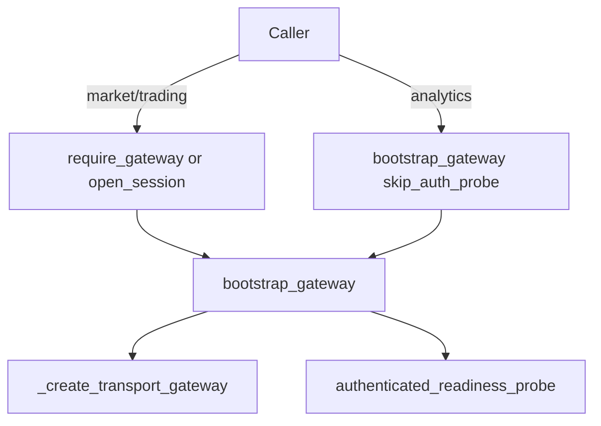

# Brokers package — Trading OS market-access layer

This package is the **broker / market-connectivity layer of Trading OS**. It is
organized as a *mini operating system* responsible for market connectivity,
instrument lifecycle, market data, and execution — but it deliberately exposes
**no gateways, no services, and no client APIs** to product code.

See [ADR-014](../../../docs/architecture/adrs/adr-014-brokers-trading-os.md) for the
architecture decision record.

## Three equivalent interfaces (single core)

Every capability delegates to [`brokers/services/`](services/) — one code path:

| Interface | Example |
|-----------|---------|
| **Python SDK** | `BrokerSession("paper").stock("RELIANCE").refresh()` |
| **CLI** | `broker quote RELIANCE --broker paper` |
| **MCP** | `broker.quote(symbol="RELIANCE", broker="paper")` |

Install CLI: `pip install -e .` then `broker doctor paper`.

MCP server: `pip install -e ".[mcp]"` then `broker-mcp`.

## Layered architecture

```
                    Trading OS

                  Public SDK Layer
┌───────────────────────────────────────────────────────┐
│ BrokerSession  (brokers.session)                       │
│   session.stock("RELIANCE")                             │
│   session.future(...)  session.option(...)              │
│   session.option_chain(...)                            │
└───────────────────────────────────────────────────────┘
                         │  returns rich domain objects
                         ▼
┌───────────────────────────────────────────────────────┐
│     Rich Domain Objects (domain/ — not brokers/domain/) │
│   Equity Future Option Index ETF Currency Spot         │
│   Quote  HistoricalSeries  MarketDepth  Subscription    │
│   OrderBook  OptionChain  (instrument.broker.*)         │
└───────────────────────────────────────────────────────┘
                         │  coordinated by
                         ▼
┌───────────────────────────────────────────────────────┐
│              Runtime Managers (brokers.runtime)         │
│   RuntimeBundle: SubscriptionManager HistoricalManager│
│   QuoteManager ExecutionManager CapabilityManager     │
│   SymbolRegistry EventBusFacade                         │
└───────────────────────────────────────────────────────┘
                         │  implemented by
                         ▼
┌───────────────────────────────────────────────────────┐
│ Broker implementations (brokers.{dhan,upstox,paper})
│   Self-register via __init__.py · wire.py · auth · market_data · execution
└───────────────────────────────────────────────────────┘
```

## Public API (use this)

```python
from brokers.session import BrokerSession

session = BrokerSession("paper")          # or "dhan" / "upstox"
stock = session.stock("RELIANCE")         # -> Equity (rich domain object)
stock.refresh()
chain = session.option_chain("NIFTY")     # -> OptionChain (composed Options)
ce = chain.atm                            # -> Option

# Broker-specific superpowers stay behind instrument.broker.*
stock.broker.depth20()                    # Dhan
stock.broker.depth30()                    # Upstox
```

## Developer tooling

| Tool | Command |
|------|---------|
| Pre-flight | `broker doctor paper` |
| Startup verify | `broker verify paper` |
| Certification | `broker certify paper --json` |
| Mapping round-trip | `broker mappings` |
| Benchmark | `broker benchmark` |
| Notebooks | `src/brokers/notebooks/01_authentication.ipynb` … `19_performance.ipynb` |

Startup self-test (fail-fast): set `TRADEX_BROKER_SELFTEST=1` before `tradex.connect()`.

## Internal layout

| Path | Responsibility |
|------|---------------|
| `brokers/session/` | `BrokerSession`, `session_factory`, plugin `registry` — public entry |
| `brokers/services/` | Shared core for SDK, CLI, MCP, self-test |
| `brokers/cli/` | Developer CLI (`broker` command) |
| `brokers/mcp/` | MCP server for AI agents |
| `brokers/runtime/` | `RuntimeBundle` + thin lifecycle coordinators |
| `brokers/certification/` | `BrokerCertifier`, mapping/golden/market-hours suites |
| `brokers/diagnostics/` | `doctor`, `health`, `benchmark` |
| `brokers/dhan`, `brokers/upstox`, `brokers/paper` | Concrete broker implementations (transport); self-register in `__init__.py` |
| `brokers/extensions/` | Per-broker capability aggregators |
| `brokers/notebooks/` | Executable tutorial notebooks |

## Design principles

* **Rich domain model** — `Equity`/`Option`/`Future` live in `domain/`; `BrokerSession` returns them.
* **Composition over inheritance** — instruments compose Quote, HistoricalSeries, MarketDepth, etc.
* **Capability-based extensions** — broker specifics live behind `instrument.broker.*`.
* **Plugin architecture** — new broker = new `plugins/<name>/plugin.py` + certification pass.
* **Thin runtime** — `RuntimeBundle` coordinates lifecycles; behavior stays on domain objects.

## Import-direction rule

`domain.ports → protocols` · `tradex.runtime → kernel` ·
`brokers.{dhan,upstox,paper} → broker adapters only` ·
`brokers.common → residual shared contracts`. Never import broker-specific
types from `brokers` top-level except via `brokers.session`.

## Transport boundary (wire adapters)

``DhanWireAdapter`` / ``UpstoxWireAdapter`` in ``brokers/{dhan,upstox}/wire.py`` are
the sanctioned transport entry points. Legacy ``gateway.py`` modules are **removed**.
Factories return wire adapters; broker packages self-register in `brokers/{name}/__init__.py`.

Kernel invariants live in ``brokers/common/`` (``ReconnectingTransport``, ACL,
``TokenLifecycle`` re-export, use-case layer, ``BrokerContractSuite``).

Live nightly certification: ``.github/workflows/broker_live_certify.yml``
(skips without secrets). Run locally: ``broker verify paper``, ``broker certify dhan``.

## Connect contract (public vs private)

All live broker connections **must** pass ``bootstrap_gateway`` (or
``require_gateway`` / ``BrokerSession`` which call it internally). Raw transport
creation is private to ``infrastructure.gateway.factory``.

| Public API | Use when |
|------------|----------|
| ``BrokerSession`` / ``tradex.open_session`` | SDK, cert, MCP — preferred |
| ``bootstrap_gateway`` | Composition roots needing a raw gateway |
| ``require_gateway`` | Live gateway or hard fail |
| ``interface.ui.services.connect.connect_live`` | CLI validation commands |
| ``interface.ui.services.connect.connect_analytics`` | TOTP-safe transport-only (explicit opt-out) |

| Private (do not call from product code) | Allowed callers |
|----------------------------------------|-----------------|
| ``_create_transport_gateway`` | ``bootstrap_gateway`` only |
| ``BrokerFactory.create`` / ``UpstoxBrokerFactory.create`` | factory module only |



Scripts under ``scripts/verify/`` use ``scripts/_connect.bootstrap_or_exit``.
Architecture test: ``tests/architecture/test_connect_flow_compliance.py``.
