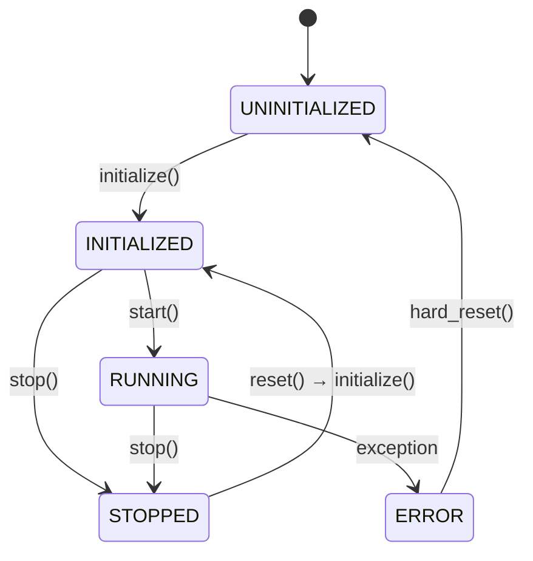
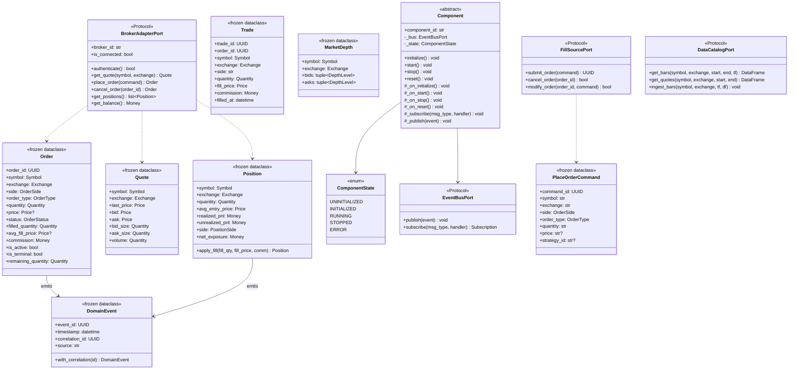

# 02 — Component Design (Low-Level)

## 1. Component Base Class

Every long-lived object in TradeXV2 inherits from `Component`, which provides
lifecycle management, message bus integration, and state machine enforcement.
This mirrors NautilusTrader's `Component` base class.

```python
# domain/ports/component.py

from __future__ import annotations

import uuid
from abc import ABC, abstractmethod
from enum import Enum
from typing import Any

from domain.events import DomainEvent
from domain.ports.event_bus import EventBusPort


class ComponentState(Enum):
    UNINITIALIZED = "UNINITIALIZED"
    INITIALIZED   = "INITIALIZED"
    RUNNING       = "RUNNING"
    STOPPED       = "STOPPED"
    ERROR         = "ERROR"


# Valid state transitions
_VALID_TRANSITIONS: dict[ComponentState, set[ComponentState]] = {
    ComponentState.UNINITIALIZED: {ComponentState.INITIALIZED},
    ComponentState.INITIALIZED:   {ComponentState.RUNNING, ComponentState.STOPPED},
    ComponentState.RUNNING:       {ComponentState.STOPPED, ComponentState.ERROR},
    ComponentState.STOPPED:       {ComponentState.INITIALIZED},  # reset
    ComponentState.ERROR:         {ComponentState.UNINITIALIZED},  # hard reset
}


class Component(ABC):
    """Base class for all lifecycle-managed components."""

    def __init__(self, component_id: str, bus: EventBusPort) -> None:
        self._component_id = component_id
        self._bus = bus
        self._state = ComponentState.UNINITIALIZED
        self._subscriptions: list[Any] = []

    @property
    def component_id(self) -> str:
        return self._component_id

    @property
    def state(self) -> ComponentState:
        return self._state

    # ── Lifecycle ──────────────────────────────────────────────

    def initialize(self) -> None:
        self._transition(ComponentState.INITIALIZED)
        self._on_initialize()

    def start(self) -> None:
        self._transition(ComponentState.RUNNING)
        self._on_start()

    def stop(self) -> None:
        self._transition(ComponentState.STOPPED)
        self._on_stop()
        self._clear_subscriptions()

    def reset(self) -> None:
        self._transition(ComponentState.UNINITIALIZED)
        self._state = ComponentState.UNINITIALIZED
        self._on_reset()

    # ── Messaging ──────────────────────────────────────────────

    def _subscribe(self, msg_type: type, handler: Any) -> None:
        sub = self._bus.subscribe(msg_type, handler)
        self._subscriptions.append(sub)

    def _publish(self, event: DomainEvent) -> None:
        self._bus.publish(event)

    # ── Hooks ──────────────────────────────────────────────────

    def _on_initialize(self) -> None: ...
    def _on_start(self) -> None: ...
    def _on_stop(self) -> None: ...
    def _on_reset(self) -> None: ...

    # ── Internals ──────────────────────────────────────────────

    def _transition(self, target: ComponentState) -> None:
        allowed = _VALID_TRANSITIONS.get(self._state, set())
        if target not in allowed:
            raise LifecycleError(
                f"{self._component_id}: cannot transition "
                f"{self._state.value} → {target.value}"
            )
        self._state = target

    def _clear_subscriptions(self) -> None:
        for sub in self._subscriptions:
            sub.unsubscribe()
        self._subscriptions.clear()


class LifecycleError(Exception):
    """Raised when an invalid component state transition is attempted."""
```

### State Machine Diagram



## 2. Domain Entities

### 2.1 Order

```python
# domain/entities/order.py

from __future__ import annotations

from dataclasses import dataclass, field
from datetime import datetime
from decimal import Decimal
from enum import Enum
from typing import Optional
from uuid import UUID

from domain.value_objects import Money, Price, Quantity, Symbol, Exchange


class OrderSide(Enum):
    BUY = "BUY"
    SELL = "SELL"


class OrderType(Enum):
    MARKET = "MARKET"
    LIMIT = "LIMIT"
    SL = "SL"
    SL_MARKET = "SL_MARKET"


class OrderStatus(Enum):
    PENDING = "PENDING"
    OPEN = "OPEN"
    PARTIALLY_FILLED = "PARTIALLY_FILLED"
    FILLED = "FILLED"
    CANCELLED = "CANCELLED"
    REJECTED = "REJECTED"
    EXPIRED = "EXPIRED"


class TimeInForce(Enum):
    DAY = "DAY"
    IOC = "IOC"
    GTC = "GTC"


@dataclass(frozen=True)
class Order:
    order_id: UUID
    symbol: Symbol
    exchange: Exchange
    side: OrderSide
    order_type: OrderType
    quantity: Quantity
    price: Optional[Price] = None
    trigger_price: Optional[Price] = None
    time_in_force: TimeInForce = TimeInForce.DAY
    status: OrderStatus = OrderStatus.PENDING
    filled_quantity: Quantity = Quantity(Decimal("0"))
    avg_fill_price: Optional[Price] = None
    commission: Money = Money(Decimal("0"), "INR")
    created_at: datetime = field(default_factory=datetime.utcnow)
    updated_at: datetime = field(default_factory=datetime.utcnow)
    correlation_id: Optional[UUID] = None
    strategy_id: Optional[str] = None
    broker_order_id: Optional[str] = None
    reject_reason: Optional[str] = None

    @property
    def remaining_quantity(self) -> Quantity:
        return Quantity(self.quantity.value - self.filled_quantity.value)

    @property
    def is_active(self) -> bool:
        return self.status in (
            OrderStatus.PENDING,
            OrderStatus.OPEN,
            OrderStatus.PARTIALLY_FILLED,
        )

    @property
    def is_terminal(self) -> bool:
        return self.status in (
            OrderStatus.FILLED,
            OrderStatus.CANCELLED,
            OrderStatus.REJECTED,
            OrderStatus.EXPIRED,
        )
```

### 2.2 Position

```python
# domain/entities/position.py

from __future__ import annotations

from dataclasses import dataclass
from datetime import datetime
from decimal import Decimal
from enum import Enum

from domain.value_objects import Money, Price, Quantity, Symbol, Exchange


class PositionSide(Enum):
    LONG = "LONG"
    SHORT = "SHORT"
    FLAT = "FLAT"


@dataclass(frozen=True)
class Position:
    symbol: Symbol
    exchange: Exchange
    quantity: Quantity
    avg_entry_price: Price
    realized_pnl: Money
    unrealized_pnl: Money
    commission: Money
    strategy_id: Optional[str] = None
    opened_at: datetime = field(default_factory=datetime.utcnow)
    updated_at: datetime = field(default_factory=datetime.utcnow)

    @property
    def side(self) -> PositionSide:
        if self.quantity.value > 0:
            return PositionSide.LONG
        elif self.quantity.value < 0:
            return PositionSide.SHORT
        return PositionSide.FLAT

    @property
    def net_exposure(self) -> Money:
        return Money(
            abs(self.quantity.value) * self.avg_entry_price.value,
            currency="INR",
        )

    def apply_fill(self, fill_quantity: Quantity, fill_price: Price, commission: Money) -> Position:
        """Return new Position after applying a fill. Pure function."""
        ...
```

### 2.3 Trade (Fill)

```python
# domain/entities/trade.py

from __future__ import annotations

from dataclasses import dataclass
from datetime import datetime
from decimal import Decimal
from uuid import UUID

from domain.value_objects import Money, Price, Quantity, Symbol, Exchange


@dataclass(frozen=True)
class Trade:
    trade_id: UUID
    order_id: UUID
    symbol: Symbol
    exchange: Exchange
    side: str  # OrderSide value
    quantity: Quantity
    fill_price: Price
    commission: Money
    filled_at: datetime = field(default_factory=datetime.utcnow)
    correlation_id: UUID | None = None
```

### 2.4 Quote & MarketDepth

```python
# domain/entities/quote.py

from __future__ import annotations

from dataclasses import dataclass
from datetime import datetime
from decimal import Decimal

from domain.value_objects import Price, Quantity, Symbol, Exchange


@dataclass(frozen=True)
class Quote:
    symbol: Symbol
    exchange: Exchange
    last_price: Price
    bid: Price
    ask: Price
    bid_size: Quantity
    ask_size: Quantity
    volume: Quantity
    timestamp: datetime = field(default_factory=datetime.utcnow)


@dataclass(frozen=True)
class DepthLevel:
    price: Price
    quantity: Quantity
    orders: int = 0


@dataclass(frozen=True)
class MarketDepth:
    symbol: Symbol
    exchange: Exchange
    bids: tuple[DepthLevel, ...]  # Top 5 or 20
    asks: tuple[DepthLevel, ...]
    timestamp: datetime = field(default_factory=datetime.utcnow)
```

## 3. Value Objects

```python
# domain/value_objects/primitives.py

from __future__ import annotations

from dataclasses import dataclass
from decimal import Decimal
from typing import NewType


@dataclass(frozen=True, order=True)
class Price:
    value: Decimal

    def __post_init__(self) -> None:
        if self.value < 0:
            raise ValueError(f"Price cannot be negative: {self.value}")


@dataclass(frozen=True, order=True)
class Quantity:
    value: Decimal

    def __post_init__(self) -> None:
        if self.value < 0:
            raise ValueError(f"Quantity cannot be negative: {self.value}")


@dataclass(frozen=True)
class Money:
    amount: Decimal
    currency: str = "INR"

    def __post_init__(self) -> None:
        if len(self.currency) != 3:
            raise ValueError(f"Invalid currency code: {self.currency}")


Symbol = NewType("Symbol", str)
Exchange = NewType("Exchange", str)
InstrumentId = NewType("InstrumentId", str)
```

## 4. Domain Events

All events are immutable, carry a correlation ID for tracing, and are timestamped.

```python
# domain/events/base.py

from __future__ import annotations

from dataclasses import dataclass, field
from datetime import datetime
from uuid import UUID, uuid4


@dataclass(frozen=True)
class DomainEvent:
    event_id: UUID = field(default_factory=uuid4)
    timestamp: datetime = field(default_factory=datetime.utcnow)
    correlation_id: UUID | None = None
    source: str = ""

    def with_correlation(self, correlation_id: UUID) -> DomainEvent:
        """Return a copy with the given correlation_id."""
        import dataclasses
        return dataclasses.replace(self, correlation_id=correlation_id)


# domain/events/order_events.py

@dataclass(frozen=True)
class OrderPlaced(DomainEvent):
    order_id: UUID = field(default_factory=uuid4)
    symbol: str = ""
    exchange: str = ""
    side: str = ""
    quantity: str = ""
    order_type: str = ""
    price: str | None = None


@dataclass(frozen=True)
class OrderAccepted(DomainEvent):
    order_id: UUID = field(default_factory=uuid4)
    broker_order_id: str = ""


@dataclass(frozen=True)
class OrderRejected(DomainEvent):
    order_id: UUID = field(default_factory=uuid4)
    reason: str = ""


@dataclass(frozen=True)
class OrderFilled(DomainEvent):
    order_id: UUID = field(default_factory=uuid4)
    trade_id: UUID = field(default_factory=uuid4)
    fill_quantity: str = ""
    fill_price: str = ""
    commission: str = "0"


@dataclass(frozen=True)
class OrderCancelled(DomainEvent):
    order_id: UUID = field(default_factory=uuid4)


@dataclass(frozen=True)
class PositionChanged(DomainEvent):
    symbol: str = ""
    exchange: str = ""
    quantity: str = ""
    avg_price: str = ""
    realized_pnl: str = ""


@dataclass(frozen=True)
class RiskBreached(DomainEvent):
    rule_name: str = ""
    detail: str = ""
    severity: str = "WARN"


@dataclass(frozen=True)
class KillSwitchActivated(DomainEvent):
    reason: str = ""
    triggered_by: str = ""
```

## 5. Domain Commands

```python
# domain/commands/order_commands.py

from __future__ import annotations

from dataclasses import dataclass, field
from uuid import UUID, uuid4

from domain.entities.order import OrderSide, OrderType, TimeInForce


@dataclass(frozen=True)
class PlaceOrderCommand:
    command_id: UUID = field(default_factory=uuid4)
    symbol: str = ""
    exchange: str = ""
    side: OrderSide = OrderSide.BUY
    order_type: OrderType = OrderType.MARKET
    quantity: str = ""
    price: str | None = None
    trigger_price: str | None = None
    time_in_force: TimeInForce = TimeInForce.DAY
    strategy_id: str | None = None
    correlation_id: UUID | None = None


@dataclass(frozen=True)
class CancelOrderCommand:
    command_id: UUID = field(default_factory=uuid4)
    order_id: UUID = field(default_factory=uuid4)
    correlation_id: UUID | None = None


@dataclass(frozen=True)
class ModifyOrderCommand:
    command_id: UUID = field(default_factory=uuid4)
    order_id: UUID = field(default_factory=uuid4)
    quantity: str | None = None
    price: str | None = None
    trigger_price: str | None = None
    correlation_id: UUID | None = None
```

## 6. Domain Ports (Protocol Interfaces)

```python
# domain/ports/broker_adapter.py

from typing import Protocol, runtime_checkable

from domain.entities.quote import Quote, MarketDepth
from domain.entities.order import Order
from domain.entities.position import Position
from domain.entities.trade import Trade
from domain.value_objects import Money, Price, Quantity


@runtime_checkable
class BrokerAdapterPort(Protocol):
    """What the application layer requires of a broker."""

    @property
    def broker_id(self) -> str: ...

    @property
    def is_connected(self) -> bool: ...

    async def authenticate(self) -> bool: ...

    async def get_quote(self, symbol: str, exchange: str) -> Quote: ...
    async def get_ltp(self, symbol: str, exchange: str) -> Price: ...
    async def get_depth(self, symbol: str, exchange: str) -> MarketDepth: ...

    async def place_order(self, command: PlaceOrderCommand) -> Order: ...
    async def cancel_order(self, order_id: str) -> Order: ...
    async def modify_order(self, order_id: str, **changes) -> Order: ...
    async def get_order(self, order_id: str) -> Order: ...
    async def get_orderbook(self) -> list[Order]: ...
    async def get_trade_book(self) -> list[Trade]: ...

    async def get_positions(self) -> list[Position]: ...
    async def get_holdings(self) -> list: ...
    async def get_balance(self) -> Money: ...

    async def close(self) -> None: ...


# domain/ports/fill_source.py

from typing import Protocol, runtime_checkable
from uuid import UUID


@runtime_checkable
class FillSourcePort(Protocol):
    """Abstraction enabling zero-parity across backtest/paper/live."""

    async def submit_order(self, command: PlaceOrderCommand) -> UUID: ...
    async def cancel_order(self, order_id: UUID) -> bool: ...
    async def modify_order(self, order_id: UUID, command: ModifyOrderCommand) -> bool: ...


# domain/ports/event_bus.py

from typing import Any, Callable, Protocol, runtime_checkable


@dataclass
class Subscription:
    msg_type: type
    handler: Callable
    _bus: Any

    def unsubscribe(self) -> None:
        self._bus._remove(self.msg_type, self.handler)


@runtime_checkable
class EventBusPort(Protocol):
    def publish(self, event: Any) -> None: ...
    def subscribe(self, msg_type: type, handler: Callable) -> Subscription: ...


# domain/ports/data_catalog.py

from typing import Protocol, runtime_checkable
import pandas as pd
from datetime import datetime


@runtime_checkable
class DataCatalogPort(Protocol):
    async def get_bars(
        self, symbol: str, exchange: str,
        start: datetime, end: datetime,
        timeframe: str = "1m",
    ) -> pd.DataFrame: ...

    async def get_quotes(
        self, symbol: str, exchange: str,
        start: datetime, end: datetime,
    ) -> pd.DataFrame: ...

    async def ingest_bars(
        self, symbol: str, exchange: str,
        timeframe: str, df: pd.DataFrame,
    ) -> None: ...
```

## 7. Class Diagram (Mermaid)



## 8. Design Constraints

1. **Frozen dataclasses everywhere** — Domain objects are immutable. State changes produce new objects.
2. **Decimal for money/price/qty** — No floats anywhere in the domain layer.
3. **No inheritance hierarchies** — Prefer composition and protocols over deep class trees.
4. **Events are the only output** — Components communicate by publishing events, not by calling each other.
5. **Commands are the only input** — External requests arrive as commands, not method calls.
6. **Ports over imports** — Application layer never imports infrastructure types directly.
