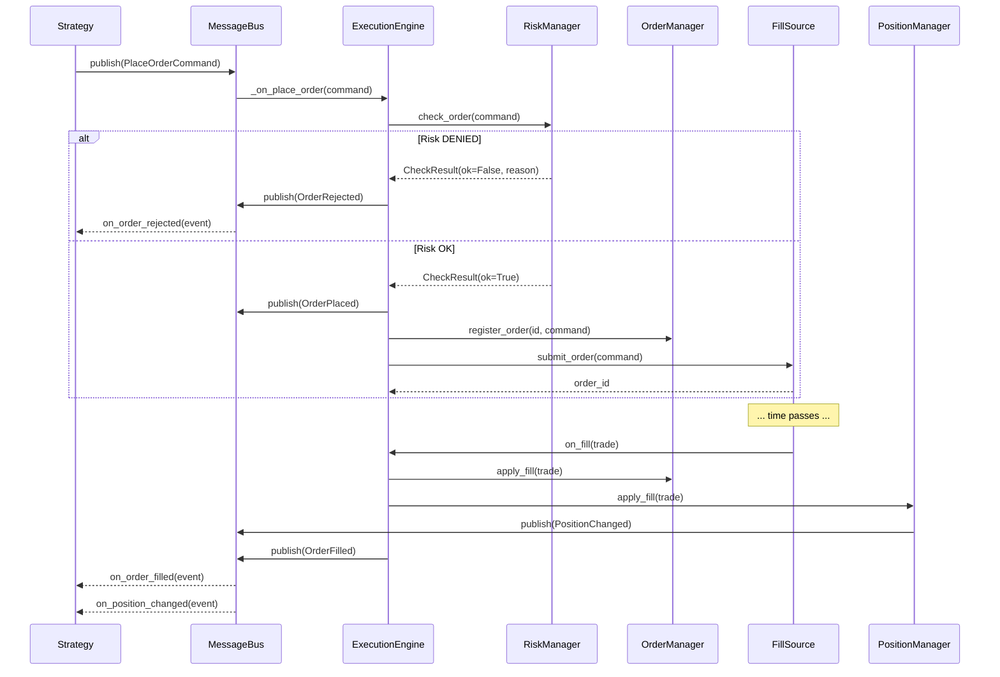

# 04 — Execution Engine

## 1. Overview

The `ExecutionEngine` is the heart of TradeXV2. It receives order commands,
runs risk checks, delegates to a `FillSource` for execution, and publishes
domain events for every state change.

The key insight from NautilusTrader: **the execution engine is identical across
backtest, paper, and live**. Only the `FillSource` changes. This is called
**zero-parity**.

```
┌─────────────────────────────────────────────────────────────┐
│                    ExecutionEngine                          │
│                                                             │
│  PlaceOrderCommand ──► RiskManager.check() ──► FillSource   │
│                              │                    │         │
│                         [DENY] ──► OrderRejected  │         │
│                                                      │      │
│                              ◄────── Fill ──────────┘      │
│                              │                              │
│                         OrderManager.apply_fill()           │
│                              │                              │
│                         PositionManager.apply_fill()        │
│                              │                              │
│                         publish(OrderFilled)                │
│                         publish(PositionChanged)            │
└─────────────────────────────────────────────────────────────┘
```

## 2. Zero-Parity Architecture

```
                    Backtest              Paper              Live
                    ────────              ─────              ────
FillSource:     SimulatedFillSource   PaperFillSource    BrokerFillSource
                    │                     │                   │
                    ▼                     ▼                   ▼
Historical      HistoricalBar        LiveQuote          BrokerGateway
Data/Replay     → simulated fill     → simulated fill   → real fill
                    │                     │                   │
                    └─────────────────────┼───────────────────┘
                                          │
                                    ExecutionEngine
                                    OrderManager
                                    PositionManager
                                    RiskManager
                                    (identical code)
```

## 3. Core Implementation

```python
# application/execution/execution_engine.py

from __future__ import annotations

import logging
from typing import Optional
from uuid import UUID

from domain.commands.order_commands import (
    CancelOrderCommand,
    ModifyOrderCommand,
    PlaceOrderCommand,
)
from domain.entities.order import Order, OrderStatus
from domain.entities.trade import Trade
from domain.events.order_events import (
    OrderCancelled,
    OrderFilled,
    OrderModified,
    OrderPlaced,
    OrderRejected,
)
from domain.ports.broker_adapter import BrokerAdapterPort
from domain.ports.event_bus import EventBusPort
from domain.ports.fill_source import FillSourcePort
from shared.messaging.component import Component, ComponentState


logger = logging.getLogger(__name__)


class ExecutionEngine(Component):
    """
    Central execution component.

    Receives PlaceOrderCommand, runs risk checks, delegates to FillSource,
    and publishes domain events for every state transition.
    """

    def __init__(
        self,
        bus: EventBusPort,
        fill_source: FillSourcePort,
        risk_manager: RiskManager,
        order_manager: OrderManager,
        position_manager: PositionManager,
    ) -> None:
        super().__init__(component_id="ExecutionEngine", bus=bus)
        self._fill_source = fill_source
        self._risk_manager = risk_manager
        self._order_manager = order_manager
        self._position_manager = position_manager

    def _on_initialize(self) -> None:
        self._subscribe(PlaceOrderCommand, self._on_place_order)
        self._subscribe(CancelOrderCommand, self._on_cancel_order)
        self._subscribe(ModifyOrderCommand, self._on_modify_order)

    # ── Command Handlers ──────────────────────────────────────

    def _on_place_order(self, command: PlaceOrderCommand) -> None:
        """Handle an incoming order command."""
        if self.state != ComponentState.RUNNING:
            logger.warning("ExecutionEngine not running, rejecting command")
            return

        # 1. Risk check
        risk_result = self._risk_manager.check_order(command)
        if not risk_result.ok:
            event = OrderRejected(
                order_id=command.command_id,
                reason=risk_result.reason,
                source="RiskManager",
            )
            self._publish(event)
            return

        # 2. Publish OrderPlaced
        placed = OrderPlaced(
            order_id=command.command_id,
            symbol=command.symbol,
            exchange=command.exchange,
            side=command.side.value,
            quantity=command.quantity,
            order_type=command.order_type.value,
            price=command.price,
            source="ExecutionEngine",
        )
        self._publish(placed)

        # 3. Register in OrderManager
        self._order_manager.register_order(command.command_id, command)

        # 4. Submit to fill source (async in real, sync in backtest)
        try:
            order_id = self._fill_source.submit_order(command)
            logger.info("Order submitted: %s → fill_source", command.command_id)
        except Exception as exc:
            self._publish(OrderRejected(
                order_id=command.command_id,
                reason=str(exc),
                source="FillSource",
            ))

    def _on_cancel_order(self, command: CancelOrderCommand) -> None:
        if self.state != ComponentState.RUNNING:
            return
        success = self._fill_source.cancel_order(command.order_id)
        if success:
            self._publish(OrderCancelled(
                order_id=command.order_id,
                source="ExecutionEngine",
            ))

    def _on_modify_order(self, command: ModifyOrderCommand) -> None:
        if self.state != ComponentState.RUNNING:
            return
        success = self._fill_source.modify_order(command.order_id, command)
        if success:
            self._publish(OrderModified(
                order_id=command.order_id,
                source="ExecutionEngine",
            ))

    # ── Fill Handling ─────────────────────────────────────────

    def on_fill(self, trade: Trade) -> None:
        """Called by FillSource when a fill occurs."""
        # 1. Apply to order manager
        self._order_manager.apply_fill(trade)

        # 2. Apply to position manager
        self._position_manager.apply_fill(trade)

        # 3. Update risk
        self._risk_manager.on_fill(trade)

        # 4. Publish events
        self._publish(OrderFilled(
            order_id=trade.order_id,
            trade_id=trade.trade_id,
            fill_quantity=str(trade.quantity.value),
            fill_price=str(trade.fill_price.value),
            commission=str(trade.commission.amount),
            source="ExecutionEngine",
        ))

    # ── Mass Status ───────────────────────────────────────────

    def apply_mass_status(
        self,
        orders: list[Order],
        positions: list,
        funds: dict,
    ) -> list[dict]:
        """Reconcile engine state with broker state. Returns drift items."""
        drift_items = []

        # Check order status drift
        local_orders = self._order_manager.get_orderbook()
        local_by_id = {o.order_id: o for o in local_orders}

        for broker_order in orders:
            local = local_by_id.get(broker_order.order_id)
            if local and local.status != broker_order.status:
                drift_items.append({
                    "type": "order_status_drift",
                    "order_id": str(broker_order.order_id),
                    "local_status": local.status.value,
                    "broker_status": broker_order.status.value,
                })

        return drift_items
```

## 4. FillSource Protocol & Implementations

### 4.1 Protocol

```python
# domain/ports/fill_source.py

from typing import Protocol, runtime_checkable
from uuid import UUID
from domain.commands.order_commands import PlaceOrderCommand, ModifyOrderCommand


@runtime_checkable
class FillSourcePort(Protocol):
    """
    Abstraction for order execution.

    The ExecutionEngine is identical across modes — only the FillSource changes.
    """

    async def submit_order(self, command: PlaceOrderCommand) -> UUID:
        """Submit order and return the order_id."""
        ...

    async def cancel_order(self, order_id: UUID) -> bool:
        """Cancel an order. Returns True if successful."""
        ...

    async def modify_order(self, order_id: UUID, command: ModifyOrderCommand) -> bool:
        """Modify an order. Returns True if successful."""
        ...
```

### 4.2 SimulatedFillSource (Backtest)

```python
# application/execution/fill_sources/simulated.py

from __future__ import annotations

from decimal import Decimal
from uuid import UUID, uuid4

from domain.commands.order_commands import PlaceOrderCommand
from domain.entities.trade import Trade
from domain.value_objects import Money, Price, Quantity


class SimulatedFillSource:
    """
    Generates fills from historical bar data.

    Uses simple assumptions:
    - Market orders fill at next bar's open
    - Limit orders fill when price touches limit
    - Slippage model configurable (default: 0.05%)
    """

    def __init__(
        self,
        slippage_bps: float = 5.0,
        on_fill: callable = None,
    ) -> None:
        self._slippage_bps = slippage_bps
        self._on_fill = on_fill
        self._pending_orders: dict[UUID, PlaceOrderCommand] = {}

    async def submit_order(self, command: PlaceOrderCommand) -> UUID:
        order_id = uuid4()
        self._pending_orders[order_id] = command
        return order_id

    def on_bar(self, bar: dict) -> None:
        """Check pending orders against new bar data."""
        filled = []
        for order_id, command in self._pending_orders.items():
            fill_price = self._simulate_fill(command, bar)
            if fill_price is not None:
                slippage = fill_price * Decimal(str(self._slippage_bps / 10000))
                final_price = fill_price + slippage  # adverse slippage
                trade = Trade(
                    trade_id=uuid4(),
                    order_id=order_id,
                    symbol=command.symbol,
                    exchange=command.exchange,
                    side=command.side.value,
                    quantity=Quantity(Decimal(command.quantity)),
                    fill_price=Price(final_price),
                    commission=Money(Decimal("20"), "INR"),  # flat fee
                )
                filled.append((order_id, trade))

        for order_id, trade in filled:
            del self._pending_orders[order_id]
            if self._on_fill:
                self._on_fill(trade)

    def _simulate_fill(self, command: PlaceOrderCommand, bar: dict) -> Decimal | None:
        """Determine if order fills on this bar."""
        if command.order_type.value == "MARKET":
            return bar["open"]
        elif command.order_type.value == "LIMIT":
            limit = Decimal(command.price)
            if command.side.value == "BUY" and bar["low"] <= limit:
                return min(limit, bar["open"])
            elif command.side.value == "SELL" and bar["high"] >= limit:
                return max(limit, bar["open"])
        return None

    async def cancel_order(self, order_id: UUID) -> bool:
        return self._pending_orders.pop(order_id, None) is not None

    async def modify_order(self, order_id: UUID, command) -> bool:
        if order_id in self._pending_orders:
            # Replace with modified version
            self._pending_orders[order_id] = command
            return True
        return False
```

### 4.3 PaperFillSource

```python
# application/execution/fill_sources/paper.py

from __future__ import annotations

from decimal import Decimal
from uuid import UUID, uuid4

from domain.commands.order_commands import PlaceOrderCommand
from domain.entities.trade import Trade
from domain.value_objects import Money, Price, Quantity


class PaperFillSource:
    """
    Generates fills from live quotes with simulated latency.

    Market orders fill at LTP + slippage.
    Limit orders fill when LTP touches limit.
    """

    def __init__(
        self,
        quote_fn: callable,  # (symbol, exchange) -> Quote
        slippage_bps: float = 2.0,
        on_fill: callable = None,
    ) -> None:
        self._quote_fn = quote_fn
        self._slippage_bps = slippage_bps
        self._on_fill = on_fill
        self._pending_orders: dict[UUID, PlaceOrderCommand] = {}

    async def submit_order(self, command: PlaceOrderCommand) -> UUID:
        order_id = uuid4()
        self._pending_orders[order_id] = command

        # For market orders, fill immediately from quote
        if command.order_type.value == "MARKET":
            quote = self._quote_fn(command.symbol, command.exchange)
            if quote:
                slippage = quote.last_price.value * Decimal(str(self._slippage_bps / 10000))
                fill_price = quote.last_price.value + slippage
                trade = Trade(
                    trade_id=uuid4(),
                    order_id=order_id,
                    symbol=command.symbol,
                    exchange=command.exchange,
                    side=command.side.value,
                    quantity=Quantity(Decimal(command.quantity)),
                    fill_price=Price(fill_price),
                    commission=Money(Decimal("20"), "INR"),
                )
                del self._pending_orders[order_id]
                if self._on_fill:
                    self._on_fill(trade)

        return order_id

    async def cancel_order(self, order_id: UUID) -> bool:
        return self._pending_orders.pop(order_id, None) is not None

    async def modify_order(self, order_id: UUID, command) -> bool:
        return order_id in self._pending_orders
```

### 4.4 BrokerFillSource (Live)

```python
# application/execution/fill_sources/broker.py

from __future__ import annotations

from uuid import UUID

from domain.commands.order_commands import PlaceOrderCommand, ModifyOrderCommand
from domain.ports.broker_adapter import BrokerAdapterPort


class BrokerFillSource:
    """
    Delegates to a real broker gateway for live execution.

    Maps between domain commands and broker-specific wire formats.
    """

    def __init__(self, gateway: BrokerAdapterPort) -> None:
        self._gateway = gateway

    async def submit_order(self, command: PlaceOrderCommand) -> UUID:
        order = await self._gateway.place_order(command)
        return order.order_id

    async def cancel_order(self, order_id: UUID) -> bool:
        try:
            await self._gateway.cancel_order(str(order_id))
            return True
        except Exception:
            return False

    async def modify_order(self, order_id: UUID, command: ModifyOrderCommand) -> bool:
        try:
            changes = {}
            if command.quantity:
                changes["quantity"] = command.quantity
            if command.price:
                changes["price"] = command.price
            await self._gateway.modify_order(str(order_id), **changes)
            return True
        except Exception:
            return False
```

## 5. TradingContext

The `TradingContext` bundles all execution-related components into a single
injectable object. This is the "dependency root" for the execution subsystem.

```python
# application/oms/context/__init__.py

from __future__ import annotations

from dataclasses import dataclass

from domain.ports.event_bus import EventBusPort


@dataclass
class TradingContext:
    """
    Bundles all execution components.

    Created by the composition root (runtime/) and injected into strategies.
    """
    event_bus: EventBusPort
    execution_engine: ExecutionEngine
    order_manager: OrderManager
    position_manager: PositionManager
    risk_manager: RiskManager
    fill_source: FillSourcePort
    mode: str  # "backtest" | "paper" | "live"

    @property
    def is_live(self) -> bool:
        return self.mode == "live"

    @property
    def is_paper(self) -> bool:
        return self.mode == "paper"

    @property
    def is_backtest(self) -> bool:
        return self.mode == "backtest"
```

## 6. Execution Flow Sequence



## 7. Current State vs Target

| Aspect | Current (graphify) | Target |
|---|---|---|
| ExecutionEngine | degree 41, `src/application/execution/execution_engine.py` | Same location, cleaner interface |
| TradingContext | degree 67, `src/application/oms/context/__init__.py` | Reduced to pure dataclass bundle |
| FillSource | Not formalized | Explicit Protocol + 3 implementations |
| Zero-parity | Partial (some shared code) | Full — same engine, different FillSource |
| Risk check | Inline in engine | Separate component, pluggable rules |
| Mass status | Ad hoc | Formal reconciliation with drift detection |

## 8. Testing Strategy

```python
# tests/unit/test_execution_engine.py

def test_order_passes_risk_and_gets_placed():
    bus = MessageBus()
    risk = MockRiskManager(allow_all=True)
    fill_source = MockFillSource()
    om = OrderManager(bus)
    pm = PositionManager(bus)
    engine = ExecutionEngine(bus, fill_source, risk, om, pm)
    engine.initialize()
    engine.start()

    events = []
    bus.subscribe(OrderPlaced, lambda e: events.append(e))

    engine._on_place_order(PlaceOrderCommand(
        symbol="RELIANCE", exchange="NSE", side=OrderSide.BUY,
        order_type=OrderType.MARKET, quantity="10",
    ))

    assert len(events) == 1
    assert events[0].symbol == "RELIANCE"

def test_order_rejected_by_risk():
    bus = MessageBus()
    risk = MockRiskManager(allow_all=False, reason="Position limit exceeded")
    fill_source = MockFillSource()
    engine = ExecutionEngine(bus, fill_source, risk, OrderManager(bus), PositionManager(bus))
    engine.initialize()
    engine.start()

    events = []
    bus.subscribe(OrderRejected, lambda e: events.append(e))

    engine._on_place_order(PlaceOrderCommand(
        symbol="RELIANCE", exchange="NSE", side=OrderSide.BUY,
        order_type=OrderType.MARKET, quantity="10",
    ))

    assert len(events) == 1
    assert "Position limit" in events[0].reason

def test_fill_updates_position():
    bus = MessageBus()
    engine = ExecutionEngine(bus, MockFillSource(), MockRiskManager(), OrderManager(bus), PositionManager(bus))
    engine.initialize()
    engine.start()

    positions = []
    bus.subscribe(PositionChanged, lambda e: positions.append(e))

    engine.on_fill(Trade(
        trade_id=uuid4(), order_id=uuid4(),
        symbol="RELIANCE", exchange="NSE", side="BUY",
        quantity=Quantity(Decimal("10")),
        fill_price=Price(Decimal("2500")),
        commission=Money(Decimal("20"), "INR"),
    ))

    assert len(positions) == 1
```
