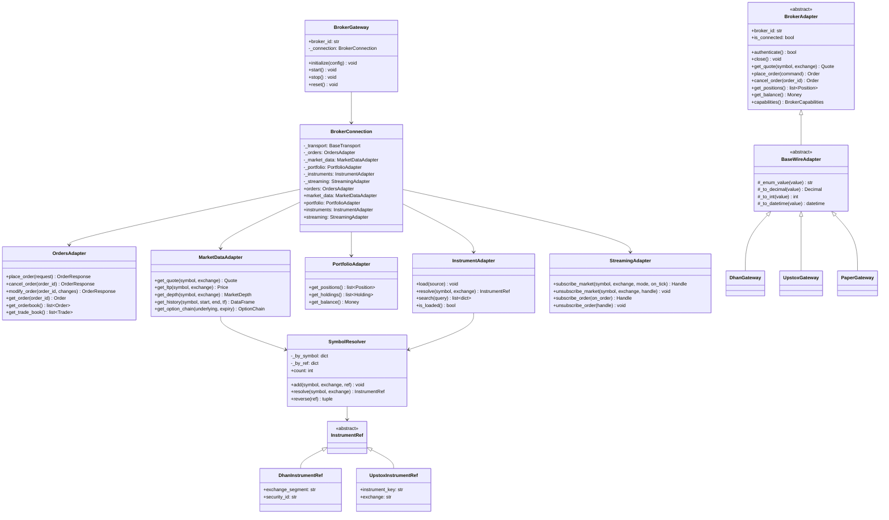

# 05 — Brokers Module Redesign

## 1. Problem Statement

Graphify analysis reveals severe god-class problems in the current broker module:

| Class | Degree | File | Issue |
|---|---|---|---|
| `DhanBroker` | **376** | `src/brokers/dhan/wire.py:32` | Handles orders, market data, streaming, instruments, portfolio |
| `UpstoxWireAdapter` | **195** | `src/brokers/upstox/wire.py:43` | Same monolithic pattern |
| `PaperGateway` | **158** | `src/brokers/paper/paper_gateway.py:33` | All paper trading logic in one class |
| `DhanConnection` | **121** | `src/brokers/dhan/streaming/connection.py:73` | WebSocket + order streaming mixed |

Total: 307 broker files (Dhan: 102, Upstox: 128, Paper: 12, common: 37).

## 2. Target Architecture

```
brokers/
├── common/
│   ├── base_wire_adapter.py      # Shared enum/mapping helpers
│   ├── base_transport.py         # HTTP client abstraction
│   ├── capabilities.py           # BrokerCapabilities dataclass
│   ├── quote_normalize.py        # Quote normalization helpers
│   ├── rate_limit_config.py      # Rate limit definitions
│   └── symbol_resolver.py        # Symbol → InstrumentRef mapping
│
├── dhan/
│   ├── __init__.py               # BrokerPlugin registration
│   ├── config/
│   │   ├── capabilities.py       # Dhan-specific capabilities
│   │   └── urls.py               # Dhan API URLs
│   ├── dhan_gateway.py           # DhanGateway(BrokerAdapter)
│   ├── dhan_connection.py        # DhanConnection (owns sub-adapters)
│   ├── adapters/
│   │   ├── orders.py             # DhanOrdersAdapter
│   │   ├── market_data.py        # DhanMarketDataAdapter
│   │   ├── portfolio.py          # DhanPortfolioAdapter
│   │   ├── instruments.py        # DhanInstrumentAdapter
│   │   └── streaming.py          # DhanStreamingAdapter
│   ├── wire.py                   # DhanWireAdapter(BaseWireAdapter)
│   └── websocket/
│       ├── connection.py         # WebSocket connection manager
│       ├── subscription.py       # Subscription manager
│       ├── market_data.py        # Market data message handler
│       └── order_stream.py       # Order update handler
│
├── upstox/
│   ├── __init__.py               # BrokerPlugin registration
│   ├── config/
│   │   ├── capabilities.py
│   │   └── urls.py
│   ├── upstox_gateway.py
│   ├── upstox_connection.py
│   ├── adapters/
│   │   ├── orders.py
│   │   ├── market_data.py
│   │   ├── portfolio.py
│   │   ├── instruments.py
│   │   └── streaming.py
│   ├── wire.py
│   └── websocket/
│       ├── connection.py
│       ├── subscription.py
│       ├── market_data_v3.py
│       └── order_stream.py
│
└── paper/
    ├── __init__.py
    ├── paper_gateway.py
    ├── paper_connection.py
    ├── adapters/
    │   ├── orders.py
    │   ├── market_data.py
    │   ├── portfolio.py
    │   └── instruments.py
    └── paper_market_data.py
```

## 3. Class Hierarchy



## 4. Gateway → Connection → Sub-Adapters Pattern

### 4.1 Gateway

The gateway is the entry point. It owns the connection and delegates all
operations to sub-adapters.

```python
# brokers/dhan/dhan_gateway.py

from __future__ import annotations

import logging
from typing import Any

from brokers.common.base_wire_adapter import BaseWireAdapter
from brokers.common.capabilities import BrokerCapabilities
from brokers.dhan.dhan_connection import DhanConnection
from brokers.dhan.config.capabilities import DHAN_CAPABILITIES
from domain.entities.quote import Quote
from domain.entities.order import Order
from domain.entities.position import Position
from domain.value_objects import Money


logger = logging.getLogger(__name__)


class DhanGateway(BaseWireAdapter):
    """
    Dhan broker gateway.

    Thin facade that delegates to DhanConnection's sub-adapters.
    No business logic here — just routing.
    """

    def __init__(self, config: dict[str, Any]) -> None:
        self._config = config
        self._connection: DhanConnection | None = None
        self._capabilities = DHAN_CAPABILITIES

    @property
    def broker_id(self) -> str:
        return "dhan"

    @property
    def is_connected(self) -> bool:
        return self._connection is not None and self._connection.is_connected

    async def authenticate(self) -> bool:
        self._connection = DhanConnection(self._config)
        return await self._connection.authenticate()

    async def close(self) -> None:
        if self._connection:
            await self._connection.close()

    # ── Market Data ───────────────────────────────────────────

    async def get_quote(self, symbol: str, exchange: str) -> Quote:
        return await self._connection.market_data.get_quote(symbol, exchange)

    async def get_ltp(self, symbol: str, exchange: str):
        return await self._connection.market_data.get_ltp(symbol, exchange)

    async def get_depth(self, symbol: str, exchange: str):
        return await self._connection.market_data.get_depth(symbol, exchange)

    # ── Orders ────────────────────────────────────────────────

    async def place_order(self, command) -> Order:
        return await self._connection.orders.place_order(command)

    async def cancel_order(self, order_id: str) -> Order:
        return await self._connection.orders.cancel_order(order_id)

    async def modify_order(self, order_id: str, **changes) -> Order:
        return await self._connection.orders.modify_order(order_id, **changes)

    async def get_order(self, order_id: str) -> Order:
        return await self._connection.orders.get_order(order_id)

    async def get_orderbook(self) -> list[Order]:
        return await self._connection.orders.get_orderbook()

    # ── Portfolio ─────────────────────────────────────────────

    async def get_positions(self) -> list[Position]:
        return await self._connection.portfolio.get_positions()

    async def get_balance(self) -> Money:
        return await self._connection.portfolio.get_balance()

    # ── Capabilities ──────────────────────────────────────────

    def capabilities(self) -> BrokerCapabilities:
        return self._capabilities
```

### 4.2 Connection

The connection owns the transport and all sub-adapters.

```python
# brokers/dhan/dhan_connection.py

from __future__ import annotations

from typing import Any

from brokers.common.base_transport import BaseTransport
from brokers.common.symbol_resolver import SymbolResolver
from brokers.dhan.adapters.orders import DhanOrdersAdapter
from brokers.dhan.adapters.market_data import DhanMarketDataAdapter
from brokers.dhan.adapters.portfolio import DhanPortfolioAdapter
from brokers.dhan.adapters.instruments import DhanInstrumentAdapter
from brokers.dhan.adapters.streaming import DhanStreamingAdapter
from brokers.dhan.wire import DhanWireAdapter


class DhanConnection:
    """
    Dhan broker connection.

    Owns the transport layer and all sub-adapters.
    Responsible for authentication and lifecycle.
    """

    def __init__(self, config: dict[str, Any]) -> None:
        self._config = config
        self._transport = BaseTransport(
            base_url=config["api_url"],
            access_token=config.get("access_token"),
        )
        self._wire = DhanWireAdapter()
        self._resolver = SymbolResolver()

        # Sub-adapters
        self._orders = DhanOrdersAdapter(self._transport, self._wire, self._resolver)
        self._market_data = DhanMarketDataAdapter(self._transport, self._wire, self._resolver)
        self._portfolio = DhanPortfolioAdapter(self._transport, self._wire)
        self._instruments = DhanInstrumentAdapter(self._transport, self._wire, self._resolver)
        self._streaming = DhanStreamingAdapter(config, self._wire, self._resolver)

    @property
    def orders(self) -> DhanOrdersAdapter:
        return self._orders

    @property
    def market_data(self) -> DhanMarketDataAdapter:
        return self._market_data

    @property
    def portfolio(self) -> DhanPortfolioAdapter:
        return self._portfolio

    @property
    def instruments(self) -> DhanInstrumentAdapter:
        return self._instruments

    @property
    def streaming(self) -> DhanStreamingAdapter:
        return self._streaming

    @property
    def is_connected(self) -> bool:
        return self._transport.is_connected

    async def authenticate(self) -> bool:
        return await self._transport.authenticate()

    async def close(self) -> None:
        await self._streaming.close()
        await self._transport.close()
```

### 4.3 Sub-Adapters

Each sub-adapter is focused on a single responsibility.

```python
# brokers/dhan/adapters/orders.py

from __future__ import annotations

from typing import Any

from brokers.common.base_transport import BaseTransport
from brokers.common.symbol_resolver import SymbolResolver
from brokers.dhan.wire import DhanWireAdapter
from domain.entities.order import Order
from domain.entities.trade import Trade


class DhanOrdersAdapter:
    """
    Dhan order management.

    Handles place, cancel, modify, and query operations.
    Maps between domain types and Dhan wire format.
    """

    def __init__(
        self,
        transport: BaseTransport,
        wire: DhanWireAdapter,
        resolver: SymbolResolver,
    ) -> None:
        self._transport = transport
        self._wire = wire
        self._resolver = resolver

    async def place_order(self, command) -> Order:
        ref = self._resolver.resolve(command.symbol, command.exchange)
        payload = self._map_request(command, ref)
        data = await self._transport.post("/orders", json=payload)
        return self._wire.map_order(data)

    async def cancel_order(self, order_id: str) -> Order:
        data = await self._transport.delete(f"/orders/{order_id}")
        return self._wire.map_order(data)

    async def modify_order(self, order_id: str, **changes) -> Order:
        data = await self._transport.put(f"/orders/{order_id}", json=changes)
        return self._wire.map_order(data)

    async def get_order(self, order_id: str) -> Order:
        data = await self._transport.get(f"/orders/{order_id}")
        return self._wire.map_order(data)

    async def get_orderbook(self) -> list[Order]:
        data = await self._transport.get("/orders")
        return [self._wire.map_order(item) for item in data]

    async def get_trade_book(self) -> list[Trade]:
        data = await self._transport.get("/trades")
        return [self._wire.map_trade(item) for item in data]

    def _map_request(self, command, ref) -> dict:
        return {
            "exchange_segment": ref.exchange_segment,
            "security_id": ref.security_id,
            "transaction_type": self._wire.enum_value(command.side),
            "quantity": int(command.quantity),
            "order_type": self._wire.enum_value(command.order_type),
            "price": command.price,
            "validity": self._wire.enum_value(command.time_in_force),
        }
```

## 5. SymbolResolver

```python
# brokers/common/symbol_resolver.py

from __future__ import annotations

from dataclasses import dataclass, field


@dataclass
class SymbolResolver:
    """
    Maps (symbol, exchange) ↔ InstrumentRef.

    Callers use (symbol, exchange) tuples.
    Adapters use broker-specific InstrumentRef.
    This class bridges the two.
    """

    _by_symbol: dict[tuple[str, str], Any] = field(default_factory=dict)
    _by_ref: dict[str, tuple[str, str]] = field(default_factory=dict)

    def add(self, symbol: str, exchange: str, ref: Any) -> None:
        self._by_symbol[(symbol, exchange)] = ref
        ref_key = self._ref_key(ref)
        self._by_ref[ref_key] = (symbol, exchange)

    def resolve(self, symbol: str, exchange: str) -> Any:
        ref = self._by_symbol.get((symbol, exchange))
        if ref is None:
            raise SymbolNotFoundError(f"{symbol}:{exchange} not resolved")
        return ref

    def reverse(self, ref: Any) -> tuple[str, str]:
        ref_key = self._ref_key(ref)
        result = self._by_ref.get(ref_key)
        if result is None:
            raise SymbolNotFoundError(f"Ref {ref_key} not found")
        return result

    @property
    def count(self) -> int:
        return len(self._by_symbol)

    def _ref_key(self, ref: Any) -> str:
        # Broker-specific key extraction
        if hasattr(ref, "security_id"):
            return f"{ref.exchange_segment}:{ref.security_id}"
        elif hasattr(ref, "instrument_key"):
            return f"{ref.exchange}:{ref.instrument_key}"
        raise TypeError(f"Unknown InstrumentRef type: {type(ref)}")


class SymbolNotFoundError(Exception):
    pass
```

## 6. InstrumentRef Hierarchy

```python
# brokers/common/instrument_ref.py

from __future__ import annotations

from dataclasses import dataclass


@dataclass(frozen=True)
class InstrumentRef:
    """Base class for broker-specific instrument identifiers."""
    pass


@dataclass(frozen=True)
class DhanInstrumentRef(InstrumentRef):
    exchange_segment: str  # e.g., "NSE_EQ", "NSE_FNO"
    security_id: str

    @property
    def security_id_int(self) -> int:
        return int(self.security_id)


@dataclass(frozen=True)
class UpstoxInstrumentRef(InstrumentRef):
    instrument_key: str  # e.g., "NSE_EQ|INE002A01018"
    exchange: str  # e.g., "NSE", "BSE"
```

## 7. BrokerPlugin Registration

```python
# brokers/dhan/__init__.py

from brokers.common.plugin import BrokerPlugin
from brokers.dhan.dhan_gateway import DhanGateway
from brokers.dhan.config.capabilities import load_capabilities


def create_plugin() -> BrokerPlugin:
    return BrokerPlugin(
        broker_id="dhan",
        env_file=".env.dhan",
        default_mode="live",
        supported_modes=frozenset({"live", "paper"}),
        is_live=True,
        gateway_class=DhanGateway,
        capabilities_loader=load_capabilities,
    )


# pyproject.toml entry point
# [project.entry-points."tradex.brokers"]
# dhan = "brokers.dhan:create_plugin"
```

## 8. Migration Strategy

### Phase 1: Extract Adapters (Week 1-2)
- Create `adapters/` directory in each broker
- Move order logic from `DhanBroker` to `DhanOrdersAdapter`
- Move market data logic to `DhanMarketDataAdapter`
- Keep `DhanBroker` as thin facade delegating to adapters
- All existing tests must pass

### Phase 2: Introduce Connection (Week 3-4)
- Create `DhanConnection` that owns adapters
- `DhanBroker` becomes `DhanGateway` that owns connection
- Update imports across codebase
- All existing tests must pass

### Phase 3: Repeat for Upstox (Week 5-6)
- Same pattern for Upstox
- Extract adapters, introduce connection

### Phase 4: SymbolResolver (Week 7)
- Introduce `SymbolResolver` in common
- Migrate existing symbol resolution logic
- Ensure wire types don't leak to gateway callers

### Phase 5: Plugin System (Week 8)
- Implement `BrokerPlugin` dataclass
- Add entry point registration
- Update runtime to discover brokers via plugins

## 9. Expected Outcomes

| Metric | Before | After |
|---|---|---|
| Max class degree | 376 (DhanBroker) | < 50 |
| Files per broker | ~100 (monolithic) | ~20 (focused) |
| Testability | Hard (god class) | Easy (injectable adapters) |
| Adding new broker | Copy-paste + modify | Implement 5 adapters + plugin |
| Wire type leakage | Pervasive | Zero (SymbolResolver) |
