# 11 — Flows & Data Flow Diagrams

## 1. Level 0 — Context Diagram

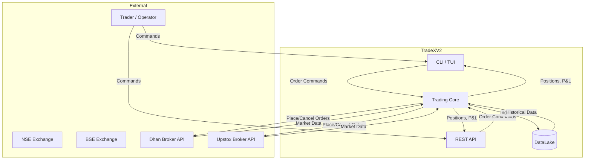

## 2. Level 1 — System Decomposition

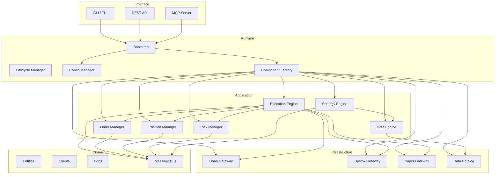

## 3. Level 2 — Order Placement Flow

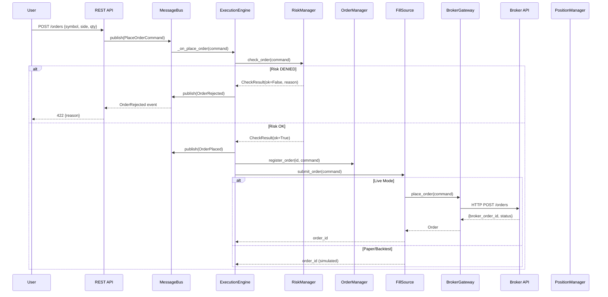

## 4. Level 2 — Fill Processing Flow

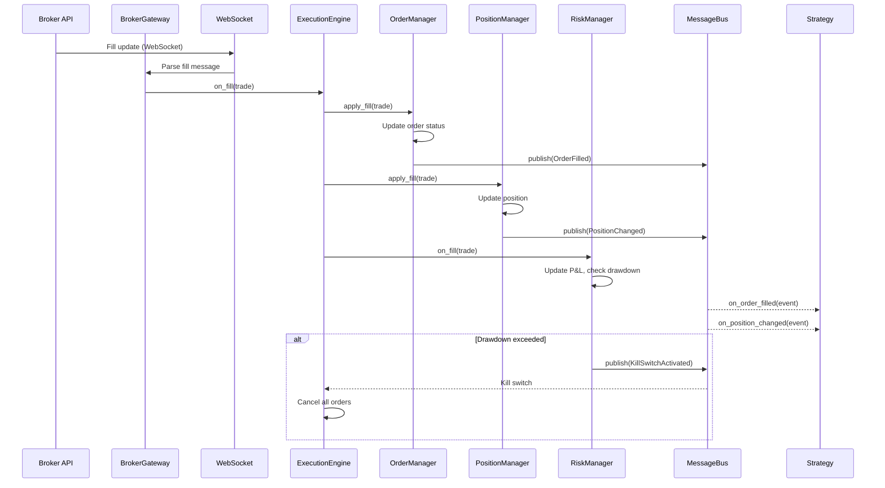

## 5. Level 2 — Market Data Flow

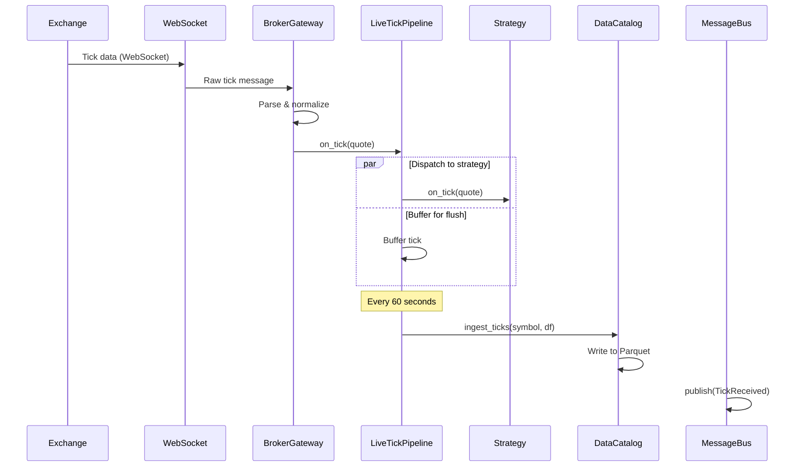

## 6. Level 2 — Backtest Flow

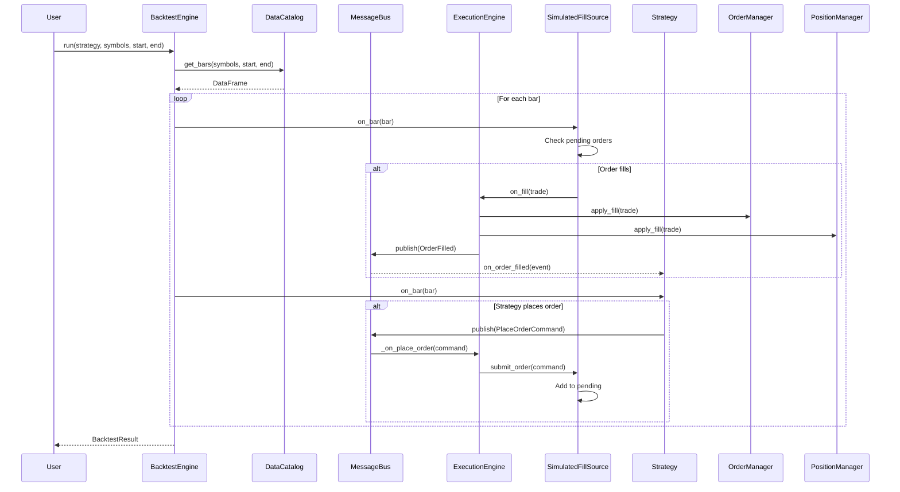

## 7. Component Lifecycle Flow

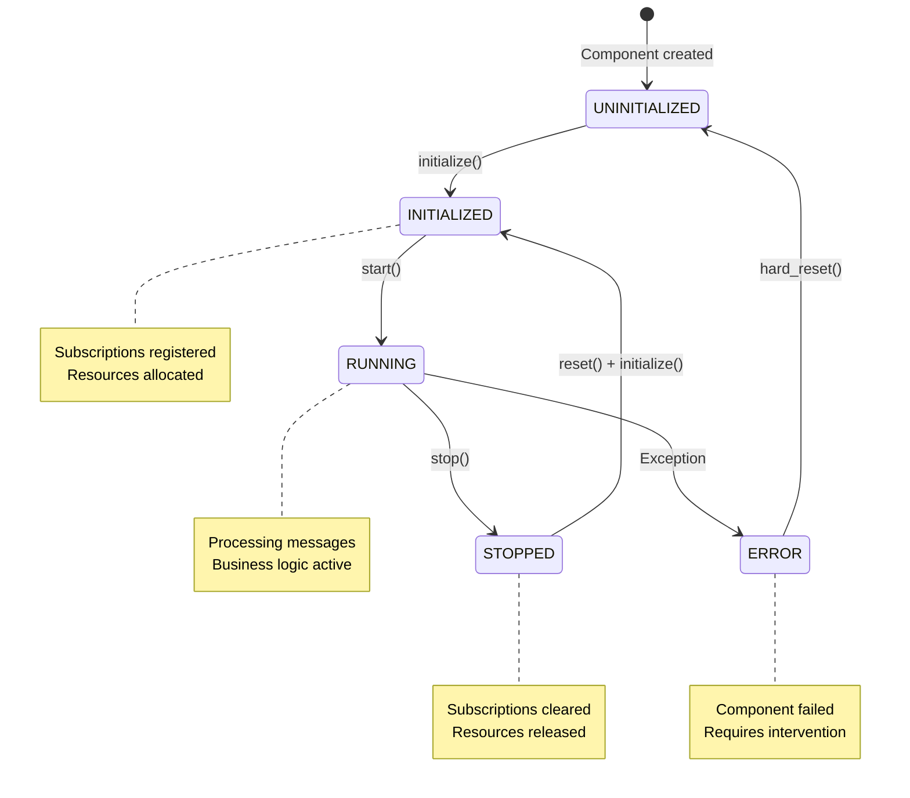

## 8. Broker Connection Flow

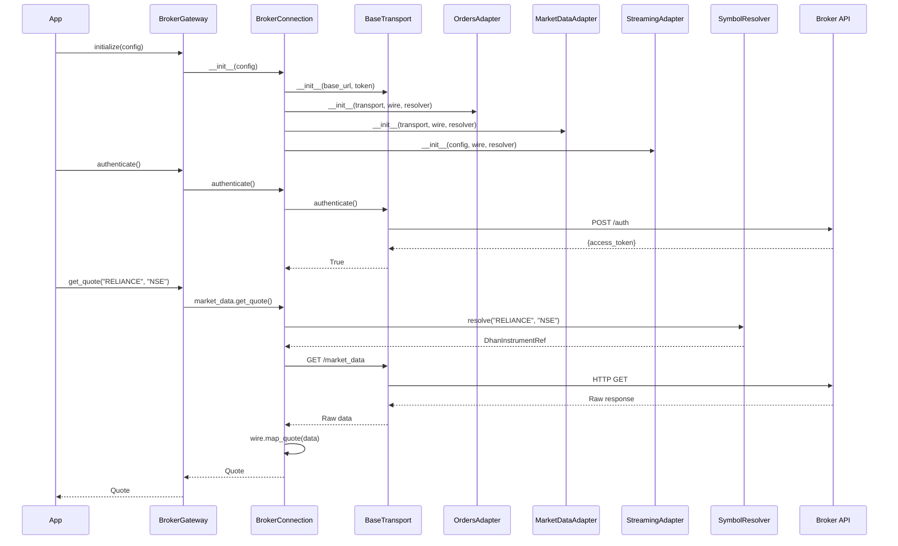

## 9. Data Flow Diagram — Source Selection

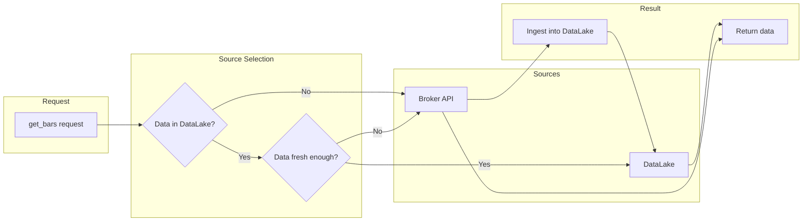

## 10. Risk Check Flow

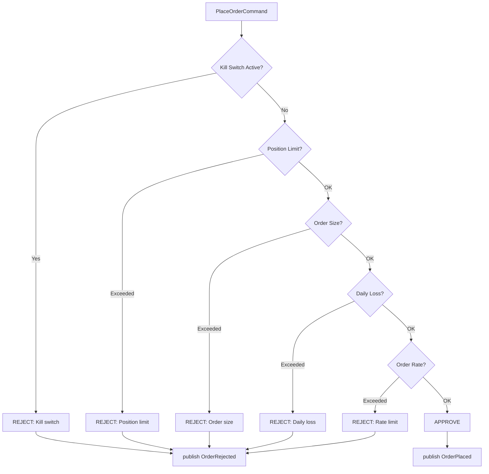

## 11. Deployment Flow

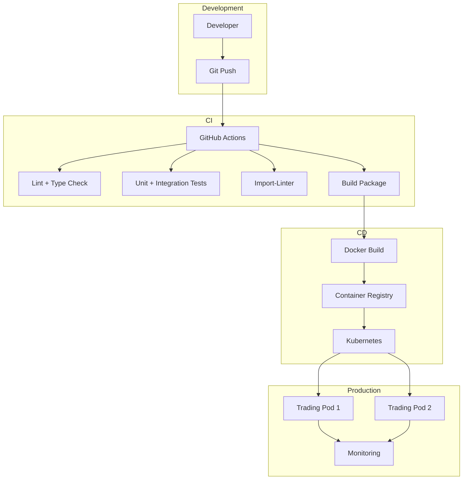
